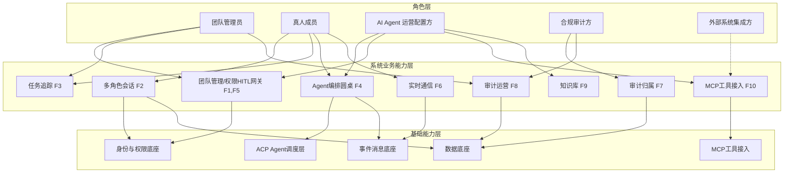
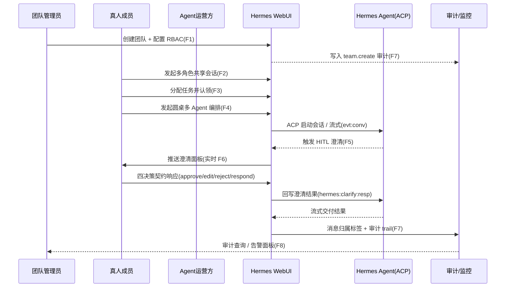
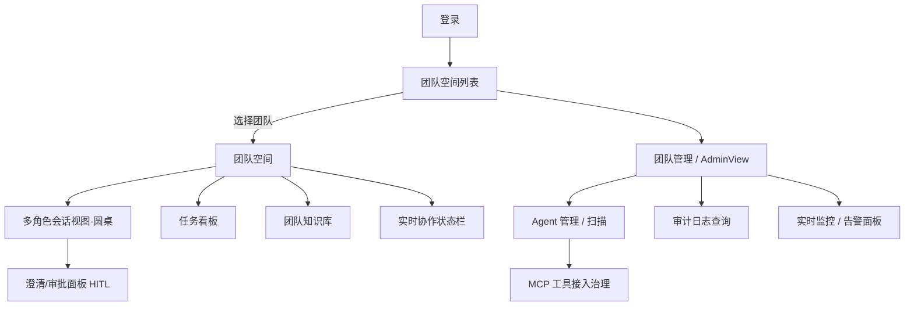

# AICoding 架构设计 · UserStory

> 本文档为《AICoding 架构设计》核心产物之一，定位为**产品需求与用户故事（UserStory）**。
> 上游输入：《高层架构设计》（G3 已冻结，v0.1.1，含 X1 流式机制经中间确认锁定为方案 B）中的需求概要、行业调研、业务架构、产品原型、功能清单与边界。
> 下游输出：驱动《系统设计》《部署设计》《安全设计》的具体功能实现。
> 本文档为《UserStory》阶段（Phase 4，Gate G4）唯一 Owner：product-story-designer（顾全景）。
> **边界纪律**：本文所有角色、场景、功能、MVP 范围、In/Out 边界均严格继承自《高层架构设计》冻结基线，不自行新增超出冻结范围的功能需求；F11/F12 仅以「完整版范围」单列，不作为 MVP 已交付能力声称。

---

## 0. 元信息：修订记录

```yaml
标题: Hermes Infi WebUI - UserStory v0.1
版本: v0.1
状态: Draft   # Draft | Reviewing | Approved | Deprecated
创建日期: 2026-07-21
最后更新: 2026-07-21
作者: product-story-designer（顾全景）
评审人:
  - 主理人（team-lead）
关联文档:
  上游输入:
    - 高层架构设计: /Users/caotinghui/Downloads/hermes-python/.workbuddy/output/高层架构设计.md (G3 已冻结 v0.1.1)
    - 资料摘要: /Users/caotinghui/Downloads/hermes-python/.workbuddy/output/material_digest.md (G1 已通过)
    - 行业调研报告: /Users/caotinghui/Downloads/hermes-python/.workbuddy/output/research_report.md (G2 已通过)
  下游产出:
    - 系统设计: AICoding架构设计-2-系统设计.md（待 Phase 4）
    - 部署设计: AICoding架构设计-3-部署设计.md（待 Phase 4）
    - 安全设计: AICoding架构设计-4-安全设计.md（待 Phase 4）
```

| 版本 | 日期 | 作者 | 变更内容 | 评审状态 |
| --- | --- | --- | --- | --- |
| v0.1 | 2026-07-21 | product-story-designer（顾全景） | 初稿（六章 + 附录 C 自检报告 + §7 待确认项） | Draft |

> **版本管理纪律**：破坏性变更（章节结构调整 / 关键决策反转）升 MAJOR；新增章节、扩充内容升 MINOR。

---

## 1. 业务背景与价值

### 1.1 业务背景

- **当前业务现状（行业 / 产品 / 用户规模）**
  - 行业：企业级 AI Agent 协作平台赛道，现有产品多为「个人 × 单 AI」范式（如 Cursor），或闭源 SaaS 多 Agent（如 Copilot Studio）。自托管、数据可驻留的开源协作平台存在明确缺口。
  - 产品：Hermes Infi WebUI 是基于 NousResearch/hermes-agent 自研的**自托管 AI Agent 平台 Web 界面**，本期由「个人 × 单 AI」扩展为「**真人团队 × 多 AI Agent**」深度协同工作台（D1 §1、§17）。
  - 用户规模：MVP 为**单组织单实例**私有化部署（D5），非功能硬指标 **N1 支撑 ≥ 50 并发用户**；完整版规划多租户隔离（O3）。目标团队形态为「管理者 + 一线成员 + Agent 运营方 + 合规方」的企业小团队（通常 5–30 人 / 组织）。
- **触发本次需求的事件（新场景 / 痛点修复）**
  - 新场景：用户提出「差异化定位 / 协作模型（角色分工、任务流转、权限边界、实时通信）/ 系统架构 / 关键能力清单 / 创新点」5 大方向诉求，要求补齐「真人团队 × 多 AI Agent」协同闭环（多角色会话 / 任务追踪 / Agent 编排 / 权限 HITL / 审计 / 实时 presence）。
  - 痛点修复：① 多真人 + 多 Agent 混合下消息责任归属不清（P1，风险 R-04）；② 协同产品缺团队工作区 + 多 Agent 编排的范式缺口（P1）；③ 真人–AI 缺标准化 HITL 澄清（P2）；④ 协同编辑缺失（P2）。
- **本系统在产品矩阵中的位置**
  - 在「自托管 AI 协作平台」中承担**「真人 × Agent 协同入口」核心职责**，上游对接 Hermes Agent（ACP）/ 模型提供商 / MCP 工具，下游对接审计与监控系统 / 外部集成（MCP/REST），与 ACP 调度层 / Hermes Agent 形成完整业务闭环（高层架构 §4.2、§5.2）。

### 1.2 行业方案

> 同类功能、痛点的行业标杆系统及解决方案（事实来源：高层架构 §3.1 / research_report §2.1）。

| 标杆系统 | 厂商 / 来源 | 场景覆盖 | 技术亮点 | 可借鉴点 | 不借鉴点 |
| --- | --- | --- | --- | --- | --- |
| OpenWebUI（B1） | 社区 | 个人×AI + 多用户企业 | RBAC / SSO / SCIM 2.0 / MCP / 企业审计 / 水平扩展 | 自托管基座、集成难度/成本/合规可控性均优 | 团队工作区深度协同弱 |
| Dify（B2） | LangGenius | 团队 / 多 Agent（LLMOps） | Agent 编排 / 工作流 / RBAC / MCP / 审计 / 可视化 | 场景契合度 5（多 Agent 编排 + 团队工作区 + 可视化 + 审计） | 闭源 EE 部分 |
| Copilot Studio（B3） | Microsoft | 企业团队 / 多 Agent | 多 Agent 编排 / Entra Agent ID / Purview 审计 | 「人机监督 + Agent ID + 治理」范式（概念层） | 闭源 SaaS 部署形态不借鉴 |
| LibreChat（B4） | 社区 | 个人×AI + 多用户 | Agents / MCP / SSO / Admin / Handoffs | 开源 Agents / MCP / SSO / Handoffs | 团队实时协同较弱 |
| Cursor（B5） | Anysphere | 个人×AI（IDE） | Agent / Background Agents / MCP / Teams | —（对照锚点） | 「个人 × AI」范式恰是本项目应差异化的方向 |

**差异化方案**：以「**自托管 + 真人团队 × 多 Agent 圆桌实时协同 + HITL 澄清闭环 + 消息归属审计**」为独有能力，数据完全驻留、可 air-gapped（高层架构 §4.1）。相对 OpenWebUI/LibreChat/Cursor 偏单 AI 对话、Copilot Studio 闭源 SaaS，形成差异。

### 1.3 方案收益与价值

| 项 | 说明 | 功能模块 | 预期价值收益 | 量化标准 |
| --- | --- | --- | --- | --- |
| 效率（业务） | 真人 × 多 Agent 协同任务从分配到交付周期缩短 | F3 任务追踪 / F4 圆桌编排 | 减少人工协调开销 | 任务平均交付时长 ≤ 现状 50%（现状假设 ≈ 8h → 目标 ≤ 4h），MVP 上线后 1 月度量 |
| 体验（业务） | 多真人实时协同的「在场感」与反馈延迟可控 | F6 实时通信 / F2 会话 | 实时看到同伴与 Agent 状态 | 消息端到端 P95 ≤ 1.5s（N2），MVP 上线度量 |
| 合规（业务） | 关键操作 100% 留痕、责任可归属 | F7 审计归属 / F8 审计运营 | 审计可追溯到会话 + 角色 | 审计覆盖率 100%（N3），MVP 上线度量 |
| 成本（成本） | 自托管零许可成本（开源基座），规避 SaaS 订阅 | 整体自托管形态（D5） | 规避 Copilot $21/用户/月订阅 | 月度许可成本 = 0，MVP 上线度量 |

### 1.4 术语清单

> 统一文档中专有名词的中英文对照与含义（与高层架构 §5 / material_digest D2/D4 对齐）。

| 术语 | 英文 / 缩写 | 含义 | 来源 |
| --- | --- | --- | --- |
| ACP | Agent Client Protocol | Agent 客户端协议，JSON-RPC over stdio，驱动后台 Agent 会话 | D1 §5、D4 §6 |
| HITL | Human-in-the-Loop | 人在回路；Agent 运行中需人工澄清 / 审批时挂起等待 | D2 §7、高层架构 §5.3 |
| 四决策契约 | approve / edit / reject / respond | HITL 澄清的四类人工决策：批准 / 编辑后批准 / 拒绝 / 答复 | 高层架构 §2.5、F5 |
| RBAC | Role-Based Access Control | 基于角色的访问控制（平台角色 + 团队权限矩阵） | D2 §5、D3 §7 |
| governance | — | Hermes 团队级内容权限矩阵（团队对话/知识库的创建/读取/管理） | D2 §5、D3 §7 |
| MCP | Model Context Protocol | 模型上下文协议，Agent 接入外部工具/数据 | D4 §7、F10 |
| 圆桌 | Roundtable | 多真人与多 Agent 同屏编排会话（WebSocket 流式） | D1 §7、F4 |
| presence | — | 用户在线状态（Redis `presence:{user}`，SET ex=60，约 30s 心跳） | D2 §7 |
| typing | — | 正在输入临时事件 | D2 §7 |
| members_changed | — | 会话成员变更事件 | D2 §7 |
| evt:conv | Redis Stream key | 按会话的流式 + 群聊事件流（`evt:conv:{id}`，限流可重传） | D2 §6、X1 锁定方案 B |
| XREAD | Redis 命令 | API 层经 XREAD 转发 evt:conv 事件，支持 Last-Event-ID/since 重连续传 | D2 §6、X1 |
| hermes:clarify | Redis List | Agent→runner 澄清请求（`hermes:clarify:req:{sid}`）/ 回复（`hermes:clarify:resp:{sid}:{cid}`） | D2 §7 |
| 消息归属标签 | message attribution tag | 每条消息标注 user / agent 归属，支撑审计追溯 | 高层架构 F7、V1 |
| 审计 trail | audit trail | 不可变审计记录，绑定会话 + 角色 | 高层架构 F7、N3 |
| SCIM 2.0 | System for Cross-domain Identity Management | 完整版 IdP 用户同步协议（OpenWebUI 模式参考） | 高层架构 §2.4 |
| CRDT / Yjs | Conflict-free Replicated Data Type | 完整版多真人实时协同编辑底层（F11，MVP 不做） | 高层架构 O1、F11 |
| 编排 DSL | Orchestration DSL | 完整版跨团队可视化编排领域语言（F12，MVP 不做） | 高层架构 O2、F12 |

---

## 2. 范围与边界

### 2.1 系统内模块及功能

> 一级功能清单（与高层架构 §6.3 功能清单互查一致，共 12 项：F1–F10 为 MVP，F11/F12 为完整版）。

| 一级模块 | 包含功能（编号） | MVP 是否包含 |
| --- | --- | --- |
| 团队协作 | F1 团队创建/邀请/RBAC 角色矩阵 | ✅ |
| 多角色会话 | F2 共享对话/分叉/导出/智能追问 | ✅ |
| 任务追踪 | F3 任务分配/状态（项目+任务） | ✅ |
| Agent 编排 | F4 圆桌多 Agent（ACP + WebSocket） | ✅ |
| 权限 HITL | F5 权限矩阵 + HITL 澄清四决策契约 | ✅ |
| 实时通信 | F6 presence / typing / members_changed 事件流 | ✅ |
| 审计归属 | F7 消息归属标签 + 不可变审计 trail | ✅ |
| 审计运营 | F8 审计日志查询 / 告警面板 | ✅ |
| 知识库 | F9 团队知识库注入（提示词附加） | ✅ |
| 工具接入 | F10 MCP 工具基础接入与权限治理 | ✅ |
| 协同编辑 | F11 多真人实时共编（Yjs CRDT） | ❌（完整版） |
| 编排增强 | F12 跨团队可视化编排 + 编排 DSL | ❌（完整版） |

### 2.2 系统外模块及功能

> 当前系统**不覆盖**的功能及其原因（继承自高层架构 §6.1 Out-of-Scope，O1–O5）。

**Out-of-Scope（协同增强能力延后至完整版）**

| 编号 | 不做的事 | 原因 | 后续计划 |
| --- | --- | --- | --- |
| O1 | 多真人实时协同编辑（Yjs CRDT） | MVP 先单人 workspace 编辑；CRDT 引入元数据膨胀 / 离线同步复杂度（风险 R-03） | 完整版（创新点 F11） |
| O2 | 跨团队可视化编排 + 编排 DSL | 依赖编排层成熟；MVP 先圆桌 + 顺序编排 | 完整版（创新点 F12） |

**Out-of-Scope（多租户与部署边界）**

| 编号 | 不做的事 | 原因 | 后续计划 |
| --- | --- | --- | --- |
| O3 | 多租户隔离（多组织） | MVP 单组织单实例，降低复杂度 | 完整版 |
| O5 | 闭源 SaaS 云部署 | 自托管定位（D1 §1 / §17），数据驻留硬约束 | 不做 |

**Out-of-Scope（模型与训练边界）**

| 编号 | 不做的事 | 原因 | 后续计划 |
| --- | --- | --- | --- |
| O4 | 模型训练 / 微调 | 超出 WebUI 平台边界，由模型提供商承担 | 不做 / 外部 |

### 2.3 外部依赖

| 依赖系统 | 提供方 | 依赖能力 | 接入方式 | 接口人 |
| --- | --- | --- | --- | --- |
| Hermes Agent | NousResearch（本地进程） | ACP 会话 / 推理 / 流式 | ACP（JSON-RPC over stdio） | Agent 调度团队（复用） |
| 模型提供商 | DeepInfra / Upstage / Nous 等 | 推理算力 | REST / SDK | 外部（平台配置） |
| MCP 工具服务 | 第三方 / 自建 | 工具 / 数据 | MCP（HTTP / stdio） | Agent 运营配置方 |
| PostgreSQL 16 | 自托管 | 持久化（用户/对话/Agent/团队/审计） | SQLAlchemy 2.0 async | 平台团队 |
| Redis 7 | 自托管 | 事件流 / 限流 / presence / 会话 | Redis Stream（evt:conv:{id}）+ XREAD | 平台团队 |
| MinIO | 自托管 | 对象存储（文件/工作区） | S3-compatible API | 平台团队 |
| 审计 / 监控系统 | SRE / 合规 | 审计 trail / 告警 | 事件订阅 / API | 合规审计方 |
| 运营看板 | 运营 | 离线指标 | 数据订阅（T+1） | 运营 |

> **X2 / X3 端口与认证冲突处理（继承 handoff）**：前端 /api 代理目标端口（8000 vs 8001）、Redis/PostgreSQL 端口与认证（文档默认 6379/5432 vs Docker 实际 1979/5439 + 密码）存在冲突（material_digest X2/X3）。以 `docker/compose.yaml` 实际配置为准，交由 platform-architect 在《部署设计》裁定归档，不影响本文业务边界与用户可感知产品形态。

---

## 3. 功能清单

> **定位**：全景骨架表，进入「角色 / 场景 / US」之前先看到完整功能版图；与高层架构 §6.3 功能清单互查一致。

### 3.1 功能清单结构

| 一级模块 | 二级模块 | 功能项 | 优先级（P0/P1/P2） | MVP 范围 | 完整版范围 | 备注 |
| --- | --- | --- | --- | --- | --- | --- |
| 团队协作 | 团队创建邀请RBAC | F1 创建团队、邀请成员、角色权限矩阵 | P0 | ✅ | ✅ | 对齐 V2；默认角色矩阵（管理员/成员/Agent运营方/审计方） |
| 多角色会话 | 共享对话分叉导出 | F2 多角色共享会话、消息分叉、导出、智能追问 | P0 | ✅ | ✅ | 对齐 V2；分叉从任意节点分支，导出 Markdown/JSON |
| 任务追踪 | 任务分配状态 | F3 项目+任务状态（待办/进行/完成） | P0 | ✅ | ✅ | 对齐 V2；任务认领/流转 |
| Agent 编排 | 圆桌多Agent | F4 ACP + WebSocket 圆桌多 Agent 编排 | P0 | ✅ | ✅ | 对齐 V2；主路径 ≤5 步 |
| 权限 HITL | 权限矩阵澄清契约 | F5 governance + hermes:clarify 对接 ACP 四决策 | P0 | ✅ | ✅ | 对齐 V1, V3；卡死率=0（完整版目标） |
| 实时通信 | presence/typing/members | F6 实时事件流（Stream + evt:conv:{id} + XREAD，含限流/重连续传） | P0 | ✅ | ✅ | 对齐 V2；经 X1 中间确认锁定方案 B |
| 审计归属 | 消息标签审计trail | F7 user/agent 归属标签 + 不可变审计 | P0 | ✅ | ✅ | 对齐 V1；审计覆盖率 100%（N3） |
| 审计运营 | 日志查询告警 | F8 审计查询与异常告警面板 | P1 | ✅ | ✅ | 对齐 V1；查询 P95 ≤ 3s |
| 知识库 | 团队知识库注入 | F9 知识库上传 + 提示词注入 | P1 | ✅ | ✅ | 对齐 V2；注入前转纯文本防注入 |
| 工具接入 | MCP基础接入 | F10 MCP 工具接入 + 权限治理 | P1 | ✅ | ✅ | 对齐 V2；治理 MCP server 权限 |
| 协同编辑 | 多真人实时共编 | F11 Yjs CRDT 协同编辑 | P2 | ❌ | ✅ | 对齐 V4；**完整版范围，MVP 不交付** |
| 编排增强 | 跨团队可视化编排 | F12 编排 DSL + 可视化 | P2 | ❌ | ✅ | 对齐 V2；**完整版范围，MVP 不交付** |

> **互查结论**：F1–F7 均为 P0 且 MVP✅；F8–F10 均为 P1 且 MVP✅；F11/F12 为 P2 且 MVP❌（完整版）。与高层架构 §6.3 完全一致，无新增 / 裁剪。

---

## 4. 角色与场景

### 4.1 角色清单

> 角色严格继承高层架构 §2.1 五类，不新增子角色、不裁剪。

| 角色 | 业务身份 | 主要操作 | 核心关注点 |
| --- | --- | --- | --- |
| 团队管理员 | 团队 Owner / 管理者（甲方决策者） | 创建团队、邀请成员、配置角色权限、查看审计、处理待澄清、监控告警 | 真人 + AI 协作过程可控、责任可追溯、权限不越界 |
| 真人成员 | 一线协作成员（最终用户 A） | 参与多角色会话、认领任务、与 Agent 协作、响应 HITL 澄清、注入知识库 | AI 输出可靠、任务不遗漏、实时看到同伴与 Agent 状态 |
| AI Agent 运营 / 配置方 | Agent 配置 / 运维（最终用户 B） | 注册助手、配置 profile、扫描 Agent、治理 MCP、配置圆桌编排 | Agent 编排稳定、HITL 澄清闭环不打断主流程 |
| 合规 / 审计方 | 合规 / SRE（受影响方） | 审计日志查阅、异常监控、责任归因 | 所有关键操作 100% 留痕、可追责到会话 + 角色 |
| 外部系统集成方 | 集成开发者（受影响方） | 通过 MCP / REST 接入工具与数据 | 接入方式标准、权限受治理、数据不越界 |

### 4.2 关键场景清单

| 编号 | 角色 | 触发条件 | 期望结果 | 频率（日均 / QPS） |
| --- | --- | --- | --- | --- |
| S1 | 团队管理员 | 新团队入驻 / 新成员加入 | 团队创建成功、成员就位、RBAC 角色矩阵就绪 | 低频（团队级，日均小于 10） |
| S2 | 真人成员 | 进入团队空间、需要协作讨论 | 发起多角色共享会话，多人/Agent 同屏 | 中频（日均 20–50 会话） |
| S3 | 真人成员 / 团队管理员 | 会话中产出可追踪工作项 | 任务被分配并认领，状态可追踪 | 中频（日均 50–200 任务事件） |
| S4 | 真人成员 / AI Agent 运营方 | 需要多 Agent 协同完成任务 | 发起圆桌编排，多 Agent 流式协作 | 中频（日均 10–50 编排） |
| S5 | 真人成员 | Agent 运行中触发 hermes:clarify | 收到澄清面板，四决策响应，Agent 不卡死 | 中频（与 S4 伴生） |
| S6 | 真人成员 | 协作过程中关注同伴/Agent 状态 | 实时看到 presence / typing / members_changed | 高频（事件流持续，峰值 QPS 数十） |
| S7 | 系统 / 合规审计方 | 任意消息产生 / 关键操作发生 | 消息打 user/agent 归属标签并写入不可变审计 trail | 高频（每条消息/操作，覆盖率 100%） |
| S8 | 合规 / 审计方 | 定期审计 / 异常告警 | 审计日志可检索、下钻、责任归因；告警面板刷新 | 低频–中频（查询日均小于 100；告警刷新 ≤10s） |
| S9 | 真人成员 / AI Agent 运营方 | 需要为团队提供背景知识 | 上传知识库并注入提示词 | 低频（文档级，日均小于 20） |
| S10 | AI Agent 运营方 / 外部系统集成方 | 需要为 Agent 提供工具 | MCP 工具接入并被治理权限 | 低频（配置级） |
| S11 | 真人成员 | 同一工作区需多人实时共编（**完整版**） | Yjs CRDT 协同编辑可用 | 中频（完整版，≥5 真人并发） |
| S12 | AI Agent 运营方 | 跨团队编排需可视化（**完整版**） | 编排 DSL + 可视化编排可用 | 低频（完整版） |

### 4.3 角色交互与系统关系图



### 4.4 业务主链路泳道图（时序）

> 端到端主链路：团队组建 → 多角色会话 → 任务分配 → Agent 编排（圆桌） → HITL 澄清 → 协同交付 → 审计复盘（继承自高层架构 §5.3）。



### 4.5 页面流转图



> **说明**：以上三图（角色交互图、主链路泳道图、页面流转图）均由 product-story-designer 以 Mermaid 直接生成并内嵌，作为 §5 UserStory 的导航上下文；图例与高层架构 §5.1/§6.2 模块划分保持一致。

---

## 5. 用户旅程（UserStory）

> 每条 UserStory 均按 5.1.1 ~ 5.1.7 的七段式展开。**US-1 ~ US-10 覆盖 MVP 范围（F1–F10）**；**US-11 / US-12 覆盖完整版范围（F11/F12），明确标注「完整版范围 · MVP 不交付」**。

### 5.1 US-1：团队组建与 RBAC 配置（F1）

#### 5.1.1 业务场景

- **视角**：团队管理员
- **描述逻辑**：新团队入驻或新成员加入时（When：管理员在团队管理端点击「创建团队」/「邀请成员」；Where：团队管理端 Web），管理员需要建立团队、邀请成员并分配角色权限矩阵，使协作具备可控的权限边界。

#### 5.1.2 业务流程

- **视角**：用户
- **描述方式**（Given / When / Then）：
  - **Given** 管理员已登录且持有 `team:create` 平台权限；**When** 管理员填写团队名称并提交；**Then** 系统创建团队并返回团队 ID，同时初始化默认角色矩阵（管理员 / 成员 / Agent 运营方 / 审计方）与 governance 默认权限。
  - **Given** 团队已存在且管理员持有 `member:invite`；**When** 管理员输入成员邮箱/账号并发起邀请；**Then** 系统生成邀请记录并触发通知，被邀人接受后写入 TeamMember。

#### 5.1.3 UE 原型

```text
┌──────────────────────────────────────────────┐
│ 团队管理 · admin-hero                         │
│ [+ 创建团队]  [邀请成员]                       │
├──────────────────────────────────────────────┤
│ 团队列表                                       │
│  • 增长团队     成员 8   [管理]                │
│  • 研发协同     成员 12  [管理]                │
├──────────────────────────────────────────────┤
│ 角色权限矩阵 (section-card)                    │
│ 角色        | 对话读 | 对话写 | 知识库 | 审计  │
│ 管理员      |  ✓   |  ✓   |  ✓   |  ✓    │
│ 成员        |  ✓   |  ✓   |  ✓   |  ✗    │
│ Agent运营方 |  ✓   |  ✓   |  ✓   |  ✗    │
│ 审计方      |  ✓   |  ✗   |  ✗   |  ✓    │
└──────────────────────────────────────────────┘
```

#### 5.1.4 业务逻辑

- **视角**：业务系统
- **描述方式**：① 校验操作者 `team:create` 权限（governance / RBAC）→ ② 创建 `team` 记录（UUIDPrimaryKey+Timestamps）→ ③ 初始化 governance 角色默认权限（`_DEFAULTS`）→ ④ 写入 TeamMember（创建者默认管理员）→ ⑤ 生成邀请（邮件/链接）并记录 → ⑥ 落审计事件 `team.create` / `member.invite`（绑定操作者+会话）→ ⑦ 返回团队 ID 与角色矩阵。

#### 5.1.5 数据描述

- 写入：`team`（id, name, owner_id, created_at）、`team_member`（team_id, user_id, role）、`governance_permission`（team_id, role, perm_key, granted）、`invitation`（id, team_id, invitee, status）、`audit_log`（actor_id, team_id, action=team.create, ts）。
- 读取：权限校验查询 `team_service.require_permission`。

#### 5.1.6 验收标准 AC

- **正常路径**：Given 管理员提交合法团队名且持有 `team:create`；When 点击「创建团队」；Then 团队创建成功、默认角色矩阵就绪、审计记录 `team.create`（覆盖率 100%，对齐 N3）。
- **异常路径 1（越权）**：Given 非管理员用户（无 `team:create`）；When 尝试创建团队；Then 系统拒绝并返回 403，不创建记录、不写审计业务事件。
- **异常路径 2（非法输入）**：Given 团队名重复或含非法字符（超长/注入字符）；When 提交；Then 返回字段校验错误提示，不落库。

#### 5.1.7 外部集成接口

- 邀请通知：经通知服务（邮件 / IM webhook），MVP 可为站内通知 + 邀请链接；完整版可经 SCIM 2.0 与 IdP 同步（O3 关联，非 MVP）。
- 权限底座：复用 `app/core/rbac.py` + `governance.py`（D2 §5、D3 §7），不新建。

### 5.2 US-2：多角色共享会话（F2）

#### 5.1.1 业务场景

- **视角**：真人成员
- **描述逻辑**：成员进入团队空间后（When：选择团队并新建/进入会话；Where：成员协作端「多角色会话视图」），与多名同伴及 Agent 在同一共享对话中协作，支持消息分叉、导出与智能追问。

#### 5.1.2 业务流程

- **视角**：用户
- **Given** 成员已加入团队且持有对话读/写权限；**When** 成员在团队空间点击「新建会话」并邀请同伴/Agent；**Then** 系统创建共享会话，多人/Agent 可同屏收发消息。
- **Given** 成员在某条消息节点希望探索不同走向；**When** 点击「分叉」；**Then** 系统从该节点派生分支会话，保留原链。
- **Given** 成员需留存记录；**When** 点击「导出」；**Then** 系统生成 Markdown / JSON 文件。

#### 5.1.3 UE 原型

```text
┌──────────────────────────────────────────────┐
│ 多角色会话视图·圆桌          [分叉][导出][追问]│
├──────────────────────────────────────────────┤
│ @Alice : 我们梳理下需求…                      │
│ 🤖 Agent-A : 建议拆分为…  [流式打字中…]       │
│ @Bob   : 我认领「鉴权」任务                    │
│ ── 分支提示：从 Agent-A 消息分叉? ──          │
└──────────────────────────────────────────────┘
```

#### 5.1.4 业务逻辑

- ① 校验 `conversation:read/write` → ② 创建 `conversation`（team-scoped，GroupMember 校验成员资格，D3 §9 陷阱）→ ③ 订阅 `evt:conv:{id}` 事件流（XREAD，含 Last-Event-ID 重连续传）→ ④ 消息写入 `conversation_message` 并打归属标签（user/agent，见 US-7）→ ⑤ 分叉：复制消息树至新 conversation，标记 fork_from → ⑥ 导出：聚合消息序列化为 Markdown/JSON → ⑦ 写审计 `conversation.create` / `conversation.fork` / `conversation.export`。

#### 5.1.5 数据描述

- 写入：`conversation`（id, team_id, type=group, fork_from）、`conversation_message`（id, conv_id, actor_type=user|agent, actor_id, content, parent_id）、`audit_log`。
- 读取：群聊 `get_conversation` 必须校验 GroupMember 成员资格（D3 §9）。

#### 5.1.6 验收标准 AC

- **正常路径**：Given 成员持有对话写权限且已在 GroupMember；When 发送消息；Then 消息实时出现在所有成员与 Agent 视图（端到端 P95 ≤ 1.5s，对齐 N2），并打归属标签。
- **异常路径 1（越权）**：Given 非团队成员尝试进入共享会话；When 请求会话；Then 返回 403，不暴露消息内容。
- **异常路径 2（断线重连）**：Given 成员网络抖动断线；When 恢复连接并携带 Last-Event-ID/since；Then 系统经 XREAD 重连续传缺失事件，不丢消息、不重复（对齐 X1 方案 B）。

#### 5.1.7 外部集成接口

- 实时流式：经 Redis Stream `evt:conv:{id}` + XREAD 转发（单 Agent SSE / 圆桌 WebSocket），机制已锁定（X1）。
- 智能追问：由 Agent 根据回复生成建议（D1 §9），不依赖外部。

### 5.3 US-3：任务分配与状态追踪（F3）

#### 5.1.1 业务场景

- **视角**：真人成员 / 团队管理员
- **描述逻辑**：会话中产出可追踪工作项时（When：成员在会话或任务看板中将讨论转为任务；Where：任务看板 / 会话内悬浮），任务被分配给成员并随状态（待办/进行/完成）流转，使协作产出不遗漏。

#### 5.1.2 业务流程

- **Given** 成员在会话中选中内容并「转为任务」；**When** 指定负责人与截止信息并提交；**Then** 系统创建任务并归入所属项目，状态置「待办」。
- **Given** 负责人看到待办任务；**When** 点击「认领 / 开始」；**Then** 状态流转为「进行中」。
- **Given** 任务完成；**When** 标记「完成」；**Then** 状态置「完成」，看板实时刷新（F6）。

#### 5.1.3 UE 原型

```text
┌──────────────────────────────────────────────┐
│ 任务看板                         [+ 新建任务]  │
├──────────┬──────────┬─────────────────────────┤
│ 待办      │ 进行中    │ 完成                    │
│ • 鉴权设计│ • 需求梳理│ • 原型评审             │
│    @Bob   │    @Alice│    @Carol               │
└──────────┴──────────┴─────────────────────────┘
```

#### 5.1.4 业务逻辑

- ① 校验 `task:create/manage` → ② 创建 `project` + `task`（status 枚举 todo/doing/done，绑定 team_id、assignee_id、conv_id）→ ③ 状态流转经 `task_service` 事务更新 → ④ 触发 `members_changed`/任务事件（F6）推送看板 → ⑤ 写审计 `task.create` / `task.transition`（绑定操作者+会话）。

#### 5.1.5 数据描述

- 写入：`project`（id, team_id, name）、`task`（id, project_id, assignee_id, conv_id, status, due_at）、`audit_log`。
- 读取：看板按 status 聚合查询。

#### 5.1.6 验收标准 AC

- **正常路径**：Given 成员持有 `task:create`；When 创建并分配给在场成员；Then 任务出现在对应看板列，被分配人与相关成员实时可见（F6）。
- **异常路径 1（越权）**：Given 无 `task:manage` 的成员尝试修改他人任务状态；When 提交变更；Then 返回 403，状态不变。
- **异常路径 2（孤立任务）**：Given 任务被创建但未分配负责人；When 提交；Then 系统允许创建但标记「未分配」并提示管理员/创建者补分配，避免任务遗漏（对齐 V2）。

#### 5.1.7 外部集成接口

- 任务事件推送：复用 `evt:conv` / `evt:user:{id}` 事件流（D2 §7），无新增外部依赖。

### 5.4 US-4：多 Agent 圆桌编排（F4）

#### 5.1.1 业务场景

- **视角**：真人成员 / AI Agent 运营配置方
- **描述逻辑**：需要多 Agent 协同完成复杂任务时（When：成员在圆桌会话中「发起编排」并选择多个已注册 Agent；Where：多角色会话视图 + Agent 运营端已注册 profile），系统在 ACP 驱动下让多 Agent 同屏协作并流式回传。

#### 5.1.2 业务流程

- **Given** 成员在会话中点击「发起圆桌」并勾选 ≥2 个 Agent；**When** 确认编排；**Then** 系统经 ACP 启动多 Agent 会话，WebSocket 流式回传各 Agent 输出（主路径 ≤ 5 步：进会话→发起编排→选 Agent→确认→收流式）。
- **Given** 编排进行中；**When** 某 Agent 需人工澄清；**Then** 系统挂起并转 HITL（见 US-5），其余 Agent 不受影响。

#### 5.1.3 UE 原型

```text
┌──────────────────────────────────────────────┐
│ 圆桌编排                       [发起圆桌]      │
├──────────────────────────────────────────────┤
│ 选择 Agent: ☑ Agent-A  ☑ Agent-B  ☐ Agent-C  │
├──────────────────────────────────────────────┤
│ 🤖 Agent-A : 负责方案设计… [流式]             │
│ 🤖 Agent-B : 负责风险评估… [流式]             │
│ ⟳ 等待 Agent-A 澄清 (HITL)                     │
└──────────────────────────────────────────────┘
```

#### 5.1.4 业务逻辑

- ① 校验 `agent:invoke` + 会话成员资格 → ② `conversation_service.send_roundtable` 派发至多 Agent（D3 §8）→ ③ `agent_runner` 消费 `acp:prompt` Stream，经 ACP 启动 Hermes Agent 子进程 → ④ 流式事件追加至 `evt:conv:{id}`（限流），API 经 XREAD/WebSocket 转发 → ⑤ Agent 触发 `hermes:clarify` 时经 HITL 网关挂起 → ⑥ 结果写 `conversation_message`（agent 归属标签）→ ⑦ 写审计 `roundtable.start` / `roundtable.message`。

#### 5.1.5 数据描述

- 写入：`conversation_message`（actor_type=agent）、`acp_session`（conv_id, agent_profile_id, status）、`audit_log`。
- 读取：Agent profile 来自 `profiles` 表（D2 §8）。

#### 5.1.6 验收标准 AC

- **正常路径**：Given 成员持 `agent:invoke` 且所选 Agent 已注册；When 发起圆桌；Then ≤5 步内收到首个流式 token，多 Agent 输出按归属标签区分显示（对齐 N2 P95 ≤ 1.5s）。
- **异常路径 1（Agent 未注册/已下线）**：Given 所选 Agent profile 不存在或 runner 不可用；When 发起；Then 系统拒绝并提示「Agent 不可用」，不创建空编排。
- **异常路径 2（模型提供商故障）**：Given 推理后端熔断（D4 §7 MCP 电路熔断参考）；When 编排中模型失败；Then 该 Agent 返回降级提示，圆桌其余 Agent 继续，整体不崩，审计记录 `roundtable.error`。

#### 5.1.7 外部集成接口

- ACP 调度：Hermes Agent via ACP over stdio（D1 §5、D4 §6），锁定 wire protocolVersion（风险 R-05）。
- 模型算力：DeepInfra / Upstage / Nous 等 REST/SDK（同步+流式，失败熔断）。

### 5.5 US-5：HITL 澄清四决策契约（F5）

#### 5.1.1 业务场景

- **视角**：真人成员（被请求澄清方）/ AI Agent 运营配置方
- **描述逻辑**：Agent 运行中遇到不确定项需人工介入时（When：Agent 经 `hermes:clarify` 发起澄清请求；Where：澄清/审批面板），真人收到面板并以 approve/edit/reject/respond 之一响应，Agent 据此继续，主流程不卡死。

#### 5.1.2 业务流程

- **Given** Agent 在会话中触发 `hermes:clarify` 澄清请求（含上下文）；**When** 被授权真人收到澄清面板并选择「approve」；**Then** Agent 获得授权继续，澄清结果与决策写回 `hermes:clarify:resp` 与审计。
- **Given** 真人选择「edit」；**When** 修改参数后提交；**Then** 以编辑后内容批准。
- **Given** 真人选择「reject」/「respond」；**When** 提交；**Then** Agent 按拒绝/答复分支处理。

#### 5.1.3 UE 原型

```text
┌──────────────────────────────────────────────┐
│ 澄清 / 审批面板  (HITL)                        │
├──────────────────────────────────────────────┤
│ Agent-A 请求澄清:                              │
│ 「是否允许调用外部 API 写入数据?」             │
│ [批准] [编辑后批准] [拒绝] [答复]              │
│ 倒计时: 29:50 （超时将自动升级）               │
└──────────────────────────────────────────────┘
```

#### 5.1.4 业务逻辑

- ① Agent→runner 写入 `hermes:clarify:req:{sid}`（RPUSH）→ ② 系统经权限网关判定可响应角色（governance）→ ③ 推送澄清面板（`evt:conv`/`evt:user`）→ ④ 真人四决策经 `request_permission` 对接 ACP → ⑤ 结果写入 `hermes:clarify:resp:{sid}:{cid}`（RPUSH/BLPOP）→ ⑥ Agent 恢复；⑦ 写审计 `hitl.clarify.request` / `hitl.clarify.response`（绑定会话+角色+决策类型）。

#### 5.1.5 数据描述

- 写入：`hermes:clarify:req:{sid}`（List）、`hermes:clarify:resp:{sid}:{cid}`（List）、`audit_log`（action=hitl.clarify.*, decision_type）。
- 读取：响应方角色校验来自 governance。

#### 5.1.6 验收标准 AC

- **正常路径**：Given Agent 触发澄清且真人在授权角色内；When 选择「approve」；Then Agent 在 ≤1s 内收到授权并继续，决策入审计（覆盖率 100%）。
- **异常路径 1（越权响应）**：Given 非授权成员尝试响应澄清；When 提交决策；Then 返回 403，澄清状态不变，不向 Agent 回写。
- **异常路径 2（澄清超时）**：Given 澄清请求发出后 **T 分钟**内无人响应；When 超时触发；Then 请求自动过期、通知发起人并升级至管理员（推荐 **T = 30 分钟**，具体值待 G4 人工确认，见 §7），Agent 不卡死主流程（对齐 V3「卡死率=0」完整版目标；MVP 先保证不卡死）。

> **说明**：超时阈值 T 为产品级可调常量，已在 §7 列为待确认项；该异常路径的存在由主理人注入的 G3 冻结边界明确要求（HITL 澄清超时须作为异常路径），取值不影响功能有无，仅需 G4 拍板。

#### 5.1.7 外部集成接口

- ACP 权限对接：`request_permission`（D2 §7、高层架构 D2）。
- 澄清存储：Redis List `hermes:clarify:*`（D2 §7），不新增外部系统。

### 5.6 US-6：实时 presence / typing / members_changed（F6）

#### 5.1.1 业务场景

- **视角**：真人成员
- **描述逻辑**：协作过程中成员希望感知同伴与 Agent 的在线/输入/成员变更状态（When：成员打开会话或状态变化；Where：实时协作状态栏），系统经事件流实时刷新。

#### 5.1.2 业务流程

- **Given** 成员在线进入会话；**When** 心跳（约 30s）上报；**Then** 系统维护 `presence:{user}`（SET ex=60）并广播在线态。
- **Given** 成员在输入框打字；**When** 触发 typing 事件；**Then** 同伴看到「正在输入」。
- **Given** 会话成员变动；**When** 成员加入/退出；**Then** 广播 `members_changed`。

#### 5.1.3 UE 原型

```text
┌──────────────────────────────────────────────┐
│ 实时协作状态栏                                 │
│ ● Alice  ● Bob  🤖 Agent-A  🤖 Agent-B(输入中) │
│ 成员变更: Carol 加入了会话                     │
└──────────────────────────────────────────────┘
```

#### 5.1.4 业务逻辑

- ① 客户端约 30s 心跳写 `presence:{user}`（SET ex=60）→ ② typing 临时事件经 `evt:conv` 广播 → ③ 成员增删经 `conversation_service` 更新 GroupMember 并广播 `members_changed` → ④ API 经 XREAD 转发至 WebSocket/SSE → ⑤ 写审计仅对成员变更等敏感事件（typing/presence 不写业务审计，避免噪声）。

#### 5.1.5 数据描述

- 写入：`presence:{user}`（Redis SET ex=60）、`evt:conv:{id}`（typing/members_changed 事件）。
- 读取：状态栏订阅 `evt:conv` 实时拉取。

#### 5.1.6 验收标准 AC

- **正常路径**：Given 成员 A 在线且成员 B 进入同一会话；When B 上线/打字；Then A 的状态栏在 P95 ≤ 1.5s 内刷新（对齐 N2）。
- **异常路径 1（断线重连）**：Given 成员网络中断 >60s；When 心跳停止；Then `presence` 过期自动置离线，恢复后重新上线并续传事件（XREAD since），不残留虚假在线。
- **异常路径 2（事件风暴/限流）**：Given 高并发会话大量 typing 事件；When 超过按会话限流阈值；Then 系统限流丢弃冗余 typing 事件，presence/members_changed 优先保障（对齐 X1 限流机制）。

#### 5.1.7 外部集成接口

- 事件底座：Redis Stream `evt:conv:{id}` + XREAD（X1 锁定方案 B），限流键 `rl:msg:{user}`（D2 §7）。

### 5.7 US-7：消息归属标签 + 不可变审计 trail（F7）

#### 5.1.1 业务场景

- **视角**：系统 / 合规审计方
- **描述逻辑**：任意消息产生或关键操作发生时（When：每条对话消息落库、每次权限/任务/HITL 操作；Where：全链路），系统为消息打 user/agent 归属标签并写入不可变审计 trail，使责任可追溯到会话 + 角色。

#### 5.1.2 业务流程

- **Given** 任意消息/操作产生；**When** 系统落库；**Then** 消息携带 `actor_type`（user/agent）+ `actor_id` 归属标签，审计记录写入不可变 trail（绑定 team_id + conversation_id + actor + action + ts）。
- **Given** 合规方检索；**When** 按会话/角色/时间筛选；**Then** 返回完整责任链。

#### 5.1.3 UE 原型

```text
┌──────────────────────────────────────────────┐
│ 审计日志查询 (audit-table)                     │
├──────────────────────────────────────────────┤
│ 时间 | 会话 | 角色 | 操作 | 对象              │
│ 10:01| #c12 | Alice(成员)| msg.send | 需求梳理│
│ 10:02| #c12 | Agent-A | msg.send | 方案建议  │
│ 10:03| #c12 | Bob(成员) | hitl.approve | 澄清 │
└──────────────────────────────────────────────┘
```

#### 5.1.4 业务逻辑

- ① 消息写库时由 `conversation_service` 注入 `actor_type/actor_id`（人/agent 双标签，解决 P1 责任归属）→ ② 关键操作经横切审计中间件统一写 `audit_log`（不可变，append-only）→ ③ 审计绑定 team_id + conversation_id + actor（user 来自 JWT / agent 来自 profile）→ ④ 检索接口支持多维下钻。

#### 5.1.5 数据描述

- 写入：`conversation_message`（actor_type, actor_id）、`audit_log`（id, team_id, conversation_id, actor_type, actor_id, action, payload, ts；append-only）。
- 读取：审计查询按索引检索（team/conversation/actor/ts）。

#### 5.1.6 验收标准 AC

- **正常路径**：Given 任意一条 user 或 agent 消息产生；When 落库；Then 消息 100% 带归属标签且对应审计记录生成（审计覆盖率 100%，对齐 N3 / V1）。
- **异常路径 1（归属缺失拦截）**：Given 某消息因异常缺失 `actor_id`；When 写库前校验；Then 系统拒绝写入并告警（fail-closed），确保 0 条无归属消息（R-04 风险缓解）。
- **异常路径 2（审计防篡改）**：Given 试图修改/删除历史审计记录；When 请求到达；Then 系统拒绝（append-only + 权限隔离），仅允许追加，保障不可变 trail。

#### 5.1.7 外部集成接口

- 审计订阅：审计/监控系统经事件订阅/API 消费 trail（D2 §2 依赖架构）；数据底座 PostgreSQL（D1 §2）。

### 5.8 US-8：审计日志查询与告警面板（F8）

#### 5.1.1 业务场景

- **视角**：合规 / 审计方 / 团队管理员
- **描述逻辑**：定期审计或异常发生时（When：合规方在审计管理端检索、管理员查看告警面板；Where：审计管理端 Web），系统提供全量审计检索、下钻、责任归因与实时告警。

#### 5.1.2 业务流程

- **Given** 合规方在审计管理端输入筛选条件（会话/角色/时间/操作）；**When** 点击查询；**Then** 系统返回匹配审计记录并支持下钻至会话上下文。
- **Given** 系统检测到异常（越权尝试/高频澄清超时）；**When** 触发告警规则；**Then** 告警面板实时刷新并通知管理员。

#### 5.1.3 UE 原型

```text
┌──────────────────────────────────────────────┐
│ 审计日志查询 / 告警面板 (admin-hero)          │
├──────────────────────────────────────────────┤
│ 筛选: [会话▾][角色▾][操作▾][时间▾]  [查询]     │
│ au-row: 10:03 Bob hitl.approve #c12           │
│ ├ 下钻 → 会话上下文                           │
│ ⚠ 告警: 10:05 越权尝试 x3 (实时刷新 ≤10s)     │
└──────────────────────────────────────────────┘
```

#### 5.1.4 业务逻辑

- ① 校验 `audit:read`（仅管理员/审计方）→ ② 查询 `audit_log` 索引，组装 DTO（禁止序列化期懒加载，D2 §9）→ ③ 下钻联动 `conversation` 上下文 → ④ 告警引擎订阅异常事件，≤10s 推送面板 → ⑤ 导出/归档支持。

#### 5.1.5 数据描述

- 读取：`audit_log`（多维索引）、`conversation`（下钻上下文）。
- 写入：告警状态（内存/Redis，T+1 运营看板订阅）。

#### 5.1.6 验收标准 AC

- **正常路径**：Given 合规方持 `audit:read`；When 提交筛选；Then 查询 P95 ≤ 3s 返回结果并支持下钻（对齐 §6.5 审计查询 P95 ≤ 3s）。
- **异常路径 1（越权）**：Given 普通成员尝试访问审计管理端；When 请求；Then 返回 403（router meta.requiresAdmin / require_permission 守卫，D2 §8、D3 §7）。
- **异常路径 2（大数据量分页）**：Given 审计量巨大（百万级）；When 查询无分页；Then 系统强制分页/游标，避免全表扫描导致超时。

#### 5.1.7 外部集成接口

- 监控告警：审计/监控系统经事件订阅（D2 §2）；运营看板 T+1 数据订阅。

### 5.9 US-9：团队知识库注入（F9）

#### 5.1.1 业务场景

- **视角**：真人成员 / AI Agent 运营配置方
- **描述逻辑**：团队需为 Agent/会话提供背景知识时（When：成员在知识库页上传参考文档；Where：团队知识库），系统存储文档并在会话/编排时将内容附加到提示词。

#### 5.1.2 业务流程

- **Given** 成员在知识库页上传文档（docx/pdf/txt 等）；**When** 提交；**Then** 系统存储文件（MinIO/DB）并解析文本。
- **Given** 会话/编排引用该知识库；**When** 发起；**Then** 系统将知识库纯文本注入提示词（注入前转纯文本防注入）。

#### 5.1.3 UE 原型

```text
┌──────────────────────────────────────────────┐
│ 团队知识库 (section-card)                      │
├──────────────────────────────────────────────┤
│ 已上传: 产品白皮书.pdf  需求文档.docx  [+上传] │
│ 注入方式: ☑ 自动附加到团队会话提示词          │
└──────────────────────────────────────────────┘
```

#### 5.1.4 业务逻辑

- ① 校验 `kb:manage` → ② `process_upload()` / `read_upload_capped()` 限大小上传（D3 §5）→ ③ Office 经 `extract_docx_html` + `_html_to_plain_text()` 转纯文本（D3 §9 防注入）→ ④ 存 MinIO/DB，记录 `knowledge_base` → ⑤ 会话发起时将纯文本拼入 system prompt → ⑥ 写审计 `kb.upload`。

#### 5.1.5 数据描述

- 写入：`knowledge_base`（id, team_id, file_ref, plain_text）、对象存储（MinIO/DB）、`audit_log`。
- 读取：会话发起时取 team 知识库纯文本注入。

#### 5.1.6 验收标准 AC

- **正常路径**：Given 成员持 `kb:manage` 且文件合规；When 上传并引用；Then 知识库在后续会话中自动注入提示词，Agent 回答带上团队背景。
- **异常路径 1（越权/越界）**：Given 成员尝试读取/管理非本团队知识库；When 请求；Then 返回 403，文件归属校验（D3 §7 `_resolve_attached_files`）。
- **异常路径 2（注入风险）**：Given 上传含 HTML/脚本的 Office 文档；When 注入提示词前；Then 系统强制转纯文本（`_html_to_plain_text`），阻断脚本注入 AI prompt（D3 §9）。

#### 5.1.7 外部集成接口

- 对象存储：MinIO（S3-compatible，STORAGE_BACKEND 可配 db/minio，D1 §14）；无新增外部系统。

### 5.10 US-10：MCP 工具基础接入与权限治理（F10）

#### 5.1.1 业务场景

- **视角**：AI Agent 运营配置方 / 外部系统集成方
- **描述逻辑**：需为 Agent 提供外部工具/数据时（When：运营方在 Agent 管理端注册 MCP server 或外部集成方接入；Where：Agent 管理端 / MCP 接入），系统接入 MCP 工具并治理其权限，确保数据不越界。

#### 5.1.2 业务流程

- **Given** 运营方在 Agent 管理端填写 MCP server 配置（HTTP/stdio + 版本固定）；**When** 提交注册；**Then** 系统登记 MCP server 并纳入治理（权限范围、可见团队）。
- **Given** 外部集成方按规范接入；**When** 调用工具；**Then** 系统在治理权限内放行，越权调用拒绝。

#### 5.1.3 UE 原型

```text
┌──────────────────────────────────────────────┐
│ Agent 管理 / MCP 接入 (cfg-input)              │
├──────────────────────────────────────────────┤
│ MCP Server: weather-api                        │
│ 类型: HTTP  版本固定: pkg==X                   │
│ 权限范围: [团队:研发协同]  [注册]              │
│ 已接入: github / search / weather (受治理)     │
└──────────────────────────────────────────────┘
```

#### 5.1.4 业务逻辑

- ① 校验 `mcp:manage` → ② 注册 MCP server（强制精确版本固定，git 40-char SHA / pkg==X，D4 §7）→ ③ 写入治理权限（可见团队/可调用工具白名单）→ ④ 调用经电路熔断（circuit breaker，D4 §7）→ ⑤ 写审计 `mcp.register` / `mcp.call`。

#### 5.1.5 数据描述

- 写入：`mcp_server`（id, team_id, transport, version_pin, permission_scope）、`audit_log`。
- 读取：Agent 调用时查治理白名单。

#### 5.1.6 验收标准 AC

- **正常路径**：Given 运营方持 `mcp:manage` 且配置合规；When 注册并授权团队；Then MCP 工具纳入治理，该团队 Agent 可调用。
- **异常路径 1（越权调用）**：Given Agent 尝试调用未授权团队的 MCP 工具；When 发起调用；Then 治理网关拒绝，返回权限错误，数据不越界。
- **异常路径 2（依赖故障/熔断）**：Given MCP server 超时/异常；When 高频调用；Then 电路熔断开启，降级返回，防止雪崩（D4 §7），审计记录 `mcp.error`。

#### 5.1.7 外部集成接口

- MCP 协议：MCP（HTTP/stdio，D4 §7）；模型提供商/工具服务由外部提供，权限受治理。

### 5.11 US-11：多真人实时协同编辑（F11）— 完整版范围 · MVP 不交付

#### 5.1.1 业务场景

- **视角**：真人成员
- **描述逻辑（完整版）**：同一工作区需多人实时共编时（When：多名成员同时编辑工作区文件；Where：工作区多标签编辑器），系统基于 Yjs CRDT 支持实时协同编辑。**本 US 属完整版范围（F11, P2, MVP❌），MVP 不交付，仅作路线图声明。**

#### 5.1.2 业务流程

- **Given**（完整版）成员 A、B 同时打开同一文件；**When** A 编辑；**Then** B 实时看到变更（CRDT 合并，离线可续传）。
- **Given**（完整版）网络抖动；**When** 恢复；**Then** CRDT 自动合并无冲突。

#### 5.1.3 UE 原型

```text
┌──────────────────────────────────────────────┐
│ 工作区协同编辑 (完整版)                        │
├──────────────────────────────────────────────┤
│ Alice 光标 | Bob 光标 | 实时合并 (CRDT)        │
└──────────────────────────────────────────────┘
```

#### 5.1.4 业务逻辑

- （完整版）引入 Yjs CRDT 层，复用现有多标签文件编辑器（D1 §13），治理协同编辑权限；MVP 单人编辑，不引入 CRDT 元数据膨胀（风险 R-03，O1 原因）。

#### 5.1.5 数据描述

- （完整版）CRDT 增量存数据底座；MVP 仅单人文件版本管理（D1 §13）。

#### 5.1.6 验收标准 AC

- **正常路径（完整版目标）**：Given ≥5 真人同时编辑；When 并发输入；Then 实时合并无冲突（对齐 V4 ≥5 真人并发）。**注：MVP 不验收此项。**
- **异常路径（完整版）**：Given 离线编辑后重连；When 同步；Then CRDT 合并一致，无数据丢失。

#### 5.1.7 外部集成接口

- （完整版）Yjs CRDT + 协同编辑服务；MVP 无。

> **范围声明**：US-11 仅以「完整版范围」单列，MVP（F1–F10）不包含协同编辑能力，不声称已实现。

### 5.12 US-12：跨团队可视化编排 + 编排 DSL（F12）— 完整版范围 · MVP 不交付

#### 5.1.1 业务场景

- **视角**：AI Agent 运营配置方
- **描述逻辑（完整版）**：跨团队编排需可视化时（When：运营方用可视化画布编排多 Agent 流程；Where：编排 DSL 编辑器），系统提供编排 DSL + 可视化编排。**本 US 属完整版范围（F12, P2, MVP❌），MVP 不交付。**

#### 5.1.2 业务流程

- **Given**（完整版）运营方在画布拖拽节点；**When** 连接成编排流；**Then** 系统生成编排 DSL 并校验。
- **Given**（完整版）跨团队编排触发；**When** 执行；**Then** 多团队 Agent 按 DSL 协同。

#### 5.1.3 UE 原型

```text
┌──────────────────────────────────────────────┐
│ 可视化编排画布 (完整版)                        │
├──────────────────────────────────────────────┤
│ [Agent-A]→[条件]→[Agent-B]  (DSL 生成中)      │
└──────────────────────────────────────────────┘
```

#### 5.1.4 业务逻辑

- （完整版）在 MVP 圆桌 + 顺序编排之上增量引入编排 DSL 与可视化；依赖多租户隔离（O3）成熟。

#### 5.1.5 数据描述

- （完整版）编排 DSL 定义存数据底座；MVP 圆桌编排状态存 `acp_session`。

#### 5.1.6 验收标准 AC

- **正常路径（完整版目标）**：Given 运营方用 DSL 定义跨团队编排；When 执行；Then 多 Agent 按图协同，状态可观测。**注：MVP 不验收此项。**
- **异常路径（完整版）**：Given DSL 语法错误；When 校验；Then 可视化提示错误位置，阻止非法编排提交。

#### 5.1.7 外部集成接口

- （完整版）编排 DSL 编译器/执行器；MVP 无（复用 ACP 圆桌）。

> **范围声明**：US-12 仅以「完整版范围」单列，MVP 不包含跨团队可视化编排，不声称已实现。

---

## 6. 非功能性需求

### 6.1 易用性需求

- **操作便利性**：圆桌主路径（进会话→发起编排→选 Agent→确认→收流式）≤ 5 步（对齐 §6.4 关键交互约束）；任务认领/流转一键完成；澄清面板四决策一键可达。
- **UI 一致性**：严格遵循既有布局规范（D2 §11 / D3 §6）：`stage` 根滚动容器、`admin-hero` 头部、`section-card` 卡片、`stat-grid` 统计卡、`cfg-input` 表单、`audit-table` 审计表、`users-toolbar` 过滤栏、`fb-st-pill` 状态标签；管理页 `admin-body` 居中 max-width:1400px。
- **引导提示**：新团队/新会话提供引导；Agent 不可用、权限不足、澄清超时等均有明确提示与下一步建议。
- **错误反馈**：字段校验错误就近提示；越权/异常返回可读错误信息，不暴露堆栈。
- **无障碍支持**：前端 i18n 中英文本地化（D1 §8）；键盘可达性与对比度满足基础无障碍；状态变化有文本/状态标签（如 presence 圆点 + 名称）。

### 6.2 性能响应需求

| 指标 | 目标 | 对齐 |
| --- | --- | --- |
| 消息端到端时延（P95） | ≤ 1.5s | N2 / V2 体验目标 |
| 并发用户数 | 支撑 ≥ 50 并发用户（单组织单实例） | N1 |
| 审计日志查询（P95） | ≤ 3s | §6.5 审计查询约束 |
| 告警面板刷新间隔 | ≤ 10s | §6.5 告警面板约束 |
| 流式首 token 时延 | 圆桌编排首 token 尽快（受模型提供商约束，失败熔断） | F4 / D4 §7 |
| presence 心跳 | 约 30s 心跳，SET ex=60 | D2 §7 |
| 事件流限流 | 按会话限流（rl:msg:{user}），保障 presence/members_changed 优先 | X1 方案 B |

> 时延度量口径：端到端 = 消息产生 → 经 `evt:conv` + XREAD 转发 → 客户端渲染完成。

### 6.3 操作与环境需求

- **浏览器兼容性**：Chrome / Edge / Firefox / Safari 最新两个大版本；Vue 3 SPA（D1 §8）。
- **网络环境**：自托管内网/私有网络；弱网/断线支持重连续传（Last-Event-ID / since，X1 方案 B）；WebSocket/SSE 长连接。
- **设备规格**：桌面端为主（管理/协作/Agent 运营/审计四端 Web）；响应式适配主流分辨率（admin-body max-width 1400px）。
- **运行环境约束**：Docker Compose 私有化自托管（D5）；MVP 单组织单实例，多租户延后（O3）；端口/Redis/DB 认证以 `docker/compose.yaml` 实际配置为准（X2/X3 handoff platform-architect）。

### 6.4 安全性需求

#### 6.4.1 安全密码设置

- 账号密码强度：**8 位以上大小写字母 + 数字 + 特殊字符**；首管理员密码来自 `FIRST_ADMIN_PASSWORD`（D1 §3），强制首次登录修改。
- 密码存储：argon2id 哈希（D2 §5 `app/core/security`），不明文存储。

#### 6.4.2 安全软件架构

- 模块通信安全：ACP over stdio（本地进程隔离）；前端每请求注入 Bearer JWT，401 单飞刷新（D2 §8）；Agent Runner 独立进程不嵌入 FastAPI（D3 §4）。
- 外部接口安全：限制未经许可的接口访问（RBAC + governance 守卫）；使用 HTTPS/WSS 加密通讯；限制外部应用可获取内容（MCP 治理白名单，F10）；安全的通讯协议（ACP/MCP 规范）。

#### 6.4.3 安全设计

- 认证授权：提供认证授权功能——JWT 认证（`get_current_user`）+ 平台 RBAC（`require_admin` / `guards.require_permission`）+ 团队 governance 权限矩阵（`team_service.require_permission`，D2 §5、D3 §7）。
- Token 撤销：Redis 不可用时 fail-closed（拒绝已撤销 token，D3 §7）。

#### 6.4.4 安全开发

- 输入校验：函数入口参数合法性/准确性检查；输入边界检查（长度/格式），如团队名、邀请输入校验（US-1）。
- 防注入：Office HTML 注入 AI prompt 前必须 `_html_to_plain_text()` 转纯文本（D3 §9）；应用输入输出模块适当过滤，防范恶意指令与信息泄露。
- 高危漏洞：不因代码编写产生可直利用高危漏洞；禁止未经授权/验证的代码；不存在可绕行安全机制的行为或后门。
- 文件上传：`read_upload_capped()` 限大小，`process_upload()` 统一处理 office（D3 §5）。

#### 6.4.5 安全测试和部署

- 上线前进行安全扫描测试、安全配置基线检查、安全功能测试；系统上线前不存在高危风险。
- 依赖固化：MCP 强制精确版本固定（git 40-char SHA / pkg==X，D4 §7），防供应链漂移。

#### 6.4.6 数据安全

- **存储与传输加密**：用户密码、身份鉴别信息等重要数据在存储（argon2id）、传输（HTTPS/WSS）过程加密，保障不泄露。
- **数据驻留**：自托管私有化（D5 / O5），数据完全驻留、可 air-gapped，不依赖外部 SaaS。
- **审计不可变**：审计 trail append-only（US-7），防篡改。

---

## 7. 待确认项与人工审核待确认点（G4）

> 以下为仍需主理人 / 用户拍板或 G4 审核确认的内容；不影响 MVP 功能边界与冻结基线，但需在 G4 通过前确认。

| 编号 | 待确认项 | 当前建议 / 默认值 | 影响范围 | 建议处理 |
| --- | --- | --- | --- | --- |
| Q1 | **HITL 澄清超时阈值 T**（US-5 异常路径 2） | 推荐 T = 30 分钟（超时自动过期 + 通知发起人 + 升级管理员） | 验收标准、产品 SLA 体感 | G4 拍板具体数值；为可调常量，可逆成本低 |
| Q2 | 审计查询在超大数据量（百万级）下的分页/游标策略 | 强制游标分页（US-8 异常路径 2） | 性能基线 | 可延至系统设计阶段细化，G4 确认方向 |
| Q3 | 首管理员 `FIRST_ADMIN_PASSWORD` 强制改密流程 | 首次登录强制修改（§6.4.1） | 安全基线 | G4 确认；安全设计阶段落地 |
| Q4 | 完整版 F11/F12 的量化验收阈值（V4 ≥5 真人并发等） | 沿用高层架构 V4 | 完整版路线图 | 不阻塞 MVP/G4，完整版启动时确认 |
| Q5 | MCP 高级治理（完整版替换计划）在 MVP 的 Mock 边界 | MVP 仅基础接入+权限白名单（F10） | 工具接入范围 | 与系统设计对齐，G4 已知会 |

> **说明**：Q1 为产品级可调常量且主理人注入的 G3 冻结边界已明确要求将「HITL 澄清超时」作为异常路径包含，故本文已含该异常路径并以推荐值占位、列为待确认；不因此触发 `[中间确认]` 阻塞（可逆成本低、且属 G4 产物审核范畴，详见附录 C 自检节点 3）。其余 Q2–Q5 均不偏离冻结边界。

---

## 附录 C：阶段内自检报告（中间确认协议 §2.4）

> 按协议 §2.4，在 §3 / §4 / §5 / §6 完成后各做一次自检（先 §2.1 判定，再 §2.3 反向验证 3 问）。本报告为 G4 审核弹窗的追溯材料。

### C.1 自检节点 1 — §3 功能清单完成后

- **§2.1 方案分歧判定**：功能清单（F1–F12）与优先级（F1–F7 P0、F8–F10 P1、F11/F12 P2）、MVP 标记（F1–F10 ✅、F11/F12 ❌）均**逐行继承高层架构 §6.3 冻结基线**，未新增功能、未调整优先级、未将完整版能力纳入 MVP。**判定：未命中阻塞触发**。
- **§2.3 反向验证 3 问**：
  - Q1（返工成本）：返工范围 = §3 整节；切换成本 = 低（纯文档，且已与冻结基线 1:1 对齐）。
  - Q2（用户感知）：功能清单决定功能有无，但本清单由冻结边界直接推导，无新引入偏差。
  - Q3（与诉求一致）：引用用户诉求④「列出需要的核心功能模块（多角色会话管理、任务分配与追踪、Agent 编排、协同编辑、审计日志等）」；F1–F10 覆盖诉求④核心模块，F11/F12 作为创新点列入完整版，一致。
- **结论**：不发起 `[中间确认]`。

### C.2 自检节点 2 — §4 角色与场景完成后

- **§2.1 方案分歧判定**：角色清单严格为冻结的五类（团队管理员 / 真人成员 / AI Agent 运营配置方 / 合规审计方 / 外部系统集成方），未细分/裁剪；场景清单 S1–S12 由业务主链路（§5.3）与 F1–F10(+F11/F12 完整版) 直接派生。**判定：未命中阻塞触发**。
- **§2.3 反向验证 3 问**：
  - Q1：返工范围 = §4 整节；切换成本 = 低。
  - Q2：角色与场景由冻结基线支撑，无新引入跨界偏差。
  - Q3：引用用户诉求②「定义真人成员与 AI Agent 之间的角色分工、任务流转机制、权限边界」；五类角色与诉求②一致。
- **结论**：不发起 `[中间确认]`。

### C.3 自检节点 3 — §5 UserStory（七段式）完成后

- **§2.1 方案分歧判定**：US-1~US-10 与 F1–F10 一一映射（1:1 拆分，确定性分解），US-11/US-12 与 F11/F12 映射并标注完整版；拆分粒度无 contested fork；X1 流式机制已锁定（方案 B），直接继承。**判定：未命中阻塞触发**。
- **§2.3 反向验证 3 问（重点：US-5 HITL 超时阈值）**：
  - Q1（返工成本）：超时阈值 T 为单一可调常量（一处配置），切换成本 = 极低（小时级）。
  - Q2（用户感知）：澄清超时是用户可见行为（面板倒计时/升级提示），属用户可感知；但主理人注入的 G3 冻结边界已明确要求「HITL 澄清超时」须作为异常路径包含，功能有无已定，仅数值待定。
  - Q3（与诉求一致）：用户诉求②提「实时通信方式」未指定 HITL 超时具体值；本决策不偏离诉求，仅设定推荐默认值并列为待确认项 Q1（§7）。
  - **判定**：§2.2 点 2（用户可见行为）形式上触及，但①决策内容（是否包含该异常路径）已由主理人指令确定、②数值为极低可逆成本常量、③属 G4 产物审核范畴（协议「禁止用中间确认替代产物审核」），故**不发起 `[中间确认]` 阻塞**，改以 §7 Q1 提交 G4 人工确认。其余 US 验收阈值（N1/N2/N3、查询≤3s、刷新≤10s）均继承自冻结基线，无自定 SLA。
- **结论**：不发起 `[中间确认]`；HITL 超时阈值以推荐值占位并列入 §7 待确认项。

### C.4 自检节点 4 — §6 非功能性需求完成后

- **§2.1 方案分歧判定**：非功能需求（易用性/性能/环境/安全）全部对齐冻结基线 §1.3（N1/N2/N3）、§6.4（安全）、§6.5（查询≤3s/刷新≤10s）与 D2/D3 安全要点；未自定新的 SLA 基线值（除 Q1 已单列待确认）。**判定：未命中阻塞触发**。
- **§2.3 反向验证 3 问**：
  - Q1：返工范围 = §6 整节；切换成本 = 低。
  - Q2：性能/安全数值由冻结基线支撑，无新引入承诺。
  - Q3：引用用户诉求①差异化定位（自托管/数据驻留）、诉求④审计日志；安全与性能目标一致。
- **结论**：不发起 `[中间确认]`。

### C.5 总体声明

- 四次自检（§3 / §4 / §5 / §6）均**未命中**协议 §2.1 / §2.2 阻塞触发；其中 §5 节点对 US-5 HITL 超时阈值做了 §2.3 专项反向验证，确认其为极低可逆成本、功能有无已由主理人指令确定、应归 G4 产物审核（§7 Q1），故以待确认项而非 `[中间确认]` 阻塞处理，符合「禁止用中间确认替代产物审核」。
- X1 流式机制（Redis Stream + evt:conv:{id} + XREAD）已在 G3 经中间确认锁定方案 B，本文直接继承，未重新裁决。
- X2 / X3 端口与认证冲突按高层架构 handoff platform-architect 在《部署设计》裁定，不影响本文业务边界与用户可感知产品形态。
- 全文无占位符 / 示例前缀残留；角色清单 5 条（≥3，含业务身份/主要操作/核心关注点）；12 条 US 均按七段式完整展开（业务场景/业务流程/UE原型/业务逻辑/数据描述/验收标准/外部集成）；每条 US 含正常路径 + ≥1 异常路径（越权/超时/断线/熔断等）；非功能需求覆盖 §6.1~§6.4 全部子节（易用性/性能/环境/安全，安全含 6.4.1~6.4.6）。
