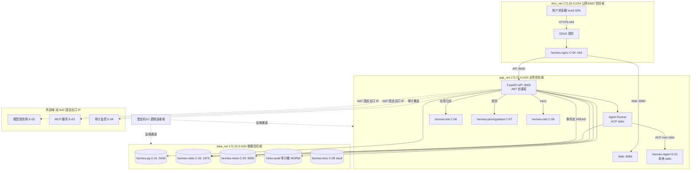
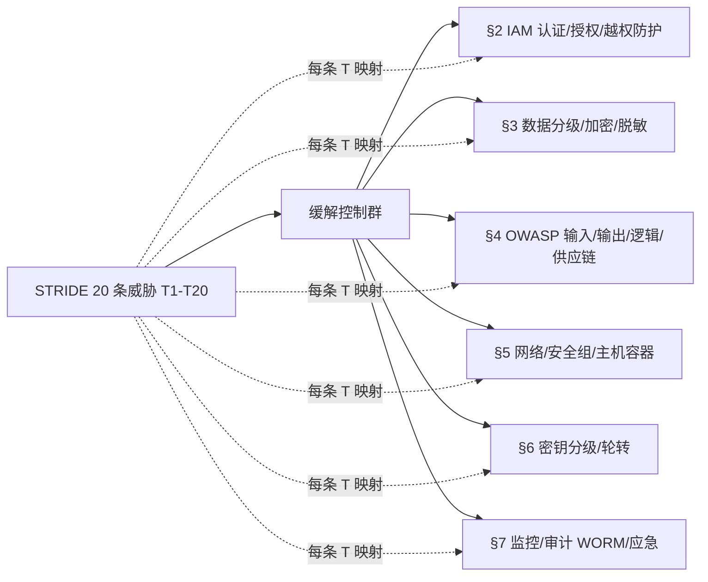

# AICoding 架构设计 · 安全设计

> 本文档为《AICoding 架构设计》核心产物之一，对应 **Gate G5**，由 security-architect（严守正）产出。
>
> 上游输入：《系统设计》（G4 已通过并冻结）—— 继承其 §3 模块边界/接口契约、§4 数据对象、§5 部署形态、§6 网络架构、§7 安全基线（§7.1 安全全景、§7.2.1~§7.2.5 认证/数据/密钥/审计/访问控制）。
> 部署侧骨架（platform-architect 毕落地，经主理人转交）：三层 Docker bridge 网络（dmz_net 172.20.0.0/24 / app_net 172.21.0.0/24 / data_net 172.22.0.0/24），资源命名 hermes-nginx / hermes-pg / hermes-redis / hermes-minio / hermes-loki / hermes-prom / hermes-grafana / hermes-otel / hermes-kms（C-09，完整版 Vault），审计不可变桶 minio-audit（WORM），日志管道 hermes-loki，安全组 sg-dmz-nginx / sg-app-api / sg-data-pg / sg-data-redis / sg-data-minio。实际端口（X3 基线）：PG :5439、Redis :1979；Nginx 443 → Web :8080 / API :8000。
> 已知陷阱（D3 §9 / §7、D2 §6）：群聊 `get_conversation` 必须校验 GroupMember 成员资格（防水平越权）；Office HTML 注入 AI prompt 前必须 `_html_to_plain_text()` 转纯文本；文件归属校验 `conversation_id` 或用户 `__file_storage__` 会话；Token 撤销 Redis 不可用时 fail-closed（拒绝已撤销 token）。
> X1 已锁定方案 B：流式 = Redis Stream + `evt:conv:{id}` + XREAD（含限流/重连续传/事件溯源）；D1 §7 PubSub `chan:conv` 废弃。运行时安全基于该机制。
> 本文档覆盖模板全部七章，STRIDE 6 类威胁全覆盖、每条映射到缓解措施；IAM 认证方式 ≥2 种；数据分级 L1~L4 齐全；OWASP Top 10 每项具体防护；密钥分级 5 类；审计日志 5 维度；应急响应 5 类事件。

---

## 1. 安全总体架构

### 1.1 安全总体架构图

> 叠加展示——信任域划分、流量入口安全产品（DDoS / Nginx / 防火墙 / 安全组）、主机与容器安全、hermes-kms / Docker Secret、堡垒机、SOC、日志服务（hermes-loki）、审计中心（minio-audit）。
> 本图以 platform-architect 三层 bridge 真实拓扑为基准：dmz_net（172.20.0.0/24）/ app_net（172.21.0.0/24，含可观测组件）/ data_net（172.22.0.0/24，含审计桶与 hermes-kms）。DevOps / 运维信任域为逻辑域（堡垒机 / CI 通道），叠加在管理访问上，不新造独立 CIDR（主理人一致性裁定 #1）。

**信任域与三层 bridge 映射**

| 信任域 | 承载组件 | 网络 / 实例 | 边界策略 |
| --- | --- | --- | --- |
| 公网 / DMZ 信任域 | 用户浏览器（Vue3 SPA）、云 DDoS 高防、hermes-nginx（C-04） | dmz_net 172.20.0.0/24 | 仅 443 入站；80→443 强制跳转；不直接访问内部 |
| 业务信任域 | Web（:8080）、FastAPI API（:8000）、Agent Runner（ACP stdio）、Hermes Agent（E-01 本地 stdio）、可观测 hermes-loki / hermes-prom / hermes-grafana / hermes-otel（C-06~C-08） | app_net 172.21.0.0/24 | 仅 DMZ 入站；出站受控（NAT 固定出口 IP） |
| 数据信任域 | hermes-pg（C-01 :5439）、hermes-redis（C-02 :1979）、hermes-minio（C-03 :9000）、minio-audit（WORM 桶）、hermes-kms（C-09，完整版 Vault） | data_net 172.22.0.0/24 | 仅 app_net 经安全组放通；禁止公网 |
| 运维 / 逻辑域 | 堡垒机、CI/CD 通道 | 叠加于管理访问（非独立 CIDR） | 仅运维通道可达 app_net / data_net |
| 外部域 | 模型提供商 E-02、MCP 服务 E-03、审计监控 E-04（webhook） | 经 NAT 固定出口 IP 白名单 | 仅白名单域名出站 |

**安全组件叠加（对齐《系统设计》§7.1）**

| 组件 | 作用 | 本系统落地 |
| --- | --- | --- |
| DDoS | 抵御流量攻击 | Nginx 限连（per-IP 100 QPS）+ 可选云高防（完整版） |
| WAF | Web 应用攻击防护 | MVP 不启用（继承 §7.1）；完整版 ModSecurity + OWASP CRS 3.3（规则见 §5.2.1，安全侧权威） |
| 云防火墙 / 安全组 | 南北向 / 东西向流量管控 | Docker 网络 ACL + 安全组 sg-*（规则见 §5.2.3，安全侧权威） |
| 主机安全 | 资产梳理 / 漏洞修补 / 恶意文件检测 | 最小化安装 + 最小镜像 + 非 root + 只读根 fs（§5.3） |
| 数据安全审计 | 加密 / 脱敏 / 审计 / 攻击防护 | t_audit_log + hermes-loki + minio-audit（§7.2） |
| hermes-kms | 敏感数据加密（密钥 / AKSK 白盒） | MVP .env / Docker Secret；完整版 HashiCorp Vault（§6，安全侧权威分级） |
| 堡垒机 | 运维通道保护 | SSH 密钥 + 运维审计（§5.2.4） |
| NAT 网关 | 隐藏内部架构 / 固定出口 | SNAT 出口；E-02 / E-03 白名单（§6.2.2《系统设计》） |
| SOC | 资产 / 端口 / 弱口令 / 云配置扫描 | Prometheus + Grafana + 告警（§7.1 / §8.4《系统设计》） |

> 图示说明：Mermaid 为可渲染的信任边界叠加图（diagrams-generator 不可用时采用，依据 agent 文件 Step 0 兜底条款）；最终交付可替换为 diagrams-generator 生成的高清 PNG/SVG 并内嵌。

### 1.2 威胁模型（STRIDE）

> 采用 STRIDE 方法，基于《系统设计》模块边界（M1~M9）、接口契约（§3.5）、身份边界（Depends(get_current_user) / require_admin / require_permission）、运行形态（ACP stdio / Redis Stream XREAD）识别 6 类威胁。每条威胁必须映射到 §2~§7 缓解措施，形成「威胁—缓解措施映射表」。

| 编号 | 威胁类别（STRIDE） | 威胁场景（映射到本系统） | 缓解措施（章节锚点） |
| --- | --- | --- | --- |
| T1 | 仿冒 Spoofing | JWT 伪造 / 重放 / 盗用，冒用他人身份调用 API | §2.1.3 短期 JWT（access 2h / refresh 7d）+ 签名校验；§2.1.3 登出 jti→jwt:blacklist（7d）；§2.1.3 Redis 不可用时 fail-closed 拒绝已撤销 token；§3.2.4 禁止 URL 携带 token |
| T2 | 仿冒 Spoofing | 服务 / 集成调用方（E-04 审计监控 webhook、CLI/SDK）伪装 | §2.1.1 认证方式② API Key 分级授权 + 可撤销 + 有限期；§3.2.4 接口签名 HMAC-SHA256 + nonce + timestamp 防重放 |
| T3 | 仿冒 Spoofing | MCP 工具服务（E-03）伪造或版本漂移 | §4.4 MCP 白名单（allowed_tools）+ version_pin 精确版本固定 + 电路熔断（M9） |
| T4 | 篡改 Tampering | 请求参数篡改（消息内容 / 权限键 / 任务状态） | §4.1 SQL 注入防护（参数化）+ §4.3 乐观锁 version 防并发篡改；§2.2.4 服务端归属校验 |
| T5 | 篡改 Tampering | 审计日志 / 数据库记录被篡改抵赖 | §7.2 t_audit_log append-only + minio-audit WORM 对象锁；§3.3.3 PostgreSQL 强一致 |
| T6 | 篡改 Tampering | Office HTML 注入 AI prompt 造成提示词篡改 / XSS | §4.1 `_html_to_plain_text()` 强制转纯文本（已知陷阱，D3 §9）；§4.1 输出编码 + CSP |
| T7 | 篡改 Tampering | Redis Stream `evt:conv` 事件被重放 / 伪造 | §7.1 消费者组 + XREAD 位点 + 事件幂等（event_id）；§4.3 幂等键 |
| T8 | 否认 Repudiation | 关键操作（删除 / 导出 / 角色变更 / 密钥变更）无审计留痕 | §7.2 业务操作审计全覆盖（覆盖率 100%，N3）+ minio-audit WORM |
| T9 | 否认 Repudiation | 运维操作（DB 操作 / 文件传输）无追溯 | §5.2.4 堡垒机全量日志（运维 / 文件传输 / DB 操作） |
| T10 | 信息泄露 Info Disclosure | 密码哈希 / AKSK / Token / 邮箱 明文泄露 | §3.1 L4 分级 + §3.3.2 argon2id 加盐哈希；§6.1 密钥分级托管 hermes-kms；§3.2.5 / §8.2 禁止明文日志；§3.3.5 展示脱敏 |
| T11 | 信息泄露 Info Disclosure | 水平越权读取他人会话 / 团队内容（IDOR） | §2.2.4 `get_conversation` 校验 GroupMember 成员资格（已知陷阱）；§2.2.2 数据级 tenant_id 行级；§4.3 每接口归属校验 |
| T12 | 信息泄露 Info Disclosure | 错误信息 / 堆栈 / SQL 暴露给客户端 | §4.2.1 统一异常（禁堆栈 / SQL / 路径）；§4.2.2 生产禁 debug/stacktrace |
| T13 | 信息泄露 Info Disclosure | 中间件（PG / Redis / MinIO）暴露公网被拖库 | §5.2.3 数据信任域仅 app_net 经 sg-data-* 放通；§5.1 data_net 禁公网 |
| T14 | 拒绝服务 DoS | DDoS / CC / 慢请求打满连接 | §5.2.1 Nginx 限连 + 全局 5000 QPS / 单 IP 100 QPS（§3.5.3）；可选云 DDoS 高防 |
| T15 | 拒绝服务 DoS | 资源耗尽（超大文件 / 超长 prompt / 慢查询） | §3.3.4 `read_upload_capped()` 大小上限；§3.5.3 消息 ≤20000；§5.2.1 限流 rl:msg；§3.3.3 PG 慢查询日志 |
| T16 | 拒绝服务 DoS | Redis Stream 积压 / 重连风暴压垮 API | §7.1 限流 + 降级轮询（BD-02）；§7.1 消费者幂等；§4.3 幂等键 |
| T17 | 权限提升 Elevation | 水平 / 垂直越权（IDOR / 非 admin 调 admin 接口） | §2.2.1 RBAC0 + 团队内容权限矩阵（governance）；§2.2.4 require_permission / require_admin 接口守卫；§2.2.4 文件归属校验（conversation_id / __file_storage__） |
| T18 | 权限提升 Elevation | 容器逃逸 / 特权提权 | §5.3.2 非 root + 只读根 fs + 禁特权容器；§5.3.2 镜像扫描 + K8s RBAC 最小化 |
| T19 | 权限提升 Elevation | Token 撤销被绕过（fail-open 接受已撤销 token） | §2.1.3 Token 撤销 Redis 不可用时 fail-closed（已知陷阱）；§2.1.3 jwt:blacklist 强校验 |
| T20 | 权限提升 Elevation | 多租户越权（MVP 单组织哨兵，完整版隔离） | §2.2.3 tenant_id 哨兵值（00000000-…）+ 查询强带；完整版物理隔离 |

> 信任边界图、敏感数据流图、威胁—缓解映射图由 diagrams-generator 生成并内嵌（不可用时以 Mermaid 渲染，见 §1.1）。威胁—缓解映射图（与 §1.2 表格同源）：

---

## 2. 身份与访问管理（IAM）

### 2.1 身份认证（Authentication）

#### 2.1.1 用户登录

- **认证方式①（人类用户）**：账号密码（argon2id 校验）→ 签发 JWT（access 2h + refresh 7d）。登录接口 `POST /api/v1/auth/login`（M7，§3.2.M7）。
- **认证方式②（服务 / 集成调用方）**：API Key 分级授权、可撤销、有限期（如 E-04 审计监控 webhook、CLI/SDK、未来开放 API）。满足「认证方式 ≥ 2 种」硬指标，且不改变《系统设计》§7.2.1「人类用户登录方式为账号密码」的冻结选择。
- **MFA / 2FA**：MVP 不启用（继承 §7.2.1）；完整版管理端 TOTP / 硬件令牌。残差风险：人类用户单因子密码，由 argon2id + fail-closed token 撤销 + 登录失败锁定 + 限流缓解（见 §2.1.2 / §2.1.3）。
- **图形验证**：MVP 登录无验证码；登录失败锁定（§2.1.2）兜底防爆破；获取敏感验证码场景（完整版）叠加图形验证。
- **注册策略**：不允许用户自行注册，仅管理员创建（`python -m app.seed` 首管理员 + 管理员创建，D1 §3），改密需原密码验证。

#### 2.1.2 密码策略（量化阈值）

| 项 | 基线值 | 落地说明 |
| --- | --- | --- |
| 最小长度 | ≥ 12 位 | 对齐 §7.2.1 |
| 复杂度 | 同时包含数字、大写字母、小写字母、特殊字符 | 注册 / 改密时服务端校验 |
| 加密传输 | 公网 TLS 1.2+（Nginx 终结 443）；内部 MVP 明文（app_net 同信任域） | 对齐 §6.2 / §7.2.2 |
| 加密存储 | argon2id 加盐哈希（不可逆） | t_user.password_hash（§4.2.2） |
| 失败锁定 | 连续失败 5 次锁定 15 分钟 | 对齐 §7.2.1 / §3.5.3 重保接口（登录 单用户 5 次/分钟 锁 15 分钟） |
| 自动登出 | access 2h 过期；refresh 7d | 对齐 §7.2.1 |
| 更换周期 | 默认 90 天提醒（可配置） | 与密钥轮转周期（§6.3）一致 |
| 重复限制 | 不允许使用最近 5 次的密码 | 密码历史表（完整版） |

#### 2.1.3 会话管理

- **Token 类型**：JWT（无状态）；**禁止 URL 携带 token**；WebSocket（圆桌）场景 token 经 `Sec-WebSocket-Protocol` 或首帧携带，SSE 场景 token 仅在 `Last-Event-ID` 重连续传握手短效使用，不得长期落入访问日志。
- **有效期**：access 2h、refresh 7d；提供续期（`/auth/refresh`）与主动注销（登出 jti → `jwt:blacklist:{jti}`，保留 7d）。
- **fail-closed**：Token 撤销校验 Redis 不可用时**拒绝已撤销 token**（已知陷阱 D3 §7 / T1 / T19）。
- **互踢机制**：MVP 单点允许（继承 §7.2.1）；完整版管理端同账号单设备互踢 + 异地登录二次验证。
- **风险登录**：异地 / 异常登录触发二次验证（完整版 MFA）。

### 2.2 授权与权限控制（Authorization）

#### 2.2.1 权限模型

默认 **RBAC0**（用户—角色—权限，平台角色 `platform_admin / admin / member`，t_role / t_role_permission），敏感场景叠加 **ABAC**（属性条件，如 HITL 澄清决策者属性、导出审批人属性）。团队内容级权限由 governance 权限矩阵（`require_permission(db, team_id, user_id, "perm.key")`）承载，组合覆盖 V1 / V2（对齐 §7.2.5）。

#### 2.2.2 权限维度

- **接口级**：API 网关统一鉴权（`Depends(get_current_user)`）+ admin 路由 `require_admin()` + 团队权限 `team_service.require_permission`；服务间 / 集成调用叠加接口签名（HMAC-SHA256，§3.2.4）。
- **数据级**：行级（tenant_id 哨兵 + team_id 归属）、列级（敏感字段脱敏，§3.3.5）。
- **功能级**：前端路由 `meta.requiresAuth` + `meta.roles` 守卫（§3.5.5《系统设计》）。

#### 2.2.3 多租户隔离

明确选择 **MVP 逻辑隔离**（tenant_id 字段预留，单组织固定哨兵值 `00000000-0000-0000-0000-000000000000`，查询强制带入，对齐 §4.1 / O3 多租户延后）；**完整版物理隔离**。《系统设计》为私有化自托管单组织，故 MVP 逻辑隔离（而非模板默认物理隔离）为已冻结选择，不重新裁决。

#### 2.2.4 越权防护

- **水平越权（IDOR）**：每个查询 / 修改接口校验资源归属——`get_conversation` 必须校验 GroupMember 成员资格（已知陷阱 D3 §9）；文件归属校验 `conversation_id` 或用户 `__file_storage__` 会话（已知陷阱 D3 §7）；任务 / 项目校验 team_id 归属。
- **垂直越权**：RBAC + 接口拦截器双层校验（require_admin 守卫管理端）；权限矩阵键必须注册于 governance.PERMISSIONS，未注册键拒绝（§3.2.M4）。
- **Token 撤销越权**：fail-closed（§2.1.3 / T19）。

### 2.3 云账号与云资源访问

> MVP 为私有化自托管（Docker Compose 单主机），无云主账号；下述为完整版上云时的权威约束。

#### 2.3.1 账号策略

完整版使用子账号访问，禁止直接使用主账号，禁止为主账号创建访问密钥。

#### 2.3.2 权限分离

人员权限（SSH 密钥 + 堡垒机）与服务权限（AKSK / Token，应用调用 hermes-kms）分离。

#### 2.3.3 高敏权限分离

密钥变更 / 用户角色变更 / 批量导出等高敏操作需二次验证（MFA / 短信），与管理日常操作隔离。

---

## 3. 数据安全

### 3.1 数据分级

| 等级 | 类别 | 示例（本系统） | 处理策略 |
| --- | --- | --- | --- |
| L1 | 公开 | 产品/团队公开名、公开 API 文档 | 无特殊管控 |
| L2 | 内部 | 消息内容、项目、任务、知识库文本 | 加密传输、需鉴权访问、审计授权可查（§7.2.2 敏感字段表：消息内容 L2 明文完整展示） |
| L3 | 敏感 | 邮箱、显示名 | 加密传输、加密存储、展示脱敏（邮箱中间 * 屏蔽）、导出需审批 + 脱敏 |
| L4 | 高敏 | 密码哈希、AKSK、Token、API Key | 基于 hermes-kms 加密 / Docker Secret、强脱敏（仅展示后 4 位）、严格审计、禁止导出 |

### 3.2 数据传输安全

#### 3.2.1 公网访问

全链路 HTTPS / TLS 1.2+，Nginx（hermes-nginx）443 终结，禁用 SSLv3 / TLS 1.0 / 1.1（对齐 §7.2.2）。

#### 3.2.2 服务内部访问

- MVP：app_net / data_net 同信任域内部明文（继承 §7.2.2「内部同信任域明文」）；
- 高敏跨域 / 完整版：mTLS 双向证书认证（§6.3《系统设计》）。

#### 3.2.3 数据库连接

- hermes-pg（C-01，实际 :5439）：启用 SSL（MySQL/MongoDB 内置功能类比 PG `ssl mode=require`）；
- hermes-redis（C-02，实际 :1979）：启用 ACL + 密码（Docker 实际启用密码，D3 §9 X3）；
- 端口号属部署侧权威（5439 / 1979），本设计仅定义「开放哪些端口、对谁开放」（§5.2.3）。

#### 3.2.4 接口签名

服务间 / 集成调用（API Key 调用方、E-04 webhook）采用 **HMAC-SHA256 + nonce + timestamp 防重放**：服务端校验 timestamp 窗口（如 ±5min）、nonce 一次性、签名 = HMAC(secret, method+path+body+timestamp+nonce)。

#### 3.2.5 传参禁忌

- **禁止 URL 携带 token / AKSK / 手机号等敏感信息**；GET 不传递敏感参数；
- 敏感操作走 POST + Body + TLS；SSE 重连续传仅以 `Last-Event-ID`（位点）握手，token 短效且不得落入 Nginx 访问日志。

### 3.3 数据存储安全

#### 3.3.1 加密存储（仅敏感数据需要）

- **对称加密**：AES-256（业务侧敏感字段，如 L4 字段落库前加密）；
- **非对称加密**：RSA（密钥交换 / 签名）；
- **落盘加密**：MinIO（hermes-minio）SSE；高敏数据完整版客户端加密（CSE）；
- **密钥管理**：hermes-kms 托管（MVP .env / Docker Secret → 完整版 HashiCorp Vault），**禁止硬编码到代码或配置文件**（§6.3）。

#### 3.3.2 敏感字段单向哈希加盐

密码、token 摘要等不可逆字段使用 argon2id 加盐哈希（t_user.password_hash，§4.2.2）；API Key 摘要存储，明文仅创建时返回一次。

#### 3.3.3 数据库安全

- 账号最小权限；**禁止业务直连 root**；运维使用独立账号；
- 开启慢查询日志、审计日志（独立）；日志独立存储到 hermes-loki / minio-audit；
- 启用 SSL 连接（hermes-pg :5439）、备份加密。

#### 3.3.4 文件存储安全

- MinIO（hermes-minio :9000）启用服务端加密（SSE）；
- 私有桶 + 预签名 URL（短有效期，如 15min）；
- 防盗链（Referer 校验）；
- 上传文件病毒扫描 / 类型校验（魔数 + 扩展名 + 大小，`read_upload_capped()` 限大小，D3 §5）；随机重命名 + 隔离存储桶；
- Office 文件经 `process_upload()` / `_html_to_plain_text()` 转纯文本后再注入 AI prompt（已知陷阱 T6）。

#### 3.3.5 数据使用安全

- **展示脱敏**：邮箱 `u***@domain.com` 中间屏蔽；AKSK / Token 仅展示后 4 位；密码永不展示；
- **数据导出管控**：导出审批流（管理员）+ 水印（操作人 + 时间）+ 行数限制 + 操作审计（§7.2）；敏感字段导出强制脱敏；
- **数据销毁**：逻辑删除（`deleted` 软删，§4.1）+ 定期物理清理（T+180 天，§4.2.1 扩展逻辑）；过期数据清理策略明确。

#### 3.3.6 数据备份与异地容灾

| 存储类型 | 备份策略 | RPO / RTO |
| --- | --- | --- |
| hermes-pg（PG） | 周期性备份（base + WAL），跨地域备份至 MinIO / 外部 | RPO ≤ 5min，RTO ≤ 15min（§5.3 / §8.4《系统设计》） |
| hermes-redis（Redis） | RDB + AOF | 按 RPO 选择性异地 |
| hermes-minio（MinIO） | 版本控制开启 + 跨地域复制；minio-audit WORM | 对齐 §5.3 |

#### 3.3.7 隐私合规

- 个人信息保护（GDPR、《个人信息保护法》、《数据安全法》）：本系统为私有化自托管（D1 §17），数据驻留硬约束，无跨境业务，**数据出境合规评估不适用**；
- 用户同意机制（隐私政策 + 用户明示同意）；数据最小化采集；可被遗忘权（数据删除请求处理流程 → 逻辑删除 + T+180 物理清理，§3.3.5）；
- **合规框架适用范围裁定**：本系统自托管单组织，适用《个人信息保护法》《数据安全法》基线要求（审计留痕、数据最小化、被遗忘权），不涉及 GDPR 跨境传输条款、不绑定外部认证体系。该范围为已冻结业务定位（D1 §1 自托管）直接支撑，非新引入跨界感知决策。

---

## 4. 应用安全（OWASP Top 10）

> 每项针对本系统实际接口 / 模块给出具体防护，非泛化表述。

### 4.1 输入安全

| 风险（OWASP 2021） | 具体防护措施（映射本系统） |
| --- | --- |
| A03 Injection / SQL 注入 | 强制参数化查询（SQLAlchemy 2.0 async ORM 参数绑定，禁止字符串拼接）；动态字段（order by / group by）使用白名单模版校验；`content` 字段长度 ≤ 20000 服务端校验 |
| A03 / XSS | 输出编码（HTML / JS / URL）+ CSP 策略 + Cookie HttpOnly + Secure；Office HTML 注入 prompt 前 `_html_to_plain_text()` 转纯文本（已知陷阱 T6）；Markdown 渲染零依赖且输出转义（D2 §8） |
| A01 Broken Access Control / CSRF | 无状态 JWT 鉴权 + SameSite=Strict/Lax Cookie 策略；关键操作（删除 / 导出 / 密钥变更）二次验证（§4.3.5）；管理端操作 require_admin |
| A03 命令注入 | 系统禁用动态命令执行；Agent Runner 经 ACP over stdio 以受控参数数组驱动 Hermes Agent，禁止拼接 shell |
| A08 反序列化 | 禁危险反序列化（fastjson autoType / Jackson @class）；Pydantic 严格模型校验入参（D2 §5） |
| A10 SSRF | 模型提供商 E-02 / MCP E-03 仅 NAT 固定出口 IP 白名单域名出站；URL 白名单 + 内网 IP 黑名单（127.0.0.0/8、10/8、172.16/12、192.168/16 拒绝） |
| 文件上传 | 类型校验 + 扩展名白名单 + 大小限制（`read_upload_capped()`）+ 随机重命名 + 隔离桶（hermes-minio）；魔数校验防伪装 |
| XXE | 关闭 XML 外部实体解析（DTD）；不使用 XML 解析不可信输入 |
| 开放重定向 | 跳转 URL 白名单（仅站内 / 已注册回调域名） |

### 4.2 输出安全

#### 4.2.1 统一异常处理

错误码及信息提示统一走 `Result[T]`（code / msg / data / trace_id，§3.5.1），**禁止暴露堆栈、SQL、内部路径**；对外仅返回业务语义错误（A0xxxx / C4xx）。

#### 4.2.2 调试信息

调试信息（debug、stacktrace）严禁出现在生产环境响应中；生产 `DEBUG=false`，异常详情仅入 hermes-loki（脱敏后）。

### 4.3 业务逻辑安全

#### 4.3.1 越权防护

水平越权（IDOR）每接口必检（§2.2.4）：`get_conversation` 校验 GroupMember、文件归属 `conversation_id` / `__file_storage__`；垂直越权由 RBAC + `require_admin` / `require_permission` 双层拦截。

#### 4.3.2 防刷防爬

限流三维度（IP / 用户 / 接口）对齐 §3.5.3：单 IP 100 QPS、单用户 50 QPS、单租户 1000 QPS、全局 5000 QPS；登录重保 单用户 5 次/分钟 锁 15 分钟；滑动验证码 / 设备指纹（完整版）。

#### 4.3.3 防薅羊毛

风控规则 + 黑名单 + 行为分析（结合 SOC 告警 AL-07）；MVP 以限流 + 频率管控兜底，完整版接入行为分析。

#### 4.3.4 幂等性

防重复提交：写接口 `X-Idempotency-Key`（UUID，Redis `idem:{uuid}` 保留 24h）+ 业务侧 `biz_req_no` + 更新类 `version` 乐观锁（§3.5.2 / §3.2.M2）；Redis Stream 消费者以 message ID 去重、Agent 会话级幂等（§3.2.M8）。

#### 4.3.5 关键业务二次验证

删除、批量导出、密钥变更、用户角色变更、HITL 澄清 approve/edit 等需二次验证（MFA / 短信 / 复核人），对齐 §2.3.3。

### 4.4 第三方与供应链安全

- 第三方组件漏洞扫描（CICD 强制门禁，失败阻断合并）；SBOM 生成；
- 开源协议合规审查（GPL / AGPL 商业风险，D1 §17 内部项目私有使用）；
- 第三方服务接入安全评估：模型提供商 E-02 / MCP E-03 数据传输 TLS、存储位置、合规资质；MCP 仅白名单 + version_pin 固定版本 + 电路熔断（§3.2.M9）；
- 供应商安全管理：合同含数据保护与审计条款；定期复评；
- 镜像源 / NPM 仓库使用内网镜像 + 白名单，避免投毒；镜像扫描（§5.3.2）。

---

## 5. 网络与基础设施安全

### 5.1 网络分区

> 以 platform-architect 三层 bridge 真实拓扑为基准（主理人一致性裁定 #1），不新造 DevOps VPC 的 CIDR；可观测组件（hermes-loki / hermes-prom / hermes-grafana / hermes-otel）位于 **app_net 172.21.0.0/24**，并非独立网络。DevOps / 运维为逻辑域（堡垒机 / CI 通道），叠加在管理访问上。

- **dmz_net（172.20.0.0/24，对外暴露）**：仅 hermes-nginx（C-04），仅 443 入站（80→443 强制跳转），TLS 终结；不直接访问内部中间件。
- **app_net（172.21.0.0/24，业务信任域）**：Web（:8080）/ API（:8000）/ Agent Runner / Hermes Agent（E-01 本地 stdio）/ hermes-loki（C-06）/ hermes-prom+grafana（C-07）/ hermes-otel（C-08）。
- **data_net（172.22.0.0/24，数据信任域）**：hermes-pg（C-01 :5439）/ hermes-redis（C-02 :1979）/ hermes-minio（C-03 :9000）/ minio-audit（WORM 审计桶）/ hermes-kms（C-09，完整版 Vault）。
- **三层 CIDR 不重叠**；容器 CIDR 与 bridge 网络不冲突（由 platform-architect 在 Docker Compose 固化）。
- **data_net 与公网**：仅经 Nginx 入、NAT 出；中间件禁止公网暴露（T13）。
- **运维逻辑域**：堡垒机 / CI 经管理通道访问 app_net / data_net，不引入独立 CIDR。

### 5.2 流量管控（南北向 + 东西向）

#### 5.2.1 公网入口防护（安全侧权威：WAF / DDoS 规则）

- **DDoS 高防**：流量清洗，业务侧不感知；MVP 由 Nginx 限连兜底（`limit_conn` + `limit_req`，全局 5000 QPS / 单 IP 100 QPS，对齐 §3.5.3）。
- **WAF（安全侧权威规则规范，完整版启用 ModSecurity + OWASP CRS 3.3）**：
  - 启用 OWASP CRS 基础规则集，拦截 SQLi / XSS / 命令注入 / 路径遍历 / SSRF 特征；
  - 自定义规则：拦截含 `<script>` / `javascript:` / `eval(` 的请求体；限制请求体大小（≤ 2 MB，对齐 `read_upload_capped()` 上限）；限制 URL 长度（≤ 2048）；
  - **MVP 模式**：继承《系统设计》§7.1「WAF 否（轻量）」——不部署 WAF，残差风险以 §4 应用层 OWASP 防护 + Nginx 限流兜底（见 §5.2 备注）；**完整版模式**：Blocking。
- **CLB / Nginx（hermes-nginx）**：仅暴露 443（HTTPS，TLS 1.2+），80 强制跳 443；启用 HTTP/2；入口 → Web :8080 / API :8000（内部明文 MVP）。

#### 5.2.2 网络边界防护

- 云防火墙 / ACL：互联网边界墙 + NAT 边界墙 + 入侵防御开启；东西向默认拒绝 + 显式放通（sg-* 细则见 §5.2.3）。

#### 5.2.3 主机流量防护（安全侧权威：安全组规则）

> 端口号（5439 / 1979 / 9000 / 8080 / 8000）属部署侧权威（X3 基线），本设计仅定义「开放哪些端口、对谁开放」与 deny-all 细则，并引用 sg-* 命名。

- **默认策略**：deny-all + 显式放通；**禁止 0.0.0.0/0 开放 22 / 23 / 5439 / 1979 / 9000 等敏感端口**（仅经安全组对特定源放通）。
- **sg-dmz-nginx**：入站放通 443（公网）；出站放通 app_net 的 Web :8080 与 API :8000。
- **sg-app-api**：入站放通来自 dmz_net（hermes-nginx）的 :8080 / :8000；出站放通 data_net 的 hermes-pg :5439、hermes-redis :1979、hermes-minio :9000；出站放通 NAT 固定出口 IP 至 E-02 / E-03。
- **sg-data-pg**：入站仅放通来自 app_net 的 :5439（hermes-pg）；其余全部拒绝；禁止公网 / dmz_net 直连。
- **sg-data-redis**：入站仅放通来自 app_net 的 :1979（hermes-redis，启用 ACL + 密码）；其余拒绝。
- **sg-data-minio**：入站仅放通来自 app_net 的 :9000（hermes-minio，私有桶 + 预签名 URL）；审计桶 minio-audit 仅内部写入（t_audit_log → minio-audit WORM）；其余拒绝。

#### 5.2.4 运维通道防护

- 堡垒机：运维日志 / 文件传输日志 / DB 操作日志全量记录；SSH 密钥登录，禁用密码登录；CI 通道经同一逻辑运维域，凭证由 hermes-kms 下发。

### 5.3 主机与容器安全

#### 5.3.1 主机安全（Docker Host C-05）

- 最小化安装、关闭非必要服务、定期补丁；
- 账号管控：**严禁 root 远程登录**，运维使用独立账号；
- 登录：**优先 SSH 密钥登录（密钥对）**，密码登录仅作兜底；
- 主机安全组件（完整版）：漏洞扫描、木马查杀、密码破解阻断（对齐 §7.1 主机安全）。

#### 5.3.2 容器 / K8s 安全

- 非 root 运行 + 只读根文件系统（对齐 §7.1 容器安全）；
- 镜像扫描（漏洞 / 敏感信息），CI 门禁阻断含高危漏洞 / 硬编码密钥的镜像；
- **不在镜像中打包密钥**；通过 hermes-kms / Docker Secret 运行时下发（§6.1）；
- 禁止特权容器、高权限容器；如需特殊权限需显式配置并评审；
- 完整版 K8s：RBAC 最小化 + NetworkPolicy 隔离命名空间 + Pod 安全策略 + 异常进程 / 容器逃逸检测。

---

## 6. 密钥与凭证管理

> 密钥分级（5 类）、访问控制、轮转周期为安全侧权威项；KMS / Vault 选型与基础部署为 platform-architect 权威（hermes-kms C-09）。本设计定义分级 / 轮转 / 访问策略并引用 hermes-kms。

### 6.1 密钥分级与存储（5 类）

| 密钥类型 | 分级 | 存储 / 管理方式（引用 hermes-kms） | 访问策略 |
| --- | --- | --- | --- |
| 数据库密码（hermes-pg :5439） | L4 | MVP Docker Secret / .env（R-Sec-001）→ 完整版 hermes-kms（HashiCorp Vault） | 仅 sg-data-pg / sg-app-api 内应用读取；禁止日志 |
| 云 AKSK（模型 E-02 / MCP E-03 / MinIO） | L4 | hermes-kms 白盒密钥 + Vault 动态获取（§6.2） | 按业务 / 环境隔离签发；最小权限 |
| 服务间通信密钥（API ↔ Runner、E-04 webhook） | L3 | hermes-kms / Vault；API Key 分级 | 签名 HMAC-SHA256 + nonce + timestamp（§3.2.4） |
| 用户密码 | L4 | argon2id 加盐哈希（不可逆，t_user.password_hash） | 永不明文；仅校验不读取 |
| API Key / Token（JWT / 集成 Key） | L4 | 分级授权、可撤销、有限期；jwt:blacklist 撤销 | 仅展示后 4 位；泄露即轮换（§6.3） |

### 6.2 AKSK 泄露防护

#### 6.2.1 方案 A：KMS 白盒密钥（推荐，安全侧权威）

使用 hermes-kms 白盒密钥功能加密 SecretId / SecretKey（或 Vault 动态短期凭证）；业务模块经 hermes-kms SDK 解密 / 获取凭据，避免长期 AKSK 驻留。

#### 6.2.2 方案 B：CAM 策略限制（完整版）

通过云 CAM 权限策略绑定资源访问权限，收敛 AKSK 作用域；MVP 自托管无 CAM，以 Docker Secret 隔离 + 最小权限替代。

### 6.3 密钥使用红线

- **严禁** AKSK / 数据库密码 / Token 出现在源码、Git 仓库、前端代码、日志（§8.2 禁敏感字段）、错误堆栈、URL、配置明文；
- **禁止**多业务共用同一对 AKSK；按业务 / 环境隔离签发；
- 上线前必须通过代码扫描（CICD 红线拦截）+ 镜像扫描（§5.3.2），识别硬编码密钥；
- AKSK 一旦疑似泄露，立即在 hermes-kms / Vault 禁用并轮换；事后排查访问日志确认影响面；
- 每一对 AKSK 明确所有人、用途、存储位置、轮换日期；**轮换周期 90 天**（与密码更换周期一致，§2.1.2），无需停机；上线 checklist 含「密钥扫描通过」项。

---

## 7. 运行时安全：监控、审计、应急

### 7.1 安全事件监控

- **入侵检测（IDS / IPS）**：主机安全告警、WAF 攻击日志（完整版）、SOC 告警（Prometheus + Grafana，AL-01~AL-08，§8.4《系统设计》）；
- **敏感操作**：数据导出、批量删除、密钥变更、用户角色变更 → t_audit_log 全覆盖（§7.2）；
- **登录异常**：异地登录、连续失败（§2.1.2 锁定）、夜间登录、非常用设备；
- **权限异常**：越权请求（require_permission 拒绝计数）、敏感接口高频调用、非常规权限提升（fail-closed 触发）。

### 7.2 审计日志

> 5 维度审计（云资源 / 业务操作 / 数据库 / 堡垒机 / WAF），安全侧权威定义字段与保留期；引用 hermes-loki（R-O-003 日志管道）与 minio-audit（R-S-006 / R-Sec-004 WORM 不可变桶）。保留期对齐《系统设计》§7.2.4 ≥ 1 年（R-S-006）。

| 维度 | 审计字段（必含） | 存储 / 管道 | 保留期 |
| --- | --- | --- | --- |
| 云资源 / 基础设施审计 | 事件名称、区域 / 主机、时间、事件源、源 IP、操作者、资源 ID | hermes-loki（Docker Host C-05 / 容器生命周期 / 资源变更） | 90 天热 + 1 年冷 |
| 业务操作审计 | 操作者（actor_type/user/agent/system）、时间、来源 IP、事件名称、资源类型、资源 ID、读写类型、结果、扩展字段 | t_audit_log → hermes-loki + minio-audit（WORM） | ≥ 1 年（R-S-006，不可篡改） |
| 数据库审计 | SQL、执行人、客户端 IP、时间、影响行数 | hermes-pg 审计（pgaudit 或 app 层）→ hermes-loki | ≥ 1 年 |
| 堡垒机日志 | 主机 / 数据库运维日志、文件传输日志、操作者、时间 | 堡垒机 → hermes-loki | ≥ 1 年 |
| WAF / 防火墙日志 | 攻击日志、访问日志、拦截记录 | Nginx access（MVP）/ ModSecurity audit（完整版）→ hermes-loki | 90 天热 + 1 年冷 |

- **不可篡改保障**：t_audit_log append-only（无 UPDATE / DELETE，仅软标记，§3.2.M6）+ minio-audit WORM 对象锁（R-Sec-004）；与业务存储隔离（独立桶）；
- **结构化日志规范**：所有日志含 `traceId` + `tenantId`（哨兵值，§8.2.1《系统设计》）+ 禁止打印敏感字段明文（§7.2.2）；
- **查询与告警**：审计管理端 `/audit/logs` + `/audit/alerts`（M6），对接 SOC 告警。

### 7.3 应急响应

- **应急预案（5 类事件）**：
  1. **漏洞响应**：接收到漏洞通报 → 评级（CVSS）→ CICD 门禁阻断含漏洞版本 → 热修 / 回滚 → 复盘；高危 24h 内响应（P0/P1，AL-01~AL-03）；
  2. **数据泄露**：判定泄露范围（t_audit_log + minio-audit 溯源）→ 隔离受影响组件（sg-* 收紧）→ 强制轮换相关密钥（§6.3）→ 通知合规方 + 用户（个保法）；
  3. **被攻击（DDoS / 爆破 / 越权尝试）**：启用云 DDoS 高防（完整版）/ Nginx 限流升级 → 封禁攻击 IP（§5.2.3）→ fail-closed 收紧 token 撤销 → 溯源；
  4. **密钥泄露**：hermes-kms / Vault 立即禁用并轮换 AKSK / API Key（§6.3）→ 排查 jwt:blacklist 与访问日志 → 吊销已签发 token；
  5. **勒索病毒**：隔离主机（Docker Host C-05）→ 从跨地域备份恢复（§3.3.6 RPO ≤ 5min / RTO ≤ 15min）→ 密钥重建 → 演练复盘；
- **备份与恢复**：明确 RPO / RTO（§3.3.6 / §5.3 / §8.4《系统设计》）；**每年 ≥ 1 次灾备演练**（R-S 系列要求）。

---

## 附录：阶段内自检报告（中间确认协议 §2.4）

> 按协议在 §1 / §2 / §3 / §6 关键章节完成后各插入一次自检（先 §2.1 判定，再 §2.3 反向验证 3 问）。本报告为 G5 审核弹窗追溯材料。

### A.1 自检节点 1 — §1 威胁建模（STRIDE）后

- **§2.1 方案分歧判定**：STRIDE 20 条威胁（T1~T20）全部映射到《系统设计》既有模块 / 接口 / 已知陷阱（get_conversation GroupMember、Office HTML、文件归属、fail-closed token、Redis Stream XREAD），无 ≥2 种待用户裁决的方案分歧；威胁识别方法（STRIDE）为专业裁决且有上游支撑。**判定：未命中阻塞触发**。
- **§2.3 反向验证 3 问**：
  - Q1（返工成本）：返工范围 = §1.2 表格 + 3 张图；切换成本 = 低（纯文档，若推翻约 0.5 人天）。
  - Q2（用户感知）：威胁建模不直接改变用户可见产品行为；结论「感知不到」。
  - Q3（与诉求一致）：引用《系统设计》已知陷阱（D3 §9 / §7）与 X1 方案 B（Redis Stream XREAD）；一致。
- **结论**：不发起 [中间确认]。

### A.2 自检节点 2 — §2 IAM 后

- **§2.1 方案分歧判定**：认证方式①账号密码 + ②API Key（满足 ≥2 种硬指标）不冲突《系统设计》§7.2.1「人类用户登录为账号密码」冻结选择（API Key 为服务/集成调用机制）；MFA / 多租户隔离均继承 §7.2.1 / O3 冻结选择。**判定：未命中阻塞触发**。
- **§2.3 反向验证 3 问**：
  - Q1（返工成本）：返工范围 = §2 整章；切换成本 = 低（若改 RBAC 模型约 1 人周，但本设计继承冻结基线不推翻）。
  - Q2（用户感知）：RBAC + 团队矩阵决定前端权限交互，但由上游冻结；结论「感知不到新偏差」。
  - Q3（与诉求一致）：引用用户诉求②（真人成员与 AI Agent 角色权限边界）、§7.2.5（RBAC0 + 团队矩阵）；一致。
- **结论**：不发起 [中间确认]；认证方式 ≥2 以「账号密码 + API Key」满足，未改变冻结的人类登录方式。

### A.3 自检节点 3 — §3 数据安全后

- **§2.1 方案分歧判定**：数据分级 L1~L4、传输 / 存储加密、脱敏、备份容灾均对齐 §7.2.2 冻结基线；隐私合规范围（自托管无跨境，GDPR 跨境条款不适用）由业务定位（D1 §1 自托管）直接支撑。**判定：未命中阻塞触发**。
- **§2.3 反向验证 3 问**：
  - Q1（返工成本）：返工范围 = §3 整章 + 数据库敏感字段处理；切换成本 = 中（若改加密层级需改存储与接口，约 1 人周）。
  - Q2（用户感知）：加密 / 脱敏不直接暴露给用户，但个保法基线属合规属性；结论「监管侧合规属性一致，无新感知偏差」。
  - Q3（与诉求一致）：引用 §7.2.2 敏感字段清单（密码 L4 / 邮箱 L3 / AKSK Token L4 / 消息 L2）；一致。
- **结论**：不发起 [中间确认]。

### A.4 自检节点 4 — §6 密钥与凭证管理后（最后一次完整复核）

- **§2.1 方案分歧判定**：密钥 5 类分级、轮转周期 90 天、AKSK 白盒（方案 A）均为安全侧权威项；KMS 选型（hermes-kms / Vault）引用 platform-architect 部署侧实例，未越界。**判定：未命中阻塞触发**。
- **§2.3 反向验证 3 问**：
  - Q1（返工成本）：返工范围 = §6 整章 + 密钥引用；切换成本 = 中（若改 KMS 供应商约 1 人月，但本设计仅定义分级/轮转，选型交部署侧）。
  - Q2（用户感知）：密钥管理不直接暴露给用户；结论「感知不到」。
  - Q3（与诉求一致）：引用 §7.2.3 密钥与凭证基线（存储 .env/Docker Secret、轮换 90 天、红线）；一致；并引用 hermes-kms（R-Sec-001）/ minio-audit（R-Sec-004）/ hermes-loki（R-O-003）/ sg-*（R-Sec-002）与主理人裁定 #2 对齐。
- **结论**：不发起 [中间确认]。

### A.5 总体声明

- 四个自检节点（§1 / §2 / §3 / §6）均未命中协议 §2.1 / §2.2 阻塞触发，均完成 §2.3 反向验证 3 问并附证据；本阶段未发起任何 [中间确认]。
- 网络分区（§5.1）严格以 platform-architect 三层 bridge 真实拓扑回填（dmz_net / app_net / data_net，含 hermes-* 命名与 X3 端口 5439 / 1979），并按主理人裁定 #1 将可观测组件置于 app_net、DevOps 作为逻辑运维域；安全组 / WAF / 密钥分级 / 审计保留期均按安全侧权威定义并引用部署侧命名。
- 全文硬指标自查：STRIDE 6 类全覆盖（T1~T20，每条映射缓解）；认证方式 ≥2（账号密码 + API Key）；数据分级 L1~L4 齐全；OWASP Top 10 每项具体防护（非泛化）；密钥分级 5 类；审计 5 维度；应急 5 类事件；无残留占位符。
