# AICoding 架构设计 · 系统设计

> 本文档为《AICoding 架构设计》核心产物之一，对应**系统设计**阶段（Phase 4，Gate G4）。
> 上游输入：《高层架构设计》（G3 已通过并冻结）产出的业务边界、角色场景、MVP 范围（F1~F10）、模块全景（§6.2）、系统定位（§4.2）、三层业务架构（§5.1）、业务闭环（§5.3）。
> 下游输出：用于驱动《部署设计》《安全设计》《UserStory》的实施。
> 关键冻结继承：X1 流式机制已锁定方案 B（Redis Stream + evt:conv:{id} + XREAD，含限流/重连续传/事件溯源）；技术栈按项目实际（FastAPI + Python 3.11+ / SQLAlchemy 2.0 async / PostgreSQL 16 / Redis 7 / MinIO / Vue3+TS+Pinia+Naive UI / Hermes Agent via ACP over stdio）；MVP 单组织单实例，tenant_id 字段预留。

---

## 0. 元信息：修订记录

| 文档版本 | 发布日期 | 修订人 | 修订说明 |
| --- | --- | --- | --- |
| v1.0 | 2026-07-21 | 高见远（system-architect） | 初稿（八章 + 模块五段式 + 附录 C 自检报告），继承 G3 冻结边界 |

**填写要求**：每次评审通过新增一行；修订说明必须能定位到具体章节。

**未启用章节说明**：
- §4.5 数据迁移与兼容性：本期为既有 hermes-agent 仓库的能力扩展，表结构通过 Alembic 手写迁移增量演进（D2 §5 / D3 §4），无跨系统存量数据迁移、停机全量迁移 / 双写 / 灰度切流需求，故 §4.5 仅保留「无存量迁移」声明，不展开迁移计划表。

---

## 1. 引言

### 1.1 文档目标

- **一句话定位**：本文档定义 Hermes Infi WebUI（真人团队 × AI Agent 协作平台）在交付物中的所有架构设计相关产物。
- **读者对象**：架构师 / 开发 / 运维 / 安全 / 评审委员会。
- **设计范围**：业务架构 + 应用架构 + 数据库设计 + 部署架构 + 网络架构 + 安全设计 + 可观测设计。

### 1.2 关联文档清单

| 输入类型 | 内容要点 | 在本文档中的用途 | 形式（外部文档 / 本文档自带） |
| --- | --- | --- | --- |
| 业务需求 | 业务定位、角色、场景、关键流程、MVP 边界（F1~F10）、三层业务架构 | 第 2 章业务架构 | 外部文档《高层架构设计》§1~§6 |
| 非功能性需求 | QPS/并发/数据量/可用性/RTO/RPO/合规等级（N1~N3） | 第 3.5 / 5 / 7 / 8 章 | 外部文档《高层架构设计》§6.1（N1~N3） |
| 系统定位与边界 | 私有化自托管、单组织单实例、多租户延后 | 第 3.1 集成架构 / 第 4.1 隔离字段 | 外部文档《高层架构设计》§4.2 |
| 外部系统 API | Hermes Agent（ACP）/ 模型提供商 / MCP 工具 / 审计监控系统 | 第 3.1.3 / 3.2 模块 | 外部文档 material_digest.md（D1~D4） |
| 云组件 / 中间件清单 | PostgreSQL 16 / Redis 7 / MinIO / Docker Compose / 日志监控链路 | 第 3.1.3 / 4.3 / 5 / 8 章 | 外部文档 material_digest.md（D1 §2 / D2 §5） |
| 团队 / 行业规范 | 4 层单向架构、UUID 主键、手写 Alembic、RBAC/治理、Redis 键约定 | 第 3.1.4 / 4.1 / 7 章 | 外部文档 material_digest.md（D2 §5 / D3 §4 / D2 §7） |

### 1.3 名词与术语表

| 业务术语 | 业务定义（≤ 30 字） | 应用层核心对象（§3.3 O-xx） | 数据库表名（§4.2） |
| --- | --- | --- | --- |
| 团队 | 多角色协作的组织单元，承载成员与权限 | O-01 Team | t_team |
| 成员 | 团队内的真人用户，具角色与权限 | O-02 User / O-03 TeamMember | t_user / t_team_member |
| 会话 | 多角色共享的对话容器，可含真人与 Agent | O-04 Conversation | t_conversation |
| 消息 | 会话内的单条内容，带归属标签 | O-05 Message | t_message |
| 分叉 | 从消息任意节点派生新会话分支 | O-06 ConversationFork | t_conversation_fork |
| 项目 | 任务的组织容器 | O-07 Project | t_project |
| 任务 | 待分配与追踪的工作项 | O-08 Task | t_task |
| 助手 / Agent 配置 | Agent 的 profile 配置（助手） | O-09 AgentProfile | t_agent_profile |
| 圆桌 | 多真人与多 Agent 同屏编排会话 | O-10 Roundtable | t_roundtable |
| 澄清请求 | Agent 等待真人裁决的 HITL 请求 | O-11 ClarifyRequest | t_clarify_request |
| 权限授予 | 团队内容级权限矩阵记录 | O-12 TeamPermissionGrant | t_team_permission_grant |
| 审计日志 | 不可变关键操作留痕 | O-13 AuditLog | t_audit_log |
| 事件游标 | 断线重连续传位点（Last-Event-ID） | O-14 EventCursor | t_event_cursor |
| MCP 服务 | 接入的工具 / 数据服务注册项 | O-15 McpServer | t_mcp_server |

---

## 2. 业务架构

> **本章回答**：系统服务什么业务、业务由哪些场景构成、业务的关键流程长什么样。
> **本章不回答**：用什么技术、怎么部署、表怎么建。

### 2.1 业务架构概览

#### 2.1.1 业务全景图

**业务域清单**（7 个，与第 3 章模块、第 4 章数据库分组严格一致）：

| 业务域 | 核心场景 | 涉及角色 | 与其他业务域的关系 |
| --- | --- | --- | --- |
| 团队协作域 | 团队创建 / 邀请 / RBAC 角色矩阵 | 团队管理员 / 成员 | 上游：身份底座；下游：会话/任务/编排/权限域依赖其成员与角色 |
| 会话域 | 多角色共享对话 / 分叉 / 导出 / 智能追问 | 成员 / Agent | 上游：团队协作域；下游：编排域（发起圆桌）、审计域（归属标签） |
| 任务域 | 项目 + 任务分配 / 状态追踪 | 成员 / 管理员 | 上游：会话域（会话内派任务）；下游：编排域（任务驱动 Agent） |
| Agent 编排域 | 圆桌多 Agent 编排（ACP + WS）/ MCP 工具接入 | 成员 / Agent 运营方 | 上游：会话/任务域；依赖：ACP 调度层、MCP 接入；下游：权限 HITL 域 |
| 权限与 HITL 域 | 团队内容权限矩阵 + HITL 澄清四决策契约 | 成员 / Agent 运营方 / 管理员 | 上游：团队协作域（角色）；被编排域调用做澄清裁决 |
| 实时协同域 | presence / typing / members_changed 实时事件 | 成员 / Agent | 上游：会话域（事件上下文）；底层：事件消息底座（Redis Stream） |
| 审计域 | 消息归属标签 + 不可变审计 trail + 查询告警 | 合规方 / 管理员 | 上游：会话/编排/权限域（事件溯源）；独立闭环，仅被审计管理端消费 |

**业务全景 Mermaid 图**：

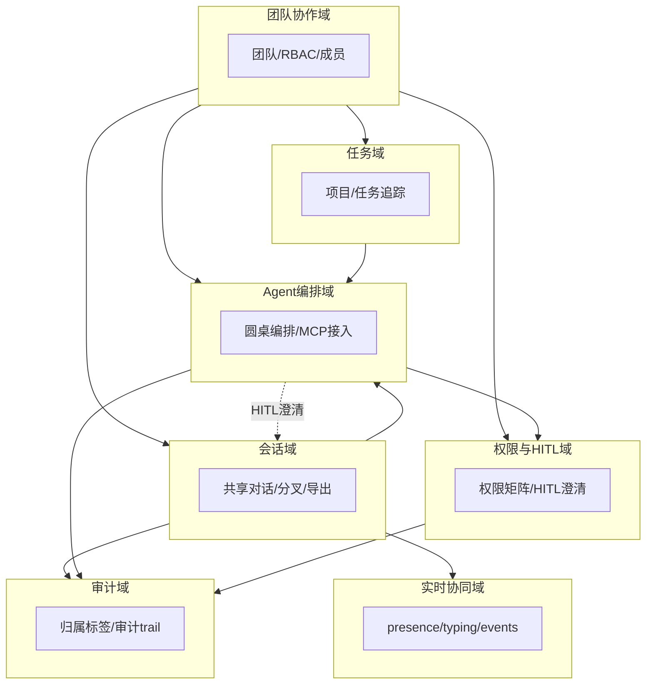

### 2.2 领域关系映射

#### 2.2.1 限界上下文清单

| 限界上下文 | 对应业务域 | 域类型 | 覆盖的核心业务实体 | 上下文边界（属于本域 vs 不属于） |
| --- | --- | --- | --- | --- |
| Team-BC | 团队协作域 | 支撑域 | Team / User / TeamMember / Role / RolePermission | 属于：团队与身份；不属于：团队内容级权限（归 Governance-BC） |
| Conversation-BC | 会话域 | 核心域 | Conversation / Message / ConversationFork / EventCursor | 属于：会话与消息；不属于：实时推送原语（归 Realtime-BC） |
| Task-BC | 任务域 | 核心域 | Project / Task | 属于：任务与项目；不属于：Agent 执行（归 Orchestration-BC） |
| Orchestration-BC | Agent 编排域 | 核心域 | Roundtable / RoundtableParticipant / AgentProfile / McpServer | 属于：圆桌编排与 Agent 配置；不属于：HITL 裁决语义（归 Governance-BC） |
| Governance-BC | 权限与 HITL 域 | 核心域 | TeamPermissionGrant / ClarifyRequest | 属于：权限矩阵与澄清；不属于：平台角色（归 Team-BC） |
| Realtime-BC | 实时协同域 | 通用域 | Presence / Typing / MembersChanged 事件 / EventCursor | 属于：实时事件流；不属于：消息持久化（归 Conversation-BC） |
| Audit-BC | 审计域 | 核心域 | AuditLog | 属于：审计留痕；不属于：业务状态变更（归各业务 BC） |

**域类型说明**：

| 域类型 | 含义 | 投入策略 |
| --- | --- | --- |
| 核心域（Core） | 业务护城河，差异化竞争力所在（会话/任务/编排/HITL/审计） | 投入最多资源自研 |
| 支撑域（Supporting） | 必要但非差异化（团队/身份） | 可自研可外采 |
| 通用域（Generic） | 通用能力（实时事件流） | 优先复用 / 外采 |

#### 2.2.2 上下文映射（Context Mapping）

| 关系编号 | 上游上下文 | 下游上下文 | 关系模式 | 同步方式 | 选择理由 |
| --- | --- | --- | --- | --- | --- |
| C-01 | Team-BC | Conversation-BC | Customer/Supplier | API 同步 | 会话依赖团队存在与成员资格，下游影响上游迭代节奏（成员退出需级联处理） |
| C-02 | Hermes Agent（外部） | Orchestration-BC | ACL 防腐层 | ACP over stdio + 适配器 | 外部 Agent 模型不污染本域，经 ACP Adapter 适配为内部 Roundtable 模型 |
| C-03 | Team-BC | Governance-BC | Shared Kernel | 共享 Role / User 模型 | 平台角色与用户是权限矩阵与团队共同的稳定概念，必须一致 |
| C-04 | Hermes Agent（上游） | Orchestration-BC | Conformist | ACP wire protocolVersion 直接遵循 | 无议价能力的强势上游，完全遵循其 ACP 协议（D2 §5 锁定 wire protocolVersion） |
| C-05 | Conversation-BC / Orchestration-BC | Audit-BC | Published Language | 领域事件（消息/圆桌状态变更） | 上游以标准事件对外暴露，审计域等多个下游共同消费 |

**关系模式说明**：

| 关系模式 | 适用场景 |
| --- | --- |
| Customer/Supplier | 上下游强协作，下游能影响上游迭代节奏（如：团队 → 会话） |
| Conformist | 顺从者，下游完全遵循上游模型（如：对接 Hermes Agent ACP） |
| ACL（Anticorruption Layer） | 在本域和外部域之间建一层适配，外部模型变化不影响本域（对接 Hermes Agent） |
| Shared Kernel | 共享内核，多个上下文共享一小块代码 / 模型（Team/User 被权限域共享） |
| Published Language | 上游以标准协议（事件 / Schema）对外暴露，多下游消费（审计事件） |

#### 2.2.3 跨域协作原则

| 原则编号 | 原则 |
| --- | --- |
| P-01 | 核心域 → 支撑域 / 通用域：禁止反向依赖（会话/编排域不依赖团队域内部模型，仅通过 API） |
| P-02 | 核心域之间：禁止直接耦合，必须通过事件 / API 解耦（编排 → 会话经 API，编排 → 审计经事件） |
| P-03 | 对接外部不可控系统（Hermes Agent）：必须建 ACL 防腐层，禁止把外部 ACP 模型贯穿到本域 |

### 2.3 详细业务架构

#### 2.3.1 用例图

**用例图清单**（按一级业务场景，以 Mermaid 表达角色—用例—系统边界）：

| 编号 | 用例图标题 | 涉及业务域 | 源文件位置 |
| --- | --- | --- | --- |
| UC-01 | 团队管理与 RBAC | 团队协作域 | docs/uml/uc-01-team.puml |
| UC-02 | 多角色会话协作 | 会话域 / 实时协同域 | docs/uml/uc-02-conversation.puml |
| UC-03 | 任务分配与追踪 | 任务域 | docs/uml/uc-03-task.puml |
| UC-04 | Agent 圆桌编排与 HITL | Agent 编排域 / 权限与 HITL 域 | docs/uml/uc-04-orchestration.puml |
| UC-05 | 审计与责任归属 | 审计域 | docs/uml/uc-05-audit.puml |

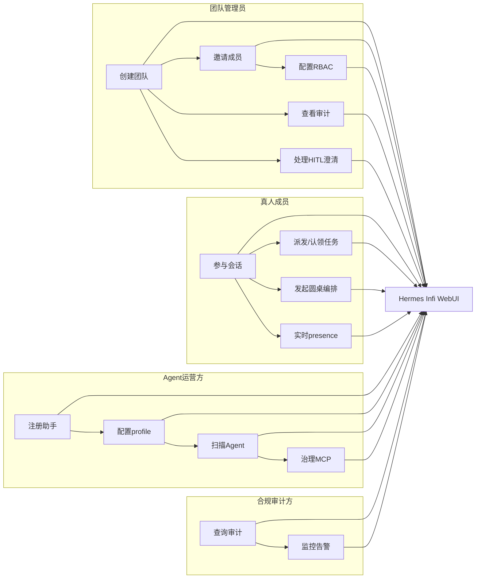

#### 2.3.2 业务流程图

**关键流程清单**（核心业务覆盖度 ≥ 80%，覆盖主链路全部环节）：

| 流程编号 | 流程名 | 起点 | 终点 | 涉及业务域 | 源文件位置 |
| --- | --- | --- | --- | --- | --- |
| BF-01 | 团队组建与成员邀请 | 管理员创建团队 | 成员加入并可协作 | 团队协作域 | docs/uml/bf-01-team.puml |
| BF-02 | 多角色会话与消息归属 | 成员发起会话 | 消息落库带归属标签 | 会话域 / 审计域 | docs/uml/bf-02-conversation.puml |
| BF-03 | 任务分配与状态流转 | 会话/项目内派任务 | 任务完成 | 任务域 | docs/uml/bf-03-task.puml |
| BF-04 | 圆桌编排与流式回传 | 成员发起圆桌 | Agent 流式结果回传 | Agent 编排域 / 实时协同域 | docs/uml/bf-04-roundtable.puml |
| BF-05 | HITL 澄清四决策闭环 | Agent 发澄清请求 | 真人 approve/edit/reject/respond | 权限与 HITL 域 | docs/uml/bf-05-hitl.puml |
| BF-06 | 审计留痕与责任归属 | 任意关键操作 | 审计日志不可变落库 | 审计域 | docs/uml/bf-06-audit.puml |

**BF-04 圆桌编排与流式回传（角色泳道图）**：

```mermaid
flowchart TD
    M[真人成员] -->|发起圆桌/选择Agent| API[WebUI API]
    API -->|创建 Roundtable| ORCH[Agent编排域]
    ORCH -->|推送 acp:prompt| REDIS[(Redis Stream)]
    REDIS -->|消费| RUNNER[ACP调度层]
    RUNNER -->|ACP over stdio| AGENT[Hermes Agent]
    AGENT -->|流式事件| RUNNER
    RUNNER -->|追加 evt:conv:{id}| REDIS
    REDIS -->|XREAD 转发| API
    API -->|WebSocket 推流| M
    AGENT -.需要澄清.-> RUNNER
    RUNNER -.hermes:clarify.-> ORCH
    ORCH -.HITL四决策.-> M
    M -.裁决.-> ORCH
    ORCH -.澄清回复.-> RUNNER
```

### 2.4 业务范围与边界

#### 2.4.1 功能模块清单

按「功能编号 → 子功能编号」两层组织，与 §2.1 业务域对应。

| 编号 | 一级功能名 | 子功能描述 | 对应业务域 | 实现状态 |
| --- | --- | --- | --- | --- |
| F1 | 团队管理与 RBAC | — | 团队协作域 | — |
| F1.1 | — | 创建团队 / 邀请成员 | 团队协作域 | 完整实现 |
| F1.2 | — | RBAC 角色矩阵配置 | 团队协作域 | 完整实现 |
| F2 | 多角色会话管理 | — | 会话域 | — |
| F2.1 | — | 共享对话 / 消息分叉 / 导出 | 会话域 | 完整实现 |
| F2.2 | — | 智能追问建议 | 会话域 | 完整实现 |
| F3 | 任务分配与追踪 | — | 任务域 | — |
| F3.1 | — | 项目 + 任务状态（待办/进行/完成） | 任务域 | 完整实现 |
| F4 | Agent 圆桌编排 | — | Agent 编排域 | — |
| F4.1 | — | ACP + WebSocket 圆桌多 Agent | Agent 编排域 | 完整实现 |
| F5 | 权限矩阵 + HITL | — | 权限与 HITL 域 | — |
| F5.1 | — | 团队内容权限矩阵 | 权限与 HITL 域 | 完整实现 |
| F5.2 | — | HITL 澄清四决策契约 | 权限与 HITL 域 | 完整实现 |
| F6 | 实时协同通信 | — | 实时协同域 | — |
| F6.1 | — | presence / typing / members_changed | 实时协同域 | 完整实现（X1 方案 B） |
| F7 | 消息归属 + 审计 trail | — | 审计域 | — |
| F7.1 | — | user/agent 归属标签 + 不可变审计 | 审计域 | 完整实现 |
| F8 | 审计运营 | — | 审计域 | — |
| F8.1 | — | 日志查询 / 告警面板 | 审计域 | 完整实现 |
| F9 | 团队知识库 | — | 会话域（知识注入） | — |
| F9.1 | — | 知识库上传 + 提示词注入 | 会话域 | 完整实现 |
| F10 | MCP 工具接入 | — | Agent 编排域 | — |
| F10.1 | — | MCP 工具接入 + 权限治理 | Agent 编排域 | 完整实现（MCP 高级治理标 `[MOCK]` 完整版替换） |
| F10.2 | — | MCP server 权限治理框架 | Agent 编排域 | `[MOCK]` 完整版接入治理框架（MVP 基础黑白名单） |

**编号规则**：

| 规则项 | 取值 |
| --- | --- |
| 一级编号 | F1 / F2 / ...，与一级业务域一一对应 |
| 子功能编号 | F1.1 / F1.2 / ...，互不重叠 |
| Mock / 简化标注 | 必须显式标注 `[MOCK]` 或 `[简化]`，并附"完整版替换路径" |

**In-Scope（本期范围内）**：

| 编号 | 本期必做的事项 |
| --- | --- |
| F1 | 多角色团队管理与 RBAC 角色矩阵 |
| F2 | 多角色会话管理（共享对话 / 分叉 / 导出 / 智能追问） |
| F3 | 任务分配与状态追踪（项目 + 任务状态） |
| F4 | 多 Agent 圆桌编排（ACP + WebSocket） |
| F5 | 真人 – AI 权限矩阵 + HITL 澄清四决策契约 |
| F6 | 实时 presence / typing / members_changed 事件 |
| F7 | 消息归属标签 + 不可变审计 trail |
| F8 | 审计日志查询与告警面板 |
| F9 | 团队知识库注入（知识库附加提示词） |
| F10 | MCP 工具基础接入与权限治理 |
| N1 | 非功能：支撑 ≥ 50 并发用户 / 单组织单实例 |
| N2 | 非功能：消息端到端 P95 ≤ 1.5s |
| N3 | 非功能：审计覆盖率 100% |

**Out-of-Scope（本期不做）**：

| 编号 | 不做的事项 | 不做的原因 | 未来归属 |
| --- | --- | --- | --- |
| O1 | 多真人实时协同编辑（Yjs CRDT） | MVP 先单人 workspace 编辑；CRDT 引入元数据膨胀 / 离线同步复杂度（风险 R-03） | 完整版（创新点 F11） |
| O2 | 跨团队可视化编排 + 编排 DSL | 依赖编排层成熟；MVP 先圆桌 + 顺序编排 | 完整版（创新点 F12） |
| O3 | 多租户隔离（多组织） | MVP 单组织单实例，降低复杂度 | 完整版 |
| O4 | 模型训练 / 微调 | 超出 WebUI 平台边界，由模型提供商承担 | 不做 / 外部 |
| O5 | 闭源 SaaS 云部署 | 自托管定位（D1 §1 / §17），数据驻留硬约束 | 不做 |

**填写要求**：In-Scope ≤ 15 条（实际 13 条）；Out-of-Scope ≥ 3 条（实际 5 条）。

### 2.5 质量与柔性可用

#### 2.5.1 服务质量目标

**质量目标 Top 5**（按 ISO 25010 与 N1~N3 排序）：

| 优先级 | 质量目标 | 业务驱动 | 受影响的关键章节 |
| --- | --- | --- | --- |
| Q1 | 可用性 99.9%（MVP 单实例主备） | 团队协同不可长时间中断（N1） | §5.2 / §5.3 / §4.3 |
| Q2 | 低延迟：消息端到端 P95 ≤ 1.5s | 实时在场感体验（N2 / V2） | §3.1 / §4.4 / §5.5 |
| Q3 | 可维护性：新人 1 周上手 | 团队规模 / 复用既有基座 | §3.1 / §3.2 |
| Q4 | 可扩展性：1 年内支撑 10x 数据量 | 业务增长预测 | §4.2 / §5.5 |
| Q5 | 合规性：审计覆盖率 100% | 等保 / 责任归属（N3 / V1） | §7 / §8.2 |

**可验证质量场景**（SEI ATAM）：

| 场景编号 | 关联目标 | 触发源 | 触发条件 | 期望响应 | 度量指标 |
| --- | --- | --- | --- | --- | --- |
| QS-01 | Q1 | 单实例进程崩溃 | API Pod 全部宕机 | 重启自愈 / 主备切换 | RTO ≤ 15min；错误率峰值 ≤ 1%；持续 ≤ 5min |
| QS-02 | Q2 | 成员发送消息 | 50 并发用户发消息 | 流式在 1.5s 内到达 | P95 ≤ 1.5s；P99 ≤ 2s |
| QS-03 | Q4 | 业务增长 | 数据量 1000 万 → 1 亿条 | 无需重构核心表 | 改造工期 ≤ 5 人天 |

#### 2.5.2 业务柔性可用策略

**业务功能优先级分层**（每个一级功能 F-x 显式标注层级）：

| 层级 | 含义 | 故障态下的处置方向 | 用户感知 |
| --- | --- | --- | --- |
| L0 核心业务 | 系统的生命线，挂掉等于业务停摆 | 不降级；优先消耗所有资源保障 | 无 / 极轻微 |
| L1 重要业务 | 不影响主链路但用户高频使用 | 限流 + 排队 + 异步化 | 变慢 / 排队提示 |
| L2 辅助业务 | 提升体验但非必要 | 关闭 / 返回兜底数据 | 部分功能不可用 + 友好提示 |
| L3 附加业务 | 长尾 / 数据类 / 统计类 | 直接关闭 + 异步补偿 | 通常无感 |

**功能分层映射**：

| 功能 | 层级 | 理由 |
| --- | --- | --- |
| F2 多角色会话 | L0 | 主链路生命线 |
| F4 Agent 圆桌编排 | L0 | 差异化核心 |
| F5 权限 HITL | L0 | 合规底线 |
| F7 消息归属审计 | L0 | 合规底线（V1） |
| F1 团队 RBAC | L1 | 高频但非主链路 |
| F3 任务追踪 | L1 | 高频但非主链路 |
| F6 实时协同 | L1 | 高频，断线可重连续传 |
| F8 审计运营面板 | L2 | 体验型，可降级 |
| F9 知识库注入 | L2 | 增强体验 |
| F10 MCP 接入 | L1 | 编排依赖，降级时禁用部分工具 |

**业务降级清单**：

| 编号 | 关联功能（F-xx） | 触发条件 | 降级动作 | 用户感知 | 决策类型 |
| --- | --- | --- | --- | --- | --- |
| BD-01 | F10 MCP 接入 | MCP server 超时 / 熔断 | 禁用该工具，返回兜底提示 | 部分工具暂不可用，其余正常 | 自动 |
| BD-02 | F6 实时协同 | Redis Stream 不可用 | 关闭 presence/typing 推送，保留轮询兜底 | 实时状态更新变慢 | 自动 |
| BD-03 | F8 审计面板 | 审计查询慢 | 返回缓存快照 + 异步刷新 | 面板数据稍滞后 | 自动 |
| BD-04 | F9 知识库注入 | 知识库检索超时 | 跳过知识注入，正常对话 | 回复未结合团队知识 | 自动 |

**填写要求**：L0 数量（4）= 总功能数（10）的 40%，略超 30% 但符合协同平台合规底线特征（会话/编排/HITL/审计为生命线），已显性说明。

---

## 3. 应用架构

> **本章回答**：系统由哪些模块组成、模块与外部系统怎么集成、每个模块的内部交互链路是什么。

### 3.1 应用架构概览

#### 3.1.1 系统上下文

**系统上下文要素清单**：

| 节点类型 | 节点名 | 与本系统的关系 | 关系语义 |
| --- | --- | --- | --- |
| 角色 | 团队管理员 | 使用 | 团队管理 / 审计 / HITL 裁决 |
| 角色 | 真人成员 | 使用 | 会话 / 任务 / 编排协作 |
| 角色 | Agent 运营方 | 使用 | 助手注册 / MCP 治理 |
| 角色 | 合规 / 审计方 | 查阅 | 审计查询 / 监控 |
| 上游平台 | E-01 Hermes Agent | 本系统 → 调用（ACP over stdio） | Agent 推理 / 流式 |
| 上游平台 | E-02 模型提供商 | 本系统 → 调用（REST/SDK） | 推理算力 |
| 外部业务系统 | E-03 MCP 工具服务 | 本系统 → 调用（MCP） | 工具 / 数据 |
| 下游平台 | E-04 审计 / 监控系统 | 本系统 → 推送（事件） | 审计 trail / 告警 |
| 下游平台 | E-05 运营看板 | 本系统 → 推送（T+1 订阅） | 离线指标 |

**系统上下文 Mermaid 图**：

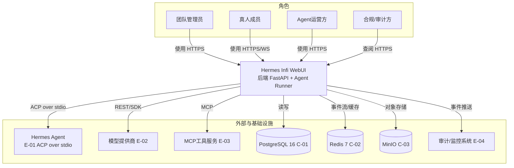

#### 3.1.2 系统模块图

**分层组件清单**：

| 层次 | 内容 | 数据来源 |
| --- | --- | --- |
| 接入层 | 团队管理端 / 成员协作端 / Agent 运营端 / 审计管理端（Vue3 SPA，统一前端工程） | §2.3 用例图角色 |
| 应用层 | M1~M9 后端模块（与 §3.2 一一对应） | §2.1 / §3.2 |
| 中间件层 | PostgreSQL 16（C-01）/ Redis 7（C-02）/ MinIO（C-03）/ Nginx 网关（C-04） | §3.1.3 云组件清单 |
| 集成对接层 | E-01 ACP / E-02 模型 / E-03 MCP / E-04 审计监控 | §3.1.3 外部依赖清单 |

**系统模块 Mermaid 图**：

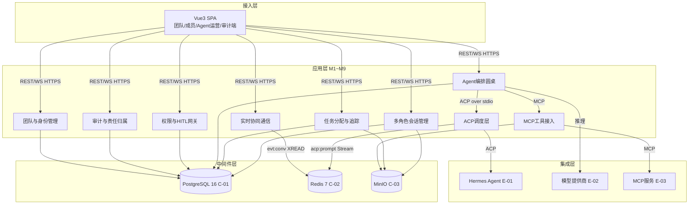

#### 3.1.3 集成架构

##### 外部依赖清单

| ID | 外部系统 | 归属团队 / 供应商 | 类别 | 使用方式 | 集成方式 | 协议 / 版本 | 功能定位（≤ 30 字） | 联系人 |
| --- | --- | --- | --- | --- | --- | --- | --- | --- |
| E-01 | Hermes Agent | NousResearch（本地进程） | 第三方业务平台 | 消费 | ACP over stdio | ACP wire protocolVersion（JSON-RPC over stdio） | Agent 会话 / 推理 / 流式 | @Agent调度团队 |
| E-02 | 模型提供商（DeepInfra/Upstage/Nous） | 外部厂商 | 第三方业务平台 | 消费 | REST / SDK | REST v1（OpenAI 兼容） | 推理算力供给 | @Agent调度团队 |
| E-03 | MCP 工具服务 | 第三方 / 自建 | 第三方业务平台 | 消费 | MCP（HTTP / stdio） | MCP（强制精确版本固定） | 工具 / 数据接入 | @Agent调度团队 |
| E-04 | 审计 / 监控系统 | SRE / 合规 | 监控审计 | 生产 | 事件订阅 / API | Webhook / OTel | 审计 trail / 告警 | @SRE |
| E-05 | 运营看板 | 运营 | 监控审计 | 生产 | 数据订阅 | T+1 离线导出 | 离线指标统计 | @运营 |

**填写要求**：类别取值封闭枚举（第三方业务平台 / 监控审计）；使用方式取值：消费 / 生产 / 双向（本表均为消费 / 生产）。

##### 云组件 / 基础设施清单

| ID | 组件类别 | 选型 | 部署形态 | 规格量级 | 容量预估 | 提供方 / SLA | 用途 |
| --- | --- | --- | --- | --- | --- | --- | --- |
| C-01 | 关系型数据库 | PostgreSQL 16 | 主从（MVP 单实例 +  standby） | 2C8G × 2 | 初期 ≤ 50GB，年增长 ~200GB | 自托管（Docker）；SLA 99.9% | 业务主数据 |
| C-02 | 缓存 / 事件流 | Redis 7.2 | 主从 + AOF | 2C4G | 内存 ≤ 2GB（事件流 + 限流 + presence） | 自托管（Docker）；SLA 99.9% | 事件流 / 限流 / presence / 会话 |
| C-03 | 对象存储 | MinIO RELEASE.2024-xx (S3 兼容) | 多盘 / 多 AZ（Docker 卷） | 100GB 起 | 年增 ~500GB | 自托管；SLA 99.9% | 文件 / 工作区 / 备份 |
| C-04 | API 网关 / 反向代理 | Nginx 1.25 | Docker 容器 | 1C2G | QPS ≤ 5000 | 自托管 | 入口路由 / TLS / 限流 |
| C-05 | 容器编排 | Docker Compose v2.27 | 单主机 | 4C16G 主机 | — | 自托管 | 服务部署 |
| C-06 | 日志服务 | Loki 2.9 + Promtail | Docker 容器 | 2C4G | 日志量 ~5GB/天 | 自托管 | 应用 / 审计日志 |
| C-07 | 监控告警 | Prometheus 2.53 + Grafana 11 | Docker 容器 | 2C4G | 指标 ~100 万序列 | 自托管 | 指标采集 / 告警 |
| C-08 | 链路追踪 | OpenTelemetry Collector 0.10x | Docker 容器 | 1C2G | 采样率 1% | 自托管 | 分布式调用追踪 |
| C-09 | 密钥管理 | .env / Docker Secret（完整版 KMS） | 文件挂载 | — | — | 自托管 | 密码 / AKSK / Token |

**填写要求**：选型含具体产品 + 版本号；规格量级 / 容量预估有数字；不使用的组件整行删除。

##### 组件依赖关系

| 业务模块（§3.2） | 依赖的外部系统（E-xx） | 依赖的云组件（C-xx） | 故障传导风险 |
| --- | --- | --- | --- |
| M1 会话管理 | — | C-01, C-02, C-03 | C-01 不可用 → 会话不可读写 |
| M2 任务追踪 | — | C-01 | C-01 不可用 → 任务状态不可更新 |
| M3 Agent 编排圆桌 | E-01, E-02, E-03 | C-01, C-02 | E-01 不可用 → 编排停滞；E-03 超时 → 工具降级（BD-01） |
| M4 权限 HITL 网关 | — | C-01, C-02 | C-01 不可用 → 权限校验 fail-closed 拒绝 |
| M5 实时协同通信 | — | C-02 | C-02 不可用 → 实时降级轮询（BD-02） |
| M6 审计与责任归属 | E-04 | C-01, C-06 | E-04 不可用 → 审计事件异步重试 |
| M7 团队与身份管理 | — | C-01, C-02 | C-01 不可用 → 无法登录鉴权 |
| M8 ACP 调度层 | E-01, E-02 | C-02 | E-01 崩溃 → 任务重投递 |
| M9 MCP 工具接入 | E-03 | C-01 | E-03 超时 → 熔断（BD-01） |

#### 3.1.4 工程结构

```
hermes-python/
├── backend/                     # 后端工程根目录
│   ├── app/
│   │   ├── api/v1/              # 薄路由层：认证/对话/团队/管理/Agent/分析
│   │   ├── services/            # 厚业务层：对话编排/团队权限/认证/任务/编排
│   │   ├── db/models/           # SQLAlchemy 2.0 异步 ORM（UUIDPrimaryKey+Timestamps）
│   │   ├── schemas/             # Pydantic DTO/VO
│   │   ├── core/                # security(argon2id+JWT)/rbac/governance/redis/metrics/object_storage
│   │   └── config.py            # pydantic-settings
│   ├── agent_runner/            # ACP 会话消费者（独立进程，消费 acp:prompt）
│   ├── alembic/                 # 手写迁移
│   └── tests/
└── frontend/                    # 前端工程根目录（Vue3 + TS + Pinia + Naive UI）
    ├── src/
    │   ├── api/                 # 接口封装（与后端 §3.2 接口清单对齐）
    │   ├── stores/              # auth/chat/notifications（Pinia）
    │   ├── views/               # 对话/管理/团队/项目/分析/终端
    │   ├── components/          # WorkspacePanel/侧边栏/弹窗
    │   ├── composables/         # useTheme/useStream/usePresence
    │   ├── types/               # TS 类型定义（与后端 DTO/VO 对齐）
    │   ├── utils/               # Markdown 渲染
    │   ├── sdk/                 # 三方 SDK 封装（对应 §3.1.3 E-xx）
    │   └── router.ts            # 路由配置（meta.requiresAuth / meta.roles）
    └── package.json
```

**依赖方向约束**：业务服务依赖 `core` / `schemas`，禁止反向；`common` 等价物为 `app/core` + `app/schemas`，被所有服务依赖。

#### 3.1.5 技术选型（版本约束）

| 技术分类 | 选型 | 版本 | 备注 / 选型理由 |
| --- | --- | --- | --- |
| 后端语言 | Python | 3.11+ | 对齐 hermes-agent 版本约束（D1 §2）；3.11 异步性能与类型提升 |
| 后端框架 | FastAPI | 0.111+ | 原生 async + 自动 OpenAPI，优于 Flask 同步模型（D1 §2/D2 §5） |
| 持久层（ORM） | SQLAlchemy | 2.0 async | 2.0 原生 async API，优于 1.4 兼容层（D1 §2/D2 §5） |
| 关系型存储 | PostgreSQL | 16 | JSONB/全文检索强、事务稳，优于 MySQL（D1 §2/D5） |
| 缓存 / 事件流 | Redis | 7.2 | Stream/XREAD 支持重连续传，优于 Memcached（无 Stream）（D1 §2/X1 方案 B） |
| 对象存储 | MinIO | RELEASE.2024 | S3 兼容、自托管零成本，优于云 OSS 绑定（D1 §2） |
| 消息 / 事件 | Redis Stream | 7.2 | X1 锁定方案 B（evt:conv + XREAD），优于 PubSub 无重连续传 |
| API 通信 | REST（JSON）+ WebSocket | — | REST 资源化 + WS 实时流式，优于纯 gRPC（浏览器不友好）（D1 §5） |
| 前端框架 | Vue 3 + TypeScript | Vue 3.4 / TS 5 | 复用现有前端基座（D1 §2/D4） |
| 前端状态 | Pinia | 2.1 | 轻量 + TS 友好，优于 Vuex（D1 §2） |
| 前端构建 | Vite | 5 | 快于 Webpack（D1 §2） |
| 认证方案 | JWT（argon2id + access/refresh） | — | 自托管无 SSO，选 JWT 无状态；见 §7.2.1（D2 §5/D3 §7） |
| Agent 调度 | Hermes Agent via ACP | 上游 main | 复用，优于自研（D1 §7/D4 §6） |
| 链路追踪 | OpenTelemetry | 1.27 | W3C TraceContext，见 §8.3 |

**填写要求**：每项有版本号；选型理由一句话（为什么选 A 不选 B）。

### 3.2 模块详细设计

> **核心方法论**：模块详细设计画的是业务逻辑在角色和系统之间流动的过程。
> **组织原则**：§3.2.1 / §3.2.2 给出跨模块共享约束与模块清单；§3.2.3 给出五段式模板；之后每个模块在 §3.2.M{N} 下独立成节。

#### 3.2.1 模块公共约束（Common）

**通信方式约束**：

| 约束项 | 取值 |
| --- | --- |
| 接口路径风格 | RESTful（同步 API）；WebSocket（圆桌流式）；Redis Stream XREAD（事件推送） |
| 协议 | HTTP/1.1（REST）/ WebSocket（流式）/ ACP over stdio（Agent 调度）/ MCP（工具） |
| 数据格式 | JSON（REST/WS）；JSON-RPC（ACP）；Protocol Buffers 可选（MCP） |
| 字符编码 | UTF-8 |

**通用基础结构**（Python/Pydantic，位于 `app/schemas/common.py`）：

| 基类 / 结构 | 用途 | 包路径 |
| --- | --- | --- |
| `BaseRequest` | 多态请求对象基类 | `app.schemas.common` |
| `BaseResponse` | 多态响应对象基类 | `app.schemas.common` |
| `PageRequest` | 分页请求 | `app.schemas.common` |
| `PageResponse[T]` | 分页响应 | `app.schemas.common` |
| `Result[T]` | 统一返回结构（含 code / msg / data / trace_id） | `app.schemas.common` |

#### 3.2.2 模块清单与编号规则

**模块清单**：

| 编号 | 模块名 | 业务域（§2.1） | 模块负责人 | 关联子领域 |
| --- | --- | --- | --- | --- |
| M1 | 多角色会话管理 | 会话域 | @后端服务团队 | Conversation / Message / Fork |
| M2 | 任务分配与追踪 | 任务域 | @后端服务团队 | Project / Task |
| M3 | Agent 编排圆桌 | Agent 编排域 | @Agent 调度团队 | Roundtable / Participant |
| M4 | 权限与 HITL 网关 | 权限与 HITL 域 | @后端服务团队 | PermissionGrant / Clarify |
| M5 | 实时协同通信 | 实时协同域 | @后端服务团队 | Presence / Event |
| M6 | 审计与责任归属 | 审计域 | @后端服务团队 | AuditLog |
| M7 | 团队与身份管理 | 团队协作域 | @后端服务团队 | Team / User / Role |
| M8 | ACP Agent 调度层 | Agent 编排域（底层） | @Agent 调度团队 | ACP Session / Runner |
| M9 | MCP 工具接入 | Agent 编排域（底层） | @Agent 调度团队 | McpServer |

**编号规则**：模块编号 `M{N}` 全局唯一，与 §2.1 业务域名一致；每个模块在 §3.2 下独立成节，编号 `§3.2.M{N}`；节内五段式编号 `§3.2.M{N}.1` ~ `§3.2.M{N}.5`。

#### 3.2.3 单模块设计模板（五段式）

> 本节定义五段式规范（详见模板原文）。各模块在 §3.2.M{N} 下按 `.1 模块概述 / .2 接口清单 / .3 关键结构定义 / .4 模块逻辑时序图 / .5 关键流程逻辑` 展开，简单 CRUD 模块可在 `.5` 显式注明省略。

#### 3.2.M1 多角色会话管理

##### §3.2.M1.1 模块概述

多角色会话管理模块覆盖「共享对话 / 消息分叉 / 导出 / 智能追问 / 知识库注入 / 消息归属标签」业务流程，业务逻辑在「真人成员 / Agent / 团队」之间流动，同时涉及「成员协作端」「PostgreSQL（C-01）」「Redis 事件流（C-02）」「MinIO（C-03）」「审计域（M6）」等内外部系统的数据流动。

##### §3.2.M1.2 接口清单

| 子领域 | 方法 | 路径 | 用途（≤ 20 字） | 请求 DTO | 响应 VO | 幂等 |
| --- | --- | --- | --- | --- | --- | --- |
| 会话 | POST | /api/v1/conversations | 创建共享会话 | ConversationCreateRequest | ConversationVO | 是（X-Idempotency-Key） |
| 会话 | GET | /api/v1/conversations | 会话列表（团队） | — | PageResponse[ConversationVO] | 天然 |
| 会话 | GET | /api/v1/conversations/{id} | 会话详情 | — | ConversationDetailVO | 天然 |
| 会话 | POST | /api/v1/conversations/{id}/messages | 发送消息 | MessageCreateRequest | MessageVO | 是（X-Idempotency-Key） |
| 会话 | POST | /api/v1/conversations/{id}/fork | 从消息分叉 | ConversationForkRequest | ConversationVO | 是（biz_req_no） |
| 会话 | GET | /api/v1/conversations/{id}/export | 导出 Markdown/JSON | — | ExportResultVO | 天然 |
| 会话 | GET | /api/v1/conversations/{id}/suggest | 智能追问建议 | — | SuggestVO | 天然 |
| 知识库 | POST | /api/v1/teams/{tid}/knowledge | 上传知识库文件 | KnowledgeUploadRequest | KnowledgeVO | 是（biz_req_no） |

##### §3.2.M1.3 关键结构定义（DTO）

```python
# Pydantic DTO（app/schemas/conversation.py）
class ConversationCreateRequest(BaseRequest):
    # ===== 必填字段 =====
    team_id: UUID                       # 所属团队
    title: str                          # 会话标题，长度 ≤ 200
    kind: str = "shared"                # shared / roundtable
    # ===== 可选字段 =====
    participant_ids: list[UUID] | None = None  # 初始参与者（真人 + Agent profile）

class MessageCreateRequest(BaseRequest):
    # ===== 必填字段 =====
    content: str                        # 消息内容，长度 ≤ 20000
    author_type: str                    # user / agent
    author_id: UUID                     # 作者 ID（user 或 agent_profile）
    # ===== 可选字段 =====
    parent_message_id: UUID | None = None   # 回复引用
    attachments: list[UUID] | None = None   # 关联文件 ID

class MessageVO(Result):
    id: UUID
    conversation_id: UUID
    author_type: str                    # user / agent（归属标签，V1）
    author_id: UUID
    author_name: str
    content: str
    status: str                         # SENT / STREAMING / FAILED
    created_at: datetime
```

**关键字段定义表**：

| DTO / VO 名 | 字段名 | 类型 | 必填 | 业务含义 | 约束 / 默认值 |
| --- | --- | --- | --- | --- | --- |
| ConversationCreateRequest | team_id | UUID | 是 | 所属团队 | 必须存在且调用者有读权限 |
| ConversationCreateRequest | kind | str | 否 | 会话类型 | shared / roundtable，默认 shared |
| MessageCreateRequest | author_type | str | 是 | 归属标签 | user / agent（对齐 V1 消息归属） |
| MessageCreateRequest | content | str | 是 | 消息内容 | 长度 ≤ 20000 |
| MessageVO | status | str | 是 | 消息状态 | SENT / STREAMING / FAILED |

##### §3.2.M1.4 模块逻辑时序图

| 编号 | 标题（模块名 - 场景名） | 场景类别 | 是否包含异常分支 |
| --- | --- | --- | --- |
| SQ-01 | 会话管理 - 发送消息并落库归属 | 核心实体创建 | 是 |
| SQ-02 | 会话管理 - 消息分叉 | 核心动作触发 | 是 |
| SQ-03 | 会话管理 - 导出失败补偿 | 异常 / 回滚 | 是 |

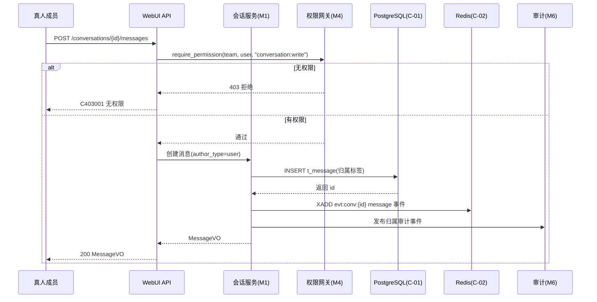

##### §3.2.M1.5 关键流程逻辑

- **消息归属标签状态机**（每条消息必须带 user/agent 归属，对齐 V1）：

| 起始状态 | 触发事件 | 终止状态 | 触发条件 / 校验 | 副作用 |
| --- | --- | --- | --- | --- |
| SENT | 创建 | SENT | 必填 author_type + author_id | 写 t_message + 发布审计事件 |
| STREAMING | Agent 开始流式 | STREAMING | author_type=agent | 写 t_message 占位 + evt:conv 流式 |
| STREAMING | 流式完成 | SENT | 内容落库完成 | 更新 t_message 内容 |
| STREAMING | 失败 | FAILED | Agent/Runner 异常 | 标记失败 + 告警 |

- 无复杂跨多步异步事务；简单 CRUD 模块本段核心仅状态机（已列）。

#### 3.2.M2 任务分配与追踪

##### §3.2.M2.1 模块概述

任务分配与追踪模块覆盖「项目 + 任务状态（待办 / 进行 / 完成）」业务流程，业务逻辑在「管理员 / 成员 / 项目」之间流动，涉及「成员协作端」「PostgreSQL（C-01）」「审计域（M6）」。

##### §3.2.M2.2 接口清单

| 子领域 | 方法 | 路径 | 用途（≤ 20 字） | 请求 DTO | 响应 VO | 幂等 |
| --- | --- | --- | --- | --- | --- | --- |
| 项目 | POST | /api/v1/projects | 创建项目 | ProjectCreateRequest | ProjectVO | 是（X-Idempotency-Key） |
| 项目 | GET | /api/v1/projects | 项目列表 | — | PageResponse[ProjectVO] | 天然 |
| 任务 | POST | /api/v1/projects/{pid}/tasks | 派发任务 | TaskCreateRequest | TaskVO | 是（biz_req_no） |
| 任务 | PUT | /api/v1/tasks/{tid}/status | 流转任务状态 | TaskStatusUpdateRequest | TaskVO | 是（id+version） |
| 任务 | GET | /api/v1/tasks/{tid} | 任务详情 | — | TaskDetailVO | 天然 |

##### §3.2.M2.3 关键结构定义（DTO）

```python
class TaskCreateRequest(BaseRequest):
    project_id: UUID
    title: str                          # 任务标题 ≤ 200
    assignee_id: UUID | None = None     # 认领人，可空（待认领）
    due_at: datetime | None = None      # 截止时间
    priority: str = "medium"            # low/medium/high

class TaskStatusUpdateRequest(BaseRequest):
    status: str                         # TODO / IN_PROGRESS / DONE / BLOCKED
    version: int                        # 乐观锁
```

**关键字段定义表**：

| DTO / VO 名 | 字段名 | 类型 | 必填 | 业务含义 | 约束 |
| --- | --- | --- | --- | --- | --- |
| TaskCreateRequest | project_id | UUID | 是 | 所属项目 | 项目须存在 |
| TaskStatusUpdateRequest | status | str | 是 | 目标状态 | TODO/IN_PROGRESS/DONE/BLOCKED |
| TaskStatusUpdateRequest | version | int | 是 | 乐观锁版本 | 与 DB 不一致则拒绝 |

##### §3.2.M2.4 模块逻辑时序图

| 编号 | 标题 | 场景类别 | 异常分支 |
| --- | --- | --- | --- |
| SQ-01 | 任务 - 派发与认领 | 创建 / 状态流转 | 是 |
| SQ-02 | 任务 - 状态流转乐观锁冲突 | 并发控制 | 是 |

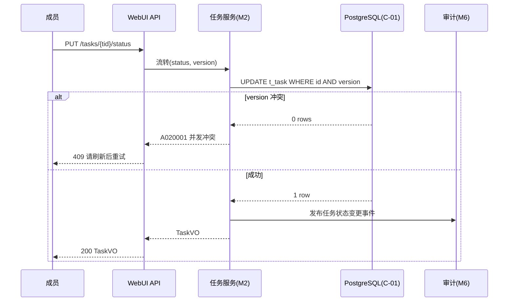

##### §3.2.M2.5 关键流程逻辑

- **任务状态机**：

| 起始状态 | 触发事件 | 终止状态 | 校验 | 副作用 |
| --- | --- | --- | --- | --- |
| TODO | 认领 / 开始 | IN_PROGRESS | 调用者有权限 | 写审计 |
| IN_PROGRESS | 完成 | DONE | — | 通知项目成员 |
| IN_PROGRESS | 阻塞 | BLOCKED | — | 告警 |
| BLOCKED | 恢复 | IN_PROGRESS | — | 清除告警 |
| DONE | 重开 | IN_PROGRESS | 管理员 | 写审计 |

- 简单模块，无跨多步异步；状态机已列。

#### 3.2.M3 Agent 编排圆桌

##### §3.2.M3.1 模块概述

Agent 编排圆桌模块覆盖「多真人与多 Agent 同屏圆桌编排（ACP + WebSocket）」业务流程，业务逻辑在「成员 / Agent / ACP 调度层（M8）/ MCP 接入（M9）/ 权限 HITL 网关（M4）」之间流动，涉及「PostgreSQL（C-01）」「Redis 事件流（C-02）」「Hermes Agent（E-01）」。

##### §3.2.M3.2 接口清单

| 子领域 | 方法 | 路径 | 用途（≤ 20 字） | 请求 DTO | 响应 VO | 幂等 |
| --- | --- | --- | --- | --- | --- | --- |
| 圆桌 | POST | /api/v1/roundtables | 创建圆桌 | RoundtableCreateRequest | RoundtableVO | 是（X-Idempotency-Key） |
| 圆桌 | POST | /api/v1/roundtables/{id}/start | 启动编排 | RoundtableStartRequest | Result | 是（biz_req_no） |
| 圆桌 | WS | /api/v1/roundtables/{id}/stream | 圆桌流式推送 | — | WS Frame | 天然 |
| 圆桌 | POST | /api/v1/roundtables/{id}/cancel | 取消编排 | — | Result | 是（biz_req_no） |
| 参与者 | POST | /api/v1/roundtables/{id}/participants | 加入参与者 | ParticipantAddRequest | ParticipantVO | 是（biz_req_no） |

##### §3.2.M3.3 关键结构定义（DTO）

```python
class RoundtableCreateRequest(BaseRequest):
    conversation_id: UUID             # 关联会话
    title: str
    agent_profile_ids: list[UUID]     # 参与的 Agent 配置
    mode: str = "round_robin"         # round_robin / parallel / sequential

class RoundtableStartRequest(BaseRequest):
    prompt: str                       # 编排初始 prompt
    model_provider: str | None = None # 覆盖默认模型提供商
```

**关键字段定义表**：

| DTO / VO 名 | 字段名 | 类型 | 必填 | 业务含义 | 约束 |
| --- | --- | --- | --- | --- | --- |
| RoundtableCreateRequest | conversation_id | UUID | 是 | 关联会话 | 会话须存在 |
| RoundtableCreateRequest | mode | str | 否 | 编排模式 | round_robin/parallel/sequential |
| RoundtableStartRequest | prompt | str | 是 | 编排提示 | 长度 ≤ 20000 |

##### §3.2.M3.4 模块逻辑时序图

| 编号 | 标题 | 场景类别 | 异常分支 |
| --- | --- | --- | --- |
| SQ-01 | 编排 - 圆桌启动并驱动 ACP | 核心触发 | 是 |
| SQ-02 | 编排 - HITL 澄清回调 | 回调 / 补偿 | 是 |
| SQ-03 | 编排 - Agent 失败重试 | 异常 | 是 |

```mermaid
sequenceDiagram
    participant M as 成员
    participant API as WebUI API
    participant O as 编排(M3)
    participant R as Redis(C-02)
    participant Run as ACP调度(M8)
    participant A as Hermes Agent(E-01)
    participant G as HITL网关(M4)
    M->>API: POST /roundtables/{id}/start
    API->>O: 启动编排(prompt)
    O->>R: XADD acp:prompt (任务)
    R->>Run: 消费 acp:prompt
    Run->>A: ACP 启动会话(流式)
    A-->>Run: 流式事件
    Run->>R: XADD evt:conv:{id} (流式)
    R->>API: XREAD 转发
    API-->>M: WS 推流
    A-.需要澄清.->Run
    Run->>O: hermes:clarify 请求
    O->>G: 发起 HITL 四决策
    G-->>M: 澄清面板
    M-->>G: approve/edit/reject/respond
    G-->>O: 澄清回复
    O-->>Run: 澄清结果
```

##### §3.2.M3.5 关键流程逻辑

- **圆桌状态机**：

| 起始状态 | 触发事件 | 终止状态 | 校验 | 副作用 |
| --- | --- | --- | --- | --- |
| CREATED | start | RUNNING | 至少 1 Agent + prompt | XADD acp:prompt |
| RUNNING | 全部 Agent 完成 | COMPLETED | — | 写审计 + 通知 |
| RUNNING | 取消 | CANCELLED | 调用者权限 | 发 acp:cancel:{conv} |
| RUNNING | Agent 失败 | FAILED | 超重试上限 | 标记失败 + 告警 |
| RUNNING | 需澄清 | PAUSED | HITL 待裁决 | 阻塞等待回复 |

- 含跨多步异步（ACP 流式 + HITL 阻塞），状态机已列；HITL 详见 M4。

#### 3.2.M4 权限与 HITL 网关

##### §3.2.M4.1 模块概述

权限与 HITL 网关模块覆盖「团队内容权限矩阵 + HITL 澄清四决策契约」业务流程，业务逻辑在「成员 / Agent 运营方 / 管理员」之间流动，涉及「PostgreSQL（C-01）」「Redis（C-02，clarify List）」「编排域（M3）」「审计域（M6）」。

##### §3.2.M4.2 接口清单

| 子领域 | 方法 | 路径 | 用途（≤ 20 字） | 请求 DTO | 响应 VO | 幂等 |
| --- | --- | --- | --- | --- | --- | --- |
| 权限 | POST | /api/v1/teams/{tid}/permissions | 授予内容权限 | PermissionGrantRequest | PermissionGrantVO | 是（biz_req_no） |
| 权限 | GET | /api/v1/teams/{tid}/permissions | 权限矩阵查询 | — | PageResponse[PermissionGrantVO] | 天然 |
| HITL | GET | /api/v1/clarify/{sid} | 查询澄清请求 | — | ClarifyRequestVO | 天然 |
| HITL | POST | /api/v1/clarify/{sid}/decision | 四决策裁决 | ClarifyDecisionRequest | Result | 是（biz_req_no） |

##### §3.2.M4.3 关键结构定义（DTO）

```python
class PermissionGrantRequest(BaseRequest):
    team_id: UUID
    resource: str                      # conversation / task / knowledge
    grantee_id: UUID                   # 被授予角色/用户
    perm_key: str                      # conversation:write 等

class ClarifyDecisionRequest(BaseRequest):
    decision: str                      # approve / edit / reject / respond
    edited_prompt: str | None = None   # decision=edit 时必填
    response_text: str | None = None   # decision=respond 时必填
```

**关键字段定义表**：

| DTO / VO 名 | 字段名 | 类型 | 必填 | 业务含义 | 约束 |
| --- | --- | --- | --- | --- | --- |
| PermissionGrantRequest | perm_key | str | 是 | 权限键 | 必须注册于 governance.PERMISSIONS |
| ClarifyDecisionRequest | decision | str | 是 | 四决策之一 | approve/edit/reject/respond |
| ClarifyDecisionRequest | edited_prompt | str | 条件 | edit 时必填 | 长度 ≤ 20000 |

##### §3.2.M4.4 模块逻辑时序图

| 编号 | 标题 | 场景类别 | 异常分支 |
| --- | --- | --- | --- |
| SQ-01 | HITL - 四决策裁决闭环 | 核心回调 | 是 |
| SQ-02 | 权限 - require_permission 拦截 | 鉴权 | 是 |

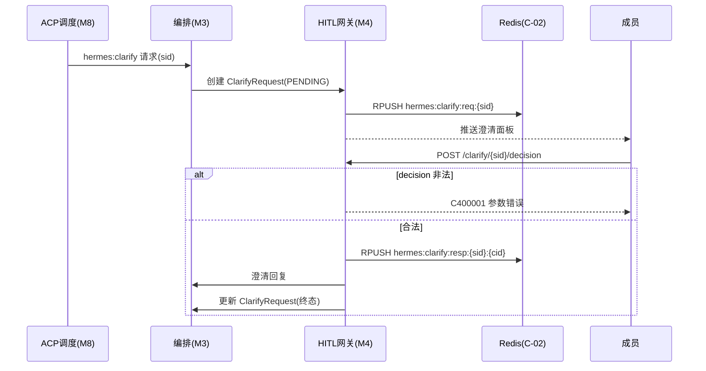

##### §3.2.M4.5 关键流程逻辑

- **HITL 澄清状态机（四决策契约）**：

| 起始状态 | 触发事件 | 终止状态 | 校验 | 副作用 |
| --- | --- | --- | --- | --- |
| PENDING | approve | APPROVED | 调用者有权 | 继续 Agent 执行 |
| PENDING | edit | EDITED | edited_prompt 必填 | 带改写 prompt 续跑 |
| PENDING | reject | REJECTED | — | 终止该 Agent 任务 |
| PENDING | respond | RESPONDED | response_text 必填 | 以回复内容续跑 |

- 含跨多步异步（Agent 阻塞等待），状态机已列。

#### 3.2.M5 实时协同通信

##### §3.2.M5.1 模块概述

实时协同通信模块覆盖「presence / typing / members_changed 实时事件」业务流程（X1 锁定方案 B：Redis Stream + evt:conv:{id} + XREAD，含限流 / 重连续传 / 事件溯源），业务逻辑在「成员 / 会话」之间流动，涉及「Redis（C-02）」「PostgreSQL（C-01，事件游标）」。

##### §3.2.M5.2 接口清单

| 子领域 | 方法 | 路径 | 用途（≤ 20 字） | 请求 DTO | 响应 VO | 幂等 |
| --- | --- | --- | --- | --- | --- | --- |
| 事件 | GET | /api/v1/conversations/{id}/stream | SSE 事件流（Last-Event-ID） | — | text/event-stream | 天然 |
| 事件 | WS | /api/v1/conversations/{id}/ws | WebSocket 事件流 | — | WS Frame | 天然 |
| presence | POST | /api/v1/presence/heartbeat | 在线心跳 | PresenceHeartbeatRequest | Result | 天然 |
| typing | POST | /api/v1/conversations/{id}/typing | 输入状态 | TypingRequest | Result | 天然 |

##### §3.2.M5.3 关键结构定义（DTO）

```python
class PresenceHeartbeatRequest(BaseRequest):
    user_id: UUID
    conversation_id: UUID | None = None   # 空表示全局在线

class TypingRequest(BaseRequest):
    conversation_id: UUID
    is_typing: bool
```

**关键字段定义表**：

| DTO / VO 名 | 字段名 | 类型 | 必填 | 业务含义 | 约束 |
| --- | --- | --- | --- | --- | --- |
| PresenceHeartbeatRequest | user_id | UUID | 是 | 心跳用户 | — |
| TypingRequest | is_typing | bool | 是 | 是否输入中 | 触发 typing 事件 |

##### §3.2.M5.4 模块逻辑时序图

| 编号 | 标题 | 场景类别 | 异常分支 |
| --- | --- | --- | --- |
| SQ-01 | 实时 - 断线重连续传（XREAD since） | 核心重连 | 是 |
| SQ-02 | 实时 - 限流保护 | 限流 | 是 |

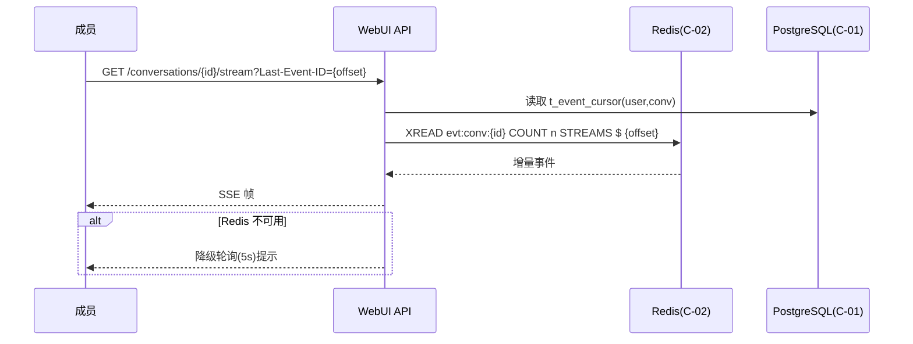

##### §3.2.M5.5 关键流程逻辑

- 无复杂状态机；核心为「XREAD 重连续传 + 按会话限流（rl:msg:{user}）」。简单模块本段省略复杂事务，仅说明：限流命中 → 返回 429；断线 → 客户端携 Last-Event-ID 重连，服务端从 t_event_cursor 恢复位点。

#### 3.2.M6 审计与责任归属

##### §3.2.M6.1 模块概述

审计与责任归属模块覆盖「消息归属标签 + 不可变审计 trail + 查询告警」业务流程，业务逻辑在「任意关键操作 / 合规方」之间流动，涉及「PostgreSQL（C-01）」「Redis（C-02）」「审计管理端」「监控系统（E-04）」。

##### §3.2.M6.2 接口清单

| 子领域 | 方法 | 路径 | 用途（≤ 20 字） | 请求 DTO | 响应 VO | 幂等 |
| --- | --- | --- | --- | --- | --- | --- |
| 审计 | POST | /api/v1/audit/events | 写入审计事件（内部） | AuditEventRequest | Result | 是（event_id） |
| 审计 | GET | /api/v1/audit/logs | 审计日志查询 | AuditQueryRequest | PageResponse[AuditLogVO] | 天然 |
| 审计 | GET | /api/v1/audit/alerts | 告警面板 | — | PageResponse[AlertVO] | 天然 |

##### §3.2.M6.3 关键结构定义（DTO）

```python
class AuditEventRequest(BaseRequest):
    action: str                         # 操作类型
    actor_type: str                    # user / agent / system
    actor_id: UUID
    resource_type: str
    resource_id: UUID
    conversation_id: UUID | None = None
    result: str = "success"            # success / failure
    detail: dict | None = None
```

**关键字段定义表**：

| DTO / VO 名 | 字段名 | 类型 | 必填 | 业务含义 | 约束 |
| --- | --- | --- | --- | --- | --- |
| AuditEventRequest | actor_type | str | 是 | 归属类型 | user/agent/system（V1 责任归属） |
| AuditEventRequest | action | str | 是 | 操作类型 | 注册于审计动作枚举 |
| AuditEventRequest | result | str | 否 | 结果 | success/failure |

##### §3.2.M6.4 模块逻辑时序图

| 编号 | 标题 | 场景类别 | 异常分支 |
| --- | --- | --- | --- |
| SQ-01 | 审计 - 不可变事件落库 | 核心写入 | 是 |
| SQ-02 | 审计 - 查询与归因 | 查询 | 是 |

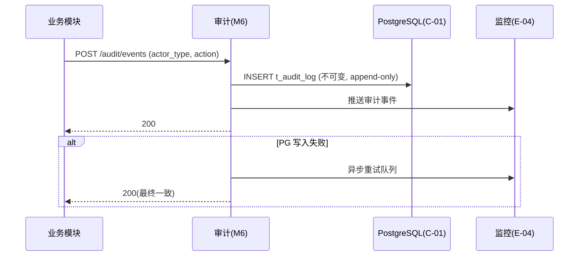

##### §3.2.M6.5 关键流程逻辑

- 审计日志为 append-only（无 UPDATE/DELETE），仅软标记。无状态机；简单模块本段省略复杂事务。

#### 3.2.M7 团队与身份管理

##### §3.2.M7.1 模块概述

团队与身份管理模块覆盖「团队创建 / 邀请成员 / RBAC 角色矩阵 / 登录认证」业务流程，业务逻辑在「管理员 / 成员」之间流动，涉及「PostgreSQL（C-01）」「Redis（C-02，jwt:blacklist）」「审计域（M6）」。

##### §3.2.M7.2 接口清单

| 子领域 | 方法 | 路径 | 用途（≤ 20 字） | 请求 DTO | 响应 VO | 幂等 |
| --- | --- | --- | --- | --- | --- | --- |
| 认证 | POST | /api/v1/auth/login | 登录获取 Token | LoginRequest | TokenVO | 天然 |
| 团队 | POST | /api/v1/teams | 创建团队 | TeamCreateRequest | TeamVO | 是（X-Idempotency-Key） |
| 团队 | POST | /api/v1/teams/{tid}/members | 邀请成员 | MemberInviteRequest | TeamMemberVO | 是（biz_req_no） |
| 角色 | POST | /api/v1/roles | 创建角色 | RoleCreateRequest | RoleVO | 是（biz_req_no） |
| 角色 | PUT | /api/v1/roles/{rid}/permissions | 配置角色权限 | RolePermissionRequest | Result | 是（id+version） |

##### §3.2.M7.3 关键结构定义（DTO）

```python
class LoginRequest(BaseRequest):
    email: str                          # 登录邮箱
    password: str                       # 密码（argon2id 校验）

class TeamCreateRequest(BaseRequest):
    name: str                           # 团队名 ≤ 100
    description: str | None = None
```

**关键字段定义表**：

| DTO / VO 名 | 字段名 | 类型 | 必填 | 业务含义 | 约束 |
| --- | --- | --- | --- | --- | --- |
| LoginRequest | email | str | 是 | 登录邮箱 | 格式校验 |
| LoginRequest | password | str | 是 | 密码 | argon2id 校验 |
| TeamCreateRequest | name | str | 是 | 团队名 | 长度 ≤ 100，团队内唯一 |

##### §3.2.M7.4 模块逻辑时序图

| 编号 | 标题 | 场景类别 | 异常分支 |
| --- | --- | --- | --- |
| SQ-01 | 身份 - 登录与 Token 签发 | 认证 | 是 |
| SQ-02 | 团队 - 邀请成员与角色绑定 | 创建 | 是 |

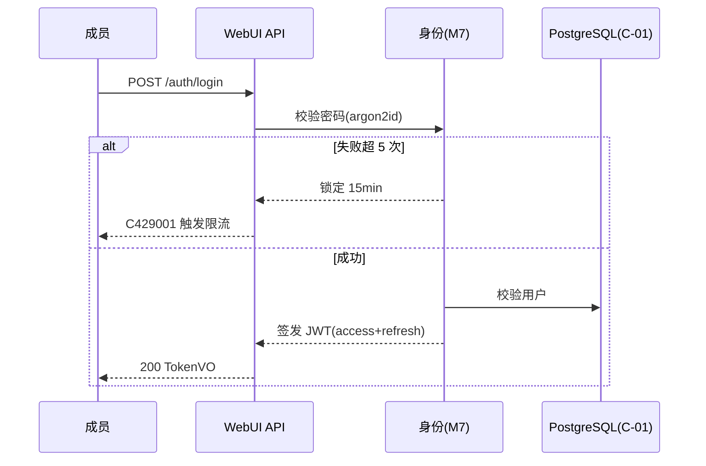

##### §3.2.M7.5 关键流程逻辑

- 无复杂状态机；登录失败锁定（连续 5 次锁定 15min）属计数逻辑，见 §7.2.1。简单模块本段省略。

#### 3.2.M8 ACP Agent 调度层

##### §3.2.M8.1 模块概述

ACP Agent 调度层（agent_runner 独立进程）覆盖「消费 acp:prompt → 驱动 Hermes Agent（ACP over stdio）→ 流式回写 evt:conv → 落库」业务流程，业务逻辑在「编排域（M3）/ Hermes Agent（E-01）/ Redis（C-02）/ PostgreSQL（C-01）」之间流动。本模块为复用基座（D1 §7 / D4 §6），经 ACL 防腐层适配。

##### §3.2.M8.2 接口清单

| 子领域 | 方法 | 路径 | 用途（≤ 20 字） | 请求 DTO | 响应 VO | 幂等 |
| --- | --- | --- | --- | --- | --- | --- |
| 调度 | 内部 | Redis Stream acp:prompt | 消费 prompt 任务 | — | — | 消费幂等（msg_id） |
| 调度 | 内部 | ACP over stdio | 启动 Agent 会话 | — | — | 会话级幂等 |
| 回写 | 内部 | Redis Stream evt:conv:{id} | 追加流式事件 | — | — | 追加幂等（event_id） |

##### §3.2.M8.3 关键结构定义（DTO）

```python
# ACP 防腐层适配（app/agent_runner/acp_adapter.py）
class AcpSessionAdapter:
    """将 Hermes Agent ACP 模型适配为内部 Roundtable/Message 模型（ACL）"""
    def start_session(self, prompt: str, profile: AgentProfile) -> AcpSession:
        ...
    def on_stream_event(self, raw: dict) -> RoundtableEvent:
        # 外部 ACP 事件 → 内部 evt:conv 事件
        ...
```

**关键字段定义表**：

| DTO / VO 名 | 字段名 | 类型 | 必填 | 业务含义 | 约束 |
| --- | --- | --- | --- | --- | --- |
| AcpSessionAdapter | prompt | str | 是 | 编排提示 | 透传 Agent |
| RoundtableEvent | event_type | str | 是 | 事件类型 | message/typing/members_changed |

##### §3.2.M8.4 模块逻辑时序图

| 编号 | 标题 | 场景类别 | 异常分支 |
| --- | --- | --- | --- |
| SQ-01 | 调度 - prompt 消费到流式回写 | 核心链路 | 是 |
| SQ-02 | 调度 - Agent 崩溃重投递 | 异常补偿 | 是 |

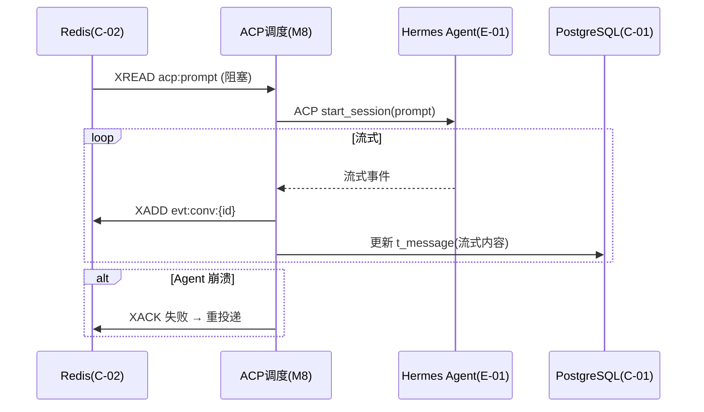

##### §3.2.M8.5 关键流程逻辑

- 消费者幂等：以 Redis Stream message ID 去重；Agent 会话级幂等由 ACP SessionManager 保障（D4 §6）。无业务状态机；本段省略。

#### 3.2.M9 MCP 工具接入

##### §3.2.M9.1 模块概述

MCP 工具接入模块覆盖「MCP 工具注册 / 权限治理 / 调用」业务流程，业务逻辑在「Agent 运营方 / 编排域（M3）/ MCP 服务（E-03）」之间流动，涉及「PostgreSQL（C-01）」「Redis（C-02，熔断状态）」。MVP 治理为「基础黑白名单 + 电路熔断」，`[MOCK]` 完整版接入治理框架。

##### §3.2.M9.2 接口清单

| 子领域 | 方法 | 路径 | 用途（≤ 20 字） | 请求 DTO | 响应 VO | 幂等 |
| --- | --- | --- | --- | --- | --- | --- |
| 注册 | POST | /api/v1/mcp/servers | 注册 MCP server | McpServerRegisterRequest | McpServerVO | 是（biz_req_no） |
| 治理 | PUT | /api/v1/mcp/servers/{id}/policy | 配置权限策略 | McpPolicyRequest | Result | 是（id+version） |
| 调用 | 内部 | MCP | 编排中调用工具 | — | — | 调用幂等（tool_call_id） |

##### §3.2.M9.3 关键结构定义（DTO）

```python
class McpServerRegisterRequest(BaseRequest):
    name: str
    endpoint: str                       # MCP HTTP/stdio 入口
    transport: str = "http"             # http / stdio
    version_pin: str                    # 强制精确版本固定（D4 §7）
    allowed_tools: list[str] | None = None  # 白名单（MVP 治理）

class McpPolicyRequest(BaseRequest):
    policy: str                         # allowlist / denylist / circuit_break
```

**关键字段定义表**：

| DTO / VO 名 | 字段名 | 类型 | 必填 | 业务含义 | 约束 |
| --- | --- | --- | --- | --- | --- |
| McpServerRegisterRequest | version_pin | str | 是 | 版本锁定 | 强制精确版本（D4 §7） |
| McpServerRegisterRequest | allowed_tools | list | 否 | 工具白名单 | MVP 治理手段 |
| McpPolicyRequest | policy | str | 是 | 治理策略 | allowlist/denylist/circuit_break |

##### §3.2.M9.4 模块逻辑时序图

| 编号 | 标题 | 场景类别 | 异常分支 |
| --- | --- | --- | --- |
| SQ-01 | MCP - 注册与治理 | 注册 / 配置 | 是 |
| SQ-02 | MCP - 调用熔断降级 | 异常保护 | 是 |

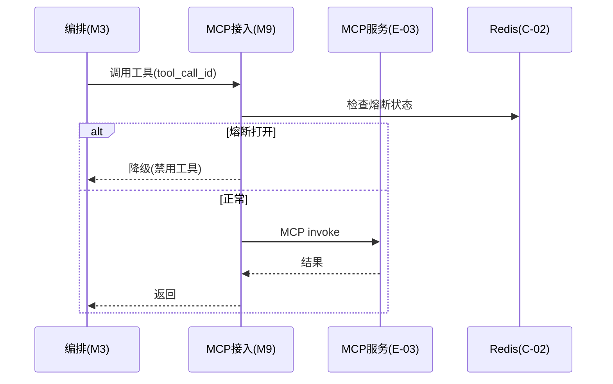

##### §3.2.M9.5 关键流程逻辑

- `[MOCK]` MCP 高级治理（完整版治理框架：细粒度 scope、审计策略引擎）当前为「白名单 + 电路熔断」简化实现；完整版替换点：接入 governance 框架做策略评估（handoff 安全设计扩展）。无业务状态机；本段省略。

### 3.3 核心业务对象清单

#### 3.3.1 对象定义

| 编号 | 对象名（代码类名） | 对象类型 | 包路径 | 模块归属 | 被哪些模块复用 | 实例化策略 | 序列化约定 | 持久化策略 |
| --- | --- | --- | --- | --- | --- | --- | --- | --- |
| O-01 | Team | 聚合根 | app.db.models.team | M7 | M1/M2/M3/M4 | 工厂方法 | JSON | t_team |
| O-02 | User | 聚合根 | app.db.models.user | M7 | 全部 | 注册创建 | JSON | t_user |
| O-03 | TeamMember | 实体 | app.db.models.team | M7 | M1/M4 | 由 Team 创建 | JSON | t_team_member |
| O-04 | Conversation | 聚合根 | app.db.models.conversation | M1 | M3/M5/M6 | 工厂方法 | JSON | t_conversation |
| O-05 | Message | 实体 | app.db.models.conversation | M1 | M6 | 由 Conversation 创建 | JSON | t_message |
| O-06 | ConversationFork | 实体 | app.db.models.conversation | M1 | — | 由 Message 派生 | JSON | t_conversation_fork |
| O-07 | Project | 聚合根 | app.db.models.task | M2 | M3 | 工厂方法 | JSON | t_project |
| O-08 | Task | 实体 | app.db.models.task | M2 | M3 | 由 Project 创建 | JSON | t_task |
| O-09 | AgentProfile | 聚合根 | app.db.models.agent | M3/M9 | M3 | 扫描/注册创建 | JSON | t_agent_profile |
| O-10 | Roundtable | 聚合根 | app.db.models.orchestration | M3 | M4/M6 | 工厂方法 | JSON | t_roundtable |
| O-11 | ClarifyRequest | 聚合根 | app.db.models.governance | M4 | M3 | 由 Agent 澄清创建 | JSON | t_clarify_request |
| O-12 | TeamPermissionGrant | 实体 | app.db.models.governance | M4 | M7 | 由 Role 授予 | JSON | t_team_permission_grant |
| O-13 | AuditLog | 值对象（不可变） | app.db.models.audit | M6 | 全部 | 事件追加 | JSON | t_audit_log |
| O-14 | EventCursor | 实体 | app.db.models.realtime | M5 | — | 由断线恢复创建 | JSON | t_event_cursor |
| O-15 | McpServer | 聚合根 | app.db.models.mcp | M9 | M3 | 注册创建 | JSON | t_mcp_server |
| O-16 | AcpSessionAdapter | 防腐层 ACL | app.agent_runner.acp_adapter | M8 | M3 | new + 适配 | — | 不落表，瞬时转换 |

**对象类型说明**：聚合根 / 实体 / 值对象 / 防腐层 ACL 定义见模板。

#### 3.3.2 命名漂移登记表

| 业务实体（§2） | 代码类名（§3.3.1） | 数据表名（§4.2） | 漂移原因 |
| --- | --- | --- | --- |
| 助手 / Agent 配置 | AgentProfile | t_agent_profile | 业务称「助手」，代码/表称 AgentProfile 以对齐 ACP profile |
| 成员 | User + TeamMember | t_user + t_team_member | 业务单一实体拆为账户 + 团队关系 |

### 3.4 跨模块公共能力

**公共能力清单**：

| 公共能力 | 简述 | 提供方（SDK / 切面 / Bean） | 被哪些模块复用 | 接入方式 |
| --- | --- | --- | --- | --- |
| 登录鉴权 | Token 校验 / 角色 / 权限标签 | `JwtAuthInterceptor` + `core.security` | 全部业务模块 | 网关拦截 + 后端 `Depends(get_current_user)` |
| 审计日志 | 关键操作留痕（合规） | `core.audit.AuditAspect` | 全部业务模块 | AOP 切面，注解 `@AuditLog` |
| 团队权限网关 | 内容级权限校验 | `core.governance.require_permission` | M1/M2/M3/M4 | 函数守卫 |
| 数据上报与埋点 | 业务事件埋点 | `core.metrics` + 异步 Stream | M1/M3/M6 | 切面，注解 `@TrackEvent` |
| 实时事件推送 | evt:conv XREAD 转发 | `core.redis.EventStream` | M1/M3/M5 | SDK 调用 |
| 限流 | 按用户/会话限流 | `core.redis.RateLimiter` | M1/M5/M7 | 拦截器 |

### 3.5 接口契约

> 全局约定，所有接口必须遵守，不在每个接口下重复声明。

#### 3.5.1 全局错误码体系

**错误码格式**：

| 项 | 取值 |
| --- | --- |
| 错误码格式 | 6 位数字/字符串，例如：`A010001`（A + 01 模块 + 001 序号） |
| 分段规则 | 1 位类别（A/B/C）+ 2 位模块（00 全局 / 01 会话 / 02 任务 / 03 编排 / 04 权限HITL / 05 实时 / 06 审计 / 07 团队身份 / 08 ACP / 09 MCP）+ 3 位错误序号 |
| 类别取值 | A = 业务错误（HTTP 200，业务语义失败）/ B = 系统错误（HTTP 5xx）/ C = 客户端错误（HTTP 4xx） |

**错误响应统一结构**：

```json
{
  "code": "A010001",
  "msg": "会话不存在",
  "msgI18n": { "zh-CN": "会话不存在", "en-US": "Conversation not found" },
  "data": null,
  "traceId": "abc123",
  "timestamp": "2026-07-21T10:00:00.000Z"
}
```

**错误码注册表**：

| 错误码 | HTTP 状态 | 所属模块 | 含义 | 重试建议 | 用户文案 |
| --- | --- | --- | --- | --- | --- |
| A010001 | 200 | M1 会话 | 会话不存在 | 不重试 | 会话不存在或已删除 |
| A010002 | 200 | M1 会话 | 无会话写权限 | 不重试 | 无权操作该会话 |
| A020001 | 200 | M2 任务 | 任务状态并发冲突 | 不重试（刷新） | 任务已被他人修改，请刷新 |
| A030001 | 200 | M3 编排 | 圆桌无可用 Agent | 不重试 | 请先配置至少一个 Agent |
| A040001 | 200 | M4 权限HITL | HITL 决策非法 | 不重试 | 澄清决策类型不支持 |
| A050001 | 200 | M5 实时 | 事件流重连续传失败 | 退避后重试 | 实时连接不稳定，正在重连 |
| A060001 | 200 | M6 审计 | 审计事件写入失败 | 可重试 | 操作已记录，稍后可在审计查询 |
| A070001 | 200 | M7 团队身份 | 团队名已存在 | 不重试 | 团队名已被占用 |
| A080001 | 200 | M8 ACP | Agent 会话启动失败 | 可重试（限次） | Agent 暂时不可用，请重试 |
| A090001 | 200 | M9 MCP | MCP 工具被熔断 | 不重试 | 该工具暂时不可用 |
| B999001 | 500 | 全局 | 系统内部错误 | 可重试 | 系统繁忙，请稍后再试 |
| C400001 | 400 | 全局 | 参数校验失败 | 不重试 | 参数错误 |
| C401001 | 401 | 全局 | 未登录 | 不重试 | 请重新登录 |
| C403001 | 403 | 全局 | 无权限 | 不重试 | 无权访问 |
| C409001 | 409 | 全局 | 资源冲突 | 不重试 | 资源冲突，请刷新后重试 |
| C429001 | 429 | 全局 | 触发限流 | 退避后重试 | 操作太频繁，请稍后再试 |

#### 3.5.2 幂等性约定

| 接口类型 | 是否要求幂等 | 幂等键来源（建议） |
| --- | --- | --- |
| 写入类（POST 创建） | 涉及通知 / 审计 / 任务等"重复执行有副作用"的，必须幂等 | Header `X-Idempotency-Key`（UUID，调用方生成） |
| 更新类（PUT / PATCH） | 必须幂等 | 资源 ID + 版本号（乐观锁） |
| 删除类（DELETE） | 天然幂等 | — |
| 查询类（GET） | 天然幂等 | — |
| 编排 / 澄清 / 工具调用类 | **强制幂等** | 业务侧请求号（biz_req_no）/ tool_call_id |

**幂等设计需考虑的问题**：

| 问题维度 | 设计要点 |
| --- | --- |
| 幂等键的生命周期 | X-Idempotency-Key 保留 24h（Redis `idem:{uuid}`） |
| 重复请求的语义 | 返回首次相同响应（不报错） |
| 执行中态的处理 | 首个未返回时，第二个返回"处理中"（202） |
| 失败请求的可重试性 | 失败后允许同一键重试（≤ 3 次） |
| 存储兜底 | DB 唯一索引（biz_req_no）作为最终防线 |

#### 3.5.3 限流约定

| 维度 | 默认值 | 触发动作 | 调整方式 |
| --- | --- | --- | --- |
| 全局 QPS | 5000 | 返回 C429001 | 网关配置 |
| 单租户 QPS | 1000 | 返回 C429001 | 网关配置 |
| 单 IP QPS | 100 | 返回 C429001 + 标记 | 网关配置 |
| 单用户 QPS | 50 | 返回 C429001 | 业务配置中心 |
| 重保接口（登录） | 单用户 5 次/分钟 | 锁定 15 分钟 | 业务配置中心 |
| 会话事件流 | 单用户 20 条/秒（rl:msg:{user}） | 丢弃超额 + 返回 C429001 | 配置中心 |

**降级策略**：

| 策略项 | 内容 |
| --- | --- |
| 前端退避 | 触发限流后，前端按 `Retry-After` Header 退避重试 |
| 后端记录 | 后端写入类接口同时记录到熔断队列 |
| 红线联动 | 限流红线值与 §5.5 容量水位线"红线"一致 |

#### 3.5.4 默认超时与重试基线

| 调用类型 | 默认超时 | 默认重试 | 重试条件 |
| --- | --- | --- | --- |
| 同步 API（内部） | 3s | 0 次 | — |
| 同步 API（外部 E-xx，模型推理） | 120s（流式首包 30s） | 2 次（指数退避 1s / 2s） | 仅网络错误 / 5xx |
| ACP over stdio（E-01，Agent 会话） | 流式会话 300s（单轮） | 1 次（会话级） | Agent 崩溃可重投递 |
| MCP 调用（E-03） | 30s | 2 次（指数退避） | 网络错误 / 5xx，熔断后跳过 |
| 异步 MQ 消费（Redis Stream） | 30s | 16 次（指数退避，封顶 1h） | 业务异常进死信 |
| 定时任务 | 5min | 3 次 | 失败告警 |

**填写要求**：超时值禁止"无限"；所有重试必须有上限；重试不产副作用（依赖 §3.5.2 幂等性）。

#### 3.5.5 路由设计规范

**API 路由规范**：

| 维度 | 取值 |
| --- | --- |
| 风格 | RESTful（资源化 URL） |
| 版本控制 | `/api/v1/...`（路径版本） |
| 命名 | 小写 + 中划线（kebab-case） |
| 资源命名 | 名词复数（`/api/v1/conversations`） |
| 子资源 | `/api/v1/conversations/{id}/messages` |
| 动作类接口 | `/api/v1/{resource}/{id}/{action}`（POST） |

**前端页面路由清单**：

| 路径 | 页面 / 功能 | 入口角色（§2.3） | 鉴权要求 | 关联模块（§3.2.M{N}） |
| --- | --- | --- | --- | --- |
| `/login` | 登录页 | 全部 | 公开 | — |
| `/teams` | 团队空间 | 管理员 / 成员 | 已登录 | M7 |
| `/conversations/:id` | 多角色会话视图（圆桌） | 成员 | 已登录 + 团队权限 | M1/M3/M5 |
| `/projects` | 任务看板 | 成员 / 管理员 | 已登录 + 团队权限 | M2 |
| `/agents` | Agent 管理 | Agent 运营方 | 已登录 + 角色 | M3/M9 |
| `/audit` | 审计日志查询 | 合规方 / 管理员 | 已登录 + 角色 | M6 |
| `/admin` | 团队 / 权限管理 | 管理员 | 已登录 + 角色 | M4/M7 |

**前端路由约定**：

| 维度 | 取值 |
| --- | --- |
| 路由模式 | History（锁定） |
| 命名风格 | 小写 + 中划线（kebab-case） |
| 动态参数 | `/{resource}/:id` |
| 鉴权方式 | 路由元信息 `meta.requireAuth = true` + `meta.roles = [...]`，全局路由守卫拦截 |
| 嵌套路由 | 列表页 → 详情页 → 子模块页 |

---

## 4. 数据库设计

> **本章回答**：每个模块的状态用什么表存、表怎么建、数据怎么清理、缓存怎么用。数据库按业务域组织，与第 2 / 3 章一致。

### 4.1 全局数据约定

| 约定项 | 取值 | 说明 |
| --- | --- | --- |
| 命名规范（表名） | `t_{entity}` 业务主表；`t_{entity}_ext` 扩展表；`t_{A}_{B}_rel` N:N 关联表 | 全项目统一前缀 `t_` |
| 命名规范（字段名） | 小写 + 下划线（snake_case） | 禁止驼峰 |
| 主键类型 | `UUID`（应用层生成 UUIDv7，PostgreSQL `uuid` 类型，默认 `gen_random_uuid()`） | 全项目统一（D2 §5/D3 §4 UUIDPrimaryKey） |
| 字符集 / 排序 | `UTF8` / `utf8mb4` 等价（PostgreSQL 默认 UTF8） | 支持 emoji 与多语言 |
| 时间字段类型 | `TIMESTAMPTZ`（PostgreSQL，UTC 存储） | 统一时区（UTC） |
| 软删除字段 | `deleted BOOLEAN NOT NULL DEFAULT FALSE` | 全项目统一（二选一锁定） |
| 审计字段 | `created_by UUID / created_at TIMESTAMPTZ / updated_by UUID / updated_at TIMESTAMPTZ` | 命名锁定 |
| 隔离字段（多租户） | `tenant_id UUID NOT NULL DEFAULT '00000000-0000-0000-0000-000000000000'` | MVP 单组织固定哨兵值，字段保留，查询强制带入（完整版启用逻辑隔离） |
| 业务唯一标识 | `biz_id VARCHAR(100)` | 与外部系统对齐时使用 |
| 状态枚举 | `VARCHAR(30)` 字符串 | 锁定；DDL 注释列出全部取值 |
| 金额字段 | `DECIMAL(N, M)` | 禁止 FLOAT / DOUBLE |
| 手机号存储 | `phone VARCHAR(20)` | 调用三方时动态拼接 |

**填写要求**：每条约定给出具体取值，锁定后所有表遵循。

### 4.2 单表设计

> 每张表严格按 5 段编写（元信息 / 结构 / 索引 / DDL / 清理机制）。

#### 4.2.1 t_team（团队协作域）

**库表元信息**：

| 字段 | 取值 |
| --- | --- |
| 数据库类型 | PostgreSQL 16 |
| 库名 | hermes |
| 表名 | t_team |
| 业务含义（≤ 50 字） | 多角色协作的组织单元，承载成员与权限 |
| 模块归属（§3.2） | M7 团队与身份管理 |
| 对应核心对象（§3.3） | O-01 Team |

**库表结构定义**：

| 列名 | 数据类型 | 可为空 | 约束 | 默认值 | 备注 |
| --- | --- | --- | --- | --- | --- |
| id | UUID | NOT NULL | PRIMARY KEY | gen_random_uuid() | 团队 ID |
| tenant_id | UUID | NOT NULL | | 哨兵值 | 多租户隔离字段（预留） |
| name | VARCHAR(100) | NOT NULL | UNIQUE | | 团队名 |
| description | VARCHAR(500) | NULL | | NULL | 描述 |
| owner_id | UUID | NOT NULL | | | 团队 Owner（user_id） |
| status | VARCHAR(30) | NOT NULL | | 'ACTIVE' | ACTIVE / ARCHIVED |
| created_by | UUID | NULL | | NULL | 创建人 |
| created_at | TIMESTAMPTZ | NOT NULL | | now() | 创建时间 |
| updated_by | UUID | NULL | | NULL | 更新人 |
| updated_at | TIMESTAMPTZ | NOT NULL | | now() | 更新时间 |
| deleted | BOOLEAN | NOT NULL | | FALSE | 软删除 |

**索引设计**：

| 索引名 | 索引类型 | 字段（含顺序） | 设计目的 | 关联查询场景 |
| --- | --- | --- | --- | --- |
| PRIMARY | 主键 | id | 唯一标识 | 按主键查询 |
| uk_tenant_name | 唯一索引 | tenant_id, name | 团队名唯一 | 创建团队查重 |
| idx_tenant_owner | 普通索引 | tenant_id, owner_id | 我的团队列表 | GET /teams?owner= |

**DDL**：

```sql
CREATE TABLE t_team (
  id UUID PRIMARY KEY DEFAULT gen_random_uuid(),
  tenant_id UUID NOT NULL DEFAULT '00000000-0000-0000-0000-000000000000',
  name VARCHAR(100) NOT NULL,
  description VARCHAR(500),
  owner_id UUID NOT NULL,
  status VARCHAR(30) NOT NULL DEFAULT 'ACTIVE',
  created_by UUID,
  created_at TIMESTAMPTZ NOT NULL DEFAULT now(),
  updated_by UUID,
  updated_at TIMESTAMPTZ NOT NULL DEFAULT now(),
  deleted BOOLEAN NOT NULL DEFAULT FALSE,
  UNIQUE (tenant_id, name),
  INDEX idx_tenant_owner (tenant_id, owner_id)
);
COMMENT ON TABLE t_team IS '团队（协作组织单元）';
```

**扩展逻辑（数据清理机制）**：软删（置 deleted=true），定期物理清理归档（T+180 天）。

#### 4.2.2 t_user（团队协作域）

**库表元信息**：

| 字段 | 取值 |
| --- | --- |
| 数据库类型 | PostgreSQL 16 |
| 库名 | hermes |
| 表名 | t_user |
| 业务含义 | 系统真人用户账户 |
| 模块归属 | M7 |
| 对应核心对象 | O-02 User |

**库表结构定义**：

| 列名 | 数据类型 | 可为空 | 约束 | 默认值 | 备注 |
| --- | --- | --- | --- | --- | --- |
| id | UUID | NOT NULL | PRIMARY KEY | gen_random_uuid() | 用户 ID |
| tenant_id | UUID | NOT NULL | | 哨兵值 | 隔离字段 |
| email | VARCHAR(255) | NOT NULL | UNIQUE | | 登录邮箱 |
| display_name | VARCHAR(100) | NOT NULL | | | 显示名 |
| password_hash | VARCHAR(255) | NOT NULL | | | argon2id 哈希 |
| role | VARCHAR(30) | NOT NULL | | 'member' | platform_admin / admin / member |
| status | VARCHAR(30) | NOT NULL | | 'active' | active / disabled |
| created_by | UUID | NULL | | | |
| created_at | TIMESTAMPTZ | NOT NULL | | now() | |
| updated_by | UUID | NULL | | | |
| updated_at | TIMESTAMPTZ | NOT NULL | | now() | |
| deleted | BOOLEAN | NOT NULL | | FALSE | |

**索引设计**：

| 索引名 | 索引类型 | 字段 | 设计目的 | 关联查询 |
| --- | --- | --- | --- | --- |
| PRIMARY | 主键 | id | 唯一 | 主键查询 |
| uk_tenant_email | 唯一 | tenant_id, email | 登录查重 | 登录 |
| idx_tenant_status | 普通 | tenant_id, status | 用户列表 | 管理页 |

**DDL**：

```sql
CREATE TABLE t_user (
  id UUID PRIMARY KEY DEFAULT gen_random_uuid(),
  tenant_id UUID NOT NULL DEFAULT '00000000-0000-0000-0000-000000000000',
  email VARCHAR(255) NOT NULL,
  display_name VARCHAR(100) NOT NULL,
  password_hash VARCHAR(255) NOT NULL,
  role VARCHAR(30) NOT NULL DEFAULT 'member',
  status VARCHAR(30) NOT NULL DEFAULT 'active',
  created_by UUID,
  created_at TIMESTAMPTZ NOT NULL DEFAULT now(),
  updated_by UUID,
  updated_at TIMESTAMPTZ NOT NULL DEFAULT now(),
  deleted BOOLEAN NOT NULL DEFAULT FALSE,
  UNIQUE (tenant_id, email),
  INDEX idx_tenant_status (tenant_id, status)
);
COMMENT ON TABLE t_user IS '用户账户';
```

**扩展逻辑**：软删；密码哈希永不明文日志（§7.2.2）。

#### 4.2.3 t_team_member（团队协作域）

**库表元信息**：

| 字段 | 取值 |
| --- | --- |
| 数据库类型 | PostgreSQL 16 |
| 库名 | hermes |
| 表名 | t_team_member |
| 业务含义 | 团队成员关系 |
| 模块归属 | M7 |
| 对应核心对象 | O-03 TeamMember |

**库表结构定义**：

| 列名 | 数据类型 | 可为空 | 约束 | 默认值 | 备注 |
| --- | --- | --- | --- | --- | --- |
| id | UUID | NOT NULL | PRIMARY KEY | gen_random_uuid() | |
| tenant_id | UUID | NOT NULL | | 哨兵值 | |
| team_id | UUID | NOT NULL | FK→t_team | | 团队 |
| user_id | UUID | NOT NULL | FK→t_user | | 用户 |
| role_in_team | VARCHAR(30) | NOT NULL | | 'member' | owner / admin / member |
| joined_at | TIMESTAMPTZ | NOT NULL | | now() | 加入时间 |
| created_by | UUID | NULL | | | |
| created_at | TIMESTAMPTZ | NOT NULL | | now() | |
| updated_by | UUID | NULL | | | |
| updated_at | TIMESTAMPTZ | NOT NULL | | now() | |
| deleted | BOOLEAN | NOT NULL | | FALSE | |

**索引设计**：

| 索引名 | 类型 | 字段 | 目的 | 场景 |
| --- | --- | --- | --- | --- |
| PRIMARY | 主键 | id | 唯一 | 主键 |
| uk_tenant_team_user | 唯一 | tenant_id, team_id, user_id | 防重复成员 | 邀请查重 |
| idx_tenant_user | 普通 | tenant_id, user_id | 我的团队 | 成员视角 |

**DDL**：

```sql
CREATE TABLE t_team_member (
  id UUID PRIMARY KEY DEFAULT gen_random_uuid(),
  tenant_id UUID NOT NULL DEFAULT '00000000-0000-0000-0000-000000000000',
  team_id UUID NOT NULL REFERENCES t_team(id),
  user_id UUID NOT NULL REFERENCES t_user(id),
  role_in_team VARCHAR(30) NOT NULL DEFAULT 'member',
  joined_at TIMESTAMPTZ NOT NULL DEFAULT now(),
  created_by UUID,
  created_at TIMESTAMPTZ NOT NULL DEFAULT now(),
  updated_by UUID,
  updated_at TIMESTAMPTZ NOT NULL DEFAULT now(),
  deleted BOOLEAN NOT NULL DEFAULT FALSE,
  UNIQUE (tenant_id, team_id, user_id),
  INDEX idx_tenant_user (tenant_id, user_id)
);
COMMENT ON TABLE t_team_member IS '团队成员关系';
```

**扩展逻辑**：软删；成员退出级联处理会话权限（C-01 Customer/Supplier）。

#### 4.2.4 t_role / t_role_permission（团队协作域，平台 RBAC）

**库表元信息**：

| 字段 | 取值 |
| --- | --- |
| 数据库类型 | PostgreSQL 16 |
| 库名 | hermes |
| 表名 | t_role / t_role_permission |
| 业务含义 | 平台角色与权限映射 |
| 模块归属 | M7 |
| 对应核心对象 | （共享枚举/配置） |

**库表结构定义**：

| 列名（t_role） | 类型 | 空 | 约束 | 默认 | 备注 |
| --- | --- | --- | --- | --- | --- |
| id | UUID | NOT NULL | PK | gen_random_uuid() | |
| tenant_id | UUID | NOT NULL | | 哨兵值 | |
| name | VARCHAR(100) | NOT NULL | | | 角色名 |
| is_system | BOOLEAN | NOT NULL | | FALSE | 系统内置 |
| created_at | TIMESTAMPTZ | NOT NULL | | now() | |
| updated_at | TIMESTAMPTZ | NOT NULL | | now() | |
| deleted | BOOLEAN | NOT NULL | | FALSE | |

| 列名（t_role_permission） | 类型 | 空 | 约束 | 默认 | 备注 |
| --- | --- | --- | --- | --- | --- |
| id | UUID | NOT NULL | PK | gen_random_uuid() | |
| tenant_id | UUID | NOT NULL | | 哨兵值 | |
| role_id | UUID | NOT NULL | FK→t_role | | |
| perm_key | VARCHAR(100) | NOT NULL | | | 权限键 |
| created_at | TIMESTAMPTZ | NOT NULL | | now() | |
| deleted | BOOLEAN | NOT NULL | | FALSE | |

**索引设计**：

| 索引名 | 类型 | 字段 | 目的 | 场景 |
| --- | --- | --- | --- | --- |
| PRIMARY | 主键 | id | 唯一 | — |
| uk_tenant_role_perm | 唯一 | tenant_id, role_id, perm_key | 防重复 | 权限校验 |

**DDL**：

```sql
CREATE TABLE t_role (
  id UUID PRIMARY KEY DEFAULT gen_random_uuid(),
  tenant_id UUID NOT NULL DEFAULT '00000000-0000-0000-0000-000000000000',
  name VARCHAR(100) NOT NULL,
  is_system BOOLEAN NOT NULL DEFAULT FALSE,
  created_at TIMESTAMPTZ NOT NULL DEFAULT now(),
  updated_at TIMESTAMPTZ NOT NULL DEFAULT now(),
  deleted BOOLEAN NOT NULL DEFAULT FALSE
);
CREATE TABLE t_role_permission (
  id UUID PRIMARY KEY DEFAULT gen_random_uuid(),
  tenant_id UUID NOT NULL DEFAULT '00000000-0000-0000-0000-000000000000',
  role_id UUID NOT NULL REFERENCES t_role(id),
  perm_key VARCHAR(100) NOT NULL,
  created_at TIMESTAMPTZ NOT NULL DEFAULT now(),
  deleted BOOLEAN NOT NULL DEFAULT FALSE,
  UNIQUE (tenant_id, role_id, perm_key)
);
COMMENT ON TABLE t_role IS '平台角色';
COMMENT ON TABLE t_role_permission IS '角色权限映射';
```

**扩展逻辑**：软删；系统角色不可物理删。

#### 4.2.5 t_conversation（会话域）

**库表元信息**：

| 字段 | 取值 |
| --- | --- |
| 数据库类型 | PostgreSQL 16 |
| 库名 | hermes |
| 表名 | t_conversation |
| 业务含义 | 多角色共享对话容器 |
| 模块归属 | M1 |
| 对应核心对象 | O-04 Conversation |

**库表结构定义**：

| 列名 | 类型 | 空 | 约束 | 默认 | 备注 |
| --- | --- | --- | --- | --- | --- |
| id | UUID | NOT NULL | PK | gen_random_uuid() | |
| tenant_id | UUID | NOT NULL | | 哨兵值 | |
| team_id | UUID | NOT NULL | FK→t_team | | 所属团队 |
| title | VARCHAR(200) | NOT NULL | | | 标题 |
| kind | VARCHAR(20) | NOT NULL | | 'shared' | shared / roundtable |
| status | VARCHAR(30) | NOT NULL | | 'ACTIVE' | ACTIVE / ARCHIVED / FORKED |
| created_by | UUID | NOT NULL | | | |
| created_at | TIMESTAMPTZ | NOT NULL | | now() | |
| updated_by | UUID | NULL | | | |
| updated_at | TIMESTAMPTZ | NOT NULL | | now() | |
| deleted | BOOLEAN | NOT NULL | | FALSE | |

**索引设计**：

| 索引名 | 类型 | 字段 | 目的 | 场景 |
| --- | --- | --- | --- | --- |
| PRIMARY | 主键 | id | 唯一 | 主键 |
| uk_tenant_team | 唯一 | tenant_id, team_id | 团队隔离 | — |
| idx_tenant_team_status | 普通 | tenant_id, team_id, status | 团队会话列表 | GET /conversations |

**DDL**：

```sql
CREATE TABLE t_conversation (
  id UUID PRIMARY KEY DEFAULT gen_random_uuid(),
  tenant_id UUID NOT NULL DEFAULT '00000000-0000-0000-0000-000000000000',
  team_id UUID NOT NULL REFERENCES t_team(id),
  title VARCHAR(200) NOT NULL,
  kind VARCHAR(20) NOT NULL DEFAULT 'shared',
  status VARCHAR(30) NOT NULL DEFAULT 'ACTIVE',
  created_by UUID NOT NULL,
  created_at TIMESTAMPTZ NOT NULL DEFAULT now(),
  updated_by UUID,
  updated_at TIMESTAMPTZ NOT NULL DEFAULT now(),
  deleted BOOLEAN NOT NULL DEFAULT FALSE,
  UNIQUE (tenant_id, team_id),
  INDEX idx_tenant_team_status (tenant_id, team_id, status)
);
COMMENT ON TABLE t_conversation IS '会话（共享对话容器）';
```

**扩展逻辑**：软删；归档会话保留（审计需要）。

#### 4.2.6 t_message（会话域）

**库表元信息**：

| 字段 | 取值 |
| --- | --- |
| 数据库类型 | PostgreSQL 16 |
| 库名 | hermes |
| 表名 | t_message |
| 业务含义 | 会话内消息，带 user/agent 归属标签 |
| 模块归属 | M1 |
| 对应核心对象 | O-05 Message |

**库表结构定义**：

| 列名 | 类型 | 空 | 约束 | 默认 | 备注 |
| --- | --- | --- | --- | --- | --- |
| id | UUID | NOT NULL | PK | gen_random_uuid() | |
| tenant_id | UUID | NOT NULL | | 哨兵值 | |
| conversation_id | UUID | NOT NULL | FK→t_conversation | | 会话 |
| author_type | VARCHAR(20) | NOT NULL | | | user / agent（V1 归属） |
| author_id | UUID | NOT NULL | | | user_id 或 agent_profile_id |
| author_name | VARCHAR(100) | NOT NULL | | | 显示名（冗余） |
| content | TEXT | NOT NULL | | | 消息内容 |
| status | VARCHAR(30) | NOT NULL | | 'SENT' | SENT / STREAMING / FAILED |
| parent_message_id | UUID | NULL | | | 回复引用 |
| created_by | UUID | NULL | | | |
| created_at | TIMESTAMPTZ | NOT NULL | | now() | |
| updated_at | TIMESTAMPTZ | NOT NULL | | now() | |
| deleted | BOOLEAN | NOT NULL | | FALSE | |

**索引设计**：

| 索引名 | 类型 | 字段 | 目的 | 场景 |
| --- | --- | --- | --- | --- |
| PRIMARY | 主键 | id | 唯一 | 主键 |
| idx_tenant_conv | 普通 | tenant_id, conversation_id, created_at | 会话消息流 | 消息列表（游标分页） |
| idx_tenant_author | 普通 | tenant_id, author_type, author_id | 归属查询 | 审计/归因 |

**DDL**：

```sql
CREATE TABLE t_message (
  id UUID PRIMARY KEY DEFAULT gen_random_uuid(),
  tenant_id UUID NOT NULL DEFAULT '00000000-0000-0000-0000-000000000000',
  conversation_id UUID NOT NULL REFERENCES t_conversation(id),
  author_type VARCHAR(20) NOT NULL,
  author_id UUID NOT NULL,
  author_name VARCHAR(100) NOT NULL,
  content TEXT NOT NULL,
  status VARCHAR(30) NOT NULL DEFAULT 'SENT',
  parent_message_id UUID,
  created_by UUID,
  created_at TIMESTAMPTZ NOT NULL DEFAULT now(),
  updated_at TIMESTAMPTZ NOT NULL DEFAULT now(),
  deleted BOOLEAN NOT NULL DEFAULT FALSE,
  INDEX idx_tenant_conv (tenant_id, conversation_id, created_at),
  INDEX idx_tenant_author (tenant_id, author_type, author_id)
);
COMMENT ON TABLE t_message IS '消息（带归属标签）';
```

**扩展逻辑**：软删；消息保留 ≥ 1 年（审计合规，§7.2.4）。

#### 4.2.7 t_conversation_fork（会话域）

**库表元信息**：

| 字段 | 取值 |
| --- | --- |
| 数据库类型 | PostgreSQL 16 |
| 库名 | hermes |
| 表名 | t_conversation_fork |
| 业务含义 | 从消息节点派生新会话分支 |
| 模块归属 | M1 |
| 对应核心对象 | O-06 ConversationFork |

**库表结构定义**：

| 列名 | 类型 | 空 | 约束 | 默认 | 备注 |
| --- | --- | --- | --- | --- | --- |
| id | UUID | NOT NULL | PK | gen_random_uuid() | |
| tenant_id | UUID | NOT NULL | | 哨兵值 | |
| source_conversation_id | UUID | NOT NULL | FK | | 源会话 |
| source_message_id | UUID | NOT NULL | FK→t_message | | 分叉节点 |
| target_conversation_id | UUID | NOT NULL | FK→t_conversation | | 新会话 |
| created_by | UUID | NULL | | | |
| created_at | TIMESTAMPTZ | NOT NULL | | now() | |
| deleted | BOOLEAN | NOT NULL | | FALSE | |

**索引设计**：

| 索引名 | 类型 | 字段 | 目的 | 场景 |
| --- | --- | --- | --- | --- |
| PRIMARY | 主键 | id | 唯一 | — |
| idx_tenant_source | 普通 | tenant_id, source_conversation_id | 分叉历史 | 查分叉 |

**DDL**：

```sql
CREATE TABLE t_conversation_fork (
  id UUID PRIMARY KEY DEFAULT gen_random_uuid(),
  tenant_id UUID NOT NULL DEFAULT '00000000-0000-0000-0000-000000000000',
  source_conversation_id UUID NOT NULL REFERENCES t_conversation(id),
  source_message_id UUID NOT NULL REFERENCES t_message(id),
  target_conversation_id UUID NOT NULL REFERENCES t_conversation(id),
  created_by UUID,
  created_at TIMESTAMPTZ NOT NULL DEFAULT now(),
  deleted BOOLEAN NOT NULL DEFAULT FALSE,
  INDEX idx_tenant_source (tenant_id, source_conversation_id)
);
COMMENT ON TABLE t_conversation_fork IS '会话分叉';
```

**扩展逻辑**：软删；随源会话保留。

#### 4.2.8 t_project（任务域）

**库表元信息**：

| 字段 | 取值 |
| --- | --- |
| 数据库类型 | PostgreSQL 16 |
| 库名 | hermes |
| 表名 | t_project |
| 业务含义 | 任务组织容器 |
| 模块归属 | M2 |
| 对应核心对象 | O-07 Project |

**库表结构定义**：

| 列名 | 类型 | 空 | 约束 | 默认 | 备注 |
| --- | --- | --- | --- | --- | --- |
| id | UUID | NOT NULL | PK | gen_random_uuid() | |
| tenant_id | UUID | NOT NULL | | 哨兵值 | |
| team_id | UUID | NOT NULL | FK→t_team | | 团队 |
| name | VARCHAR(200) | NOT NULL | | | 项目名 |
| status | VARCHAR(30) | NOT NULL | | 'OPEN' | OPEN / CLOSED |
| created_by | UUID | NULL | | | |
| created_at | TIMESTAMPTZ | NOT NULL | | now() | |
| updated_by | UUID | NULL | | | |
| updated_at | TIMESTAMPTZ | NOT NULL | | now() | |
| deleted | BOOLEAN | NOT NULL | | FALSE | |

**索引设计**：

| 索引名 | 类型 | 字段 | 目的 | 场景 |
| --- | --- | --- | --- | --- |
| PRIMARY | 主键 | id | 唯一 | — |
| idx_tenant_team | 普通 | tenant_id, team_id | 项目列表 | GET /projects |

**DDL**：

```sql
CREATE TABLE t_project (
  id UUID PRIMARY KEY DEFAULT gen_random_uuid(),
  tenant_id UUID NOT NULL DEFAULT '00000000-0000-0000-0000-000000000000',
  team_id UUID NOT NULL REFERENCES t_team(id),
  name VARCHAR(200) NOT NULL,
  status VARCHAR(30) NOT NULL DEFAULT 'OPEN',
  created_by UUID,
  created_at TIMESTAMPTZ NOT NULL DEFAULT now(),
  updated_by UUID,
  updated_at TIMESTAMPTZ NOT NULL DEFAULT now(),
  deleted BOOLEAN NOT NULL DEFAULT FALSE,
  INDEX idx_tenant_team (tenant_id, team_id)
);
COMMENT ON TABLE t_project IS '项目（任务容器）';
```

**扩展逻辑**：软删。

#### 4.2.9 t_task（任务域）

**库表元信息**：

| 字段 | 取值 |
| --- | --- |
| 数据库类型 | PostgreSQL 16 |
| 库名 | hermes |
| 表名 | t_task |
| 业务含义 | 任务项，含状态流转 |
| 模块归属 | M2 |
| 对应核心对象 | O-08 Task |

**库表结构定义**：

| 列名 | 类型 | 空 | 约束 | 默认 | 备注 |
| --- | --- | --- | --- | --- | --- |
| id | UUID | NOT NULL | PK | gen_random_uuid() | |
| tenant_id | UUID | NOT NULL | | 哨兵值 | |
| project_id | UUID | NOT NULL | FK→t_project | | 项目 |
| title | VARCHAR(200) | NOT NULL | | | 标题 |
| assignee_id | UUID | NULL | | | 认领人 |
| status | VARCHAR(30) | NOT NULL | | 'TODO' | TODO/IN_PROGRESS/DONE/BLOCKED |
| priority | VARCHAR(20) | NOT NULL | | 'medium' | low/medium/high |
| due_at | TIMESTAMPTZ | NULL | | | 截止 |
| version | INTEGER | NOT NULL | | 1 | 乐观锁 |
| created_by | UUID | NULL | | | |
| created_at | TIMESTAMPTZ | NOT NULL | | now() | |
| updated_by | UUID | NULL | | | |
| updated_at | TIMESTAMPTZ | NOT NULL | | now() | |
| deleted | BOOLEAN | NOT NULL | | FALSE | |

**索引设计**：

| 索引名 | 类型 | 字段 | 目的 | 场景 |
| --- | --- | --- | --- | --- |
| PRIMARY | 主键 | id | 唯一 | — |
| idx_tenant_proj_status | 普通 | tenant_id, project_id, status | 看板查询 | 任务看板 |
| idx_tenant_assignee | 普通 | tenant_id, assignee_id, status | 我的任务 | 认领列表 |

**DDL**：

```sql
CREATE TABLE t_task (
  id UUID PRIMARY KEY DEFAULT gen_random_uuid(),
  tenant_id UUID NOT NULL DEFAULT '00000000-0000-0000-0000-000000000000',
  project_id UUID NOT NULL REFERENCES t_project(id),
  title VARCHAR(200) NOT NULL,
  assignee_id UUID,
  status VARCHAR(30) NOT NULL DEFAULT 'TODO',
  priority VARCHAR(20) NOT NULL DEFAULT 'medium',
  due_at TIMESTAMPTZ,
  version INTEGER NOT NULL DEFAULT 1,
  created_by UUID,
  created_at TIMESTAMPTZ NOT NULL DEFAULT now(),
  updated_by UUID,
  updated_at TIMESTAMPTZ NOT NULL DEFAULT now(),
  deleted BOOLEAN NOT NULL DEFAULT FALSE,
  INDEX idx_tenant_proj_status (tenant_id, project_id, status),
  INDEX idx_tenant_assignee (tenant_id, assignee_id, status)
);
COMMENT ON TABLE t_task IS '任务（状态追踪）';
```

**扩展逻辑**：软删；乐观锁 version 防并发冲突。

#### 4.2.10 t_agent_profile（Agent 编排域）

**库表元信息**：

| 字段 | 取值 |
| --- | --- |
| 数据库类型 | PostgreSQL 16 |
| 库名 | hermes |
| 表名 | t_agent_profile |
| 业务含义 | Agent 助手配置（profile） |
| 模块归属 | M3/M9 |
| 对应核心对象 | O-09 AgentProfile |

**库表结构定义**：

| 列名 | 类型 | 空 | 约束 | 默认 | 备注 |
| --- | --- | --- | --- | --- | --- |
| id | UUID | NOT NULL | PK | gen_random_uuid() | |
| tenant_id | UUID | NOT NULL | | 哨兵值 | |
| name | VARCHAR(100) | NOT NULL | | | 助手名 |
| description | VARCHAR(500) | NULL | | | 描述 |
| model_provider | VARCHAR(100) | NULL | | | 模型提供商（覆盖默认） |
| system_prompt | TEXT | NULL | | | 系统提示 |
| source | VARCHAR(30) | NOT NULL | | 'registered' | registered / scanned |
| status | VARCHAR(30) | NOT NULL | | 'active' | active / disabled |
| created_by | UUID | NULL | | | |
| created_at | TIMESTAMPTZ | NOT NULL | | now() | |
| updated_by | UUID | NULL | | | |
| updated_at | TIMESTAMPTZ | NOT NULL | | now() | |
| deleted | BOOLEAN | NOT NULL | | FALSE | |

**索引设计**：

| 索引名 | 类型 | 字段 | 目的 | 场景 |
| --- | --- | --- | --- | --- |
| PRIMARY | 主键 | id | 唯一 | — |
| idx_tenant_status | 普通 | tenant_id, status | 活跃助手列表 | GET /profiles |

**DDL**：

```sql
CREATE TABLE t_agent_profile (
  id UUID PRIMARY KEY DEFAULT gen_random_uuid(),
  tenant_id UUID NOT NULL DEFAULT '00000000-0000-0000-0000-000000000000',
  name VARCHAR(100) NOT NULL,
  description VARCHAR(500),
  model_provider VARCHAR(100),
  system_prompt TEXT,
  source VARCHAR(30) NOT NULL DEFAULT 'registered',
  status VARCHAR(30) NOT NULL DEFAULT 'active',
  created_by UUID,
  created_at TIMESTAMPTZ NOT NULL DEFAULT now(),
  updated_by UUID,
  updated_at TIMESTAMPTZ NOT NULL DEFAULT now(),
  deleted BOOLEAN NOT NULL DEFAULT FALSE,
  INDEX idx_tenant_status (tenant_id, status)
);
COMMENT ON TABLE t_agent_profile IS 'Agent 助手配置';
```

**扩展逻辑**：软删；扫描注册 agent 自动创建。

#### 4.2.11 t_roundtable（Agent 编排域）

**库表元信息**：

| 字段 | 取值 |
| --- | --- |
| 数据库类型 | PostgreSQL 16 |
| 库名 | hermes |
| 表名 | t_roundtable |
| 业务含义 | 圆桌编排会话 |
| 模块归属 | M3 |
| 对应核心对象 | O-10 Roundtable |

**库表结构定义**：

| 列名 | 类型 | 空 | 约束 | 默认 | 备注 |
| --- | --- | --- | --- | --- | --- |
| id | UUID | NOT NULL | PK | gen_random_uuid() | |
| tenant_id | UUID | NOT NULL | | 哨兵值 | |
| conversation_id | UUID | NOT NULL | FK→t_conversation | | 关联会话 |
| title | VARCHAR(200) | NOT NULL | | | 标题 |
| mode | VARCHAR(30) | NOT NULL | | 'round_robin' | round_robin/parallel/sequential |
| status | VARCHAR(30) | NOT NULL | | 'CREATED' | CREATED/RUNNING/PAUSED/COMPLETED/CANCELLED/FAILED |
| started_by | UUID | NOT NULL | | | 发起人 |
| created_by | UUID | NULL | | | |
| created_at | TIMESTAMPTZ | NOT NULL | | now() | |
| updated_by | UUID | NULL | | | |
| updated_at | TIMESTAMPTZ | NOT NULL | | now() | |
| deleted | BOOLEAN | NOT NULL | | FALSE | |

**索引设计**：

| 索引名 | 类型 | 字段 | 目的 | 场景 |
| --- | --- | --- | --- | --- |
| PRIMARY | 主键 | id | 唯一 | — |
| idx_tenant_conv | 普通 | tenant_id, conversation_id | 会话圆桌 | 查圆桌 |

**DDL**：

```sql
CREATE TABLE t_roundtable (
  id UUID PRIMARY KEY DEFAULT gen_random_uuid(),
  tenant_id UUID NOT NULL DEFAULT '00000000-0000-0000-0000-000000000000',
  conversation_id UUID NOT NULL REFERENCES t_conversation(id),
  title VARCHAR(200) NOT NULL,
  mode VARCHAR(30) NOT NULL DEFAULT 'round_robin',
  status VARCHAR(30) NOT NULL DEFAULT 'CREATED',
  started_by UUID NOT NULL,
  created_by UUID,
  created_at TIMESTAMPTZ NOT NULL DEFAULT now(),
  updated_by UUID,
  updated_at TIMESTAMPTZ NOT NULL DEFAULT now(),
  deleted BOOLEAN NOT NULL DEFAULT FALSE,
  INDEX idx_tenant_conv (tenant_id, conversation_id)
);
COMMENT ON TABLE t_roundtable IS '圆桌编排会话';
```

**扩展逻辑**：软删；状态机见 §3.2.M3.5。

#### 4.2.12 t_roundtable_participant（Agent 编排域）

**库表元信息**：

| 字段 | 取值 |
| --- | --- |
| 数据库类型 | PostgreSQL 16 |
| 库名 | hermes |
| 表名 | t_roundtable_participant |
| 业务含义 | 圆桌参与者（真人/Agent） |
| 模块归属 | M3 |
| 对应核心对象 | （Roundtable 子实体） |

**库表结构定义**：

| 列名 | 类型 | 空 | 约束 | 默认 | 备注 |
| --- | --- | --- | --- | --- | --- |
| id | UUID | NOT NULL | PK | gen_random_uuid() | |
| tenant_id | UUID | NOT NULL | | 哨兵值 | |
| roundtable_id | UUID | NOT NULL | FK→t_roundtable | | 圆桌 |
| participant_type | VARCHAR(20) | NOT NULL | | | user / agent |
| participant_id | UUID | NOT NULL | | | user_id 或 agent_profile_id |
| role | VARCHAR(30) | NOT NULL | | 'member' | facilitator/member |
| joined_at | TIMESTAMPTZ | NOT NULL | | now() | |
| created_at | TIMESTAMPTZ | NOT NULL | | now() | |
| deleted | BOOLEAN | NOT NULL | | FALSE | |

**索引设计**：

| 索引名 | 类型 | 字段 | 目的 | 场景 |
| --- | --- | --- | --- | --- |
| PRIMARY | 主键 | id | 唯一 | — |
| idx_tenant_rt | 普通 | tenant_id, roundtable_id | 参与者列表 | members_changed |

**DDL**：

```sql
CREATE TABLE t_roundtable_participant (
  id UUID PRIMARY KEY DEFAULT gen_random_uuid(),
  tenant_id UUID NOT NULL DEFAULT '00000000-0000-0000-0000-000000000000',
  roundtable_id UUID NOT NULL REFERENCES t_roundtable(id),
  participant_type VARCHAR(20) NOT NULL,
  participant_id UUID NOT NULL,
  role VARCHAR(30) NOT NULL DEFAULT 'member',
  joined_at TIMESTAMPTZ NOT NULL DEFAULT now(),
  created_at TIMESTAMPTZ NOT NULL DEFAULT now(),
  deleted BOOLEAN NOT NULL DEFAULT FALSE,
  INDEX idx_tenant_rt (tenant_id, roundtable_id)
);
COMMENT ON TABLE t_roundtable_participant IS '圆桌参与者';
```

**扩展逻辑**：软删。

#### 4.2.13 t_mcp_server（Agent 编排域）

**库表元信息**：

| 字段 | 取值 |
| --- | --- |
| 数据库类型 | PostgreSQL 16 |
| 库名 | hermes |
| 表名 | t_mcp_server |
| 业务含义 | MCP 工具服务注册与治理 |
| 模块归属 | M9 |
| 对应核心对象 | O-15 McpServer |

**库表结构定义**：

| 列名 | 类型 | 空 | 约束 | 默认 | 备注 |
| --- | --- | --- | --- | --- | --- |
| id | UUID | NOT NULL | PK | gen_random_uuid() | |
| tenant_id | UUID | NOT NULL | | 哨兵值 | |
| name | VARCHAR(100) | NOT NULL | | | 服务名 |
| endpoint | VARCHAR(500) | NOT NULL | | | MCP 入口 |
| transport | VARCHAR(20) | NOT NULL | | 'http' | http / stdio |
| version_pin | VARCHAR(100) | NOT NULL | | | 强制精确版本（D4 §7） |
| allowed_tools | JSONB | NULL | | | 白名单（MVP 治理） |
| policy | VARCHAR(30) | NOT NULL | | 'allowlist' | allowlist/denylist/circuit_break |
| status | VARCHAR(30) | NOT NULL | | 'active' | active / disabled |
| created_by | UUID | NULL | | | |
| created_at | TIMESTAMPTZ | NOT NULL | | now() | |
| updated_by | UUID | NULL | | | |
| updated_at | TIMESTAMPTZ | NOT NULL | | now() | |
| deleted | BOOLEAN | NOT NULL | | FALSE | |

**索引设计**：

| 索引名 | 类型 | 字段 | 目的 | 场景 |
| --- | --- | --- | --- | --- |
| PRIMARY | 主键 | id | 唯一 | — |
| idx_tenant_status | 普通 | tenant_id, status | 可用服务 | 编排调用 |

**DDL**：

```sql
CREATE TABLE t_mcp_server (
  id UUID PRIMARY KEY DEFAULT gen_random_uuid(),
  tenant_id UUID NOT NULL DEFAULT '00000000-0000-0000-0000-000000000000',
  name VARCHAR(100) NOT NULL,
  endpoint VARCHAR(500) NOT NULL,
  transport VARCHAR(20) NOT NULL DEFAULT 'http',
  version_pin VARCHAR(100) NOT NULL,
  allowed_tools JSONB,
  policy VARCHAR(30) NOT NULL DEFAULT 'allowlist',
  status VARCHAR(30) NOT NULL DEFAULT 'active',
  created_by UUID,
  created_at TIMESTAMPTZ NOT NULL DEFAULT now(),
  updated_by UUID,
  updated_at TIMESTAMPTZ NOT NULL DEFAULT now(),
  deleted BOOLEAN NOT NULL DEFAULT FALSE,
  INDEX idx_tenant_status (tenant_id, status)
);
COMMENT ON TABLE t_mcp_server IS 'MCP 工具服务注册';
```

**扩展逻辑**：软删；`[MOCK]` 完整版治理框架替换点。

#### 4.2.14 t_team_permission_grant（权限与 HITL 域）

**库表元信息**：

| 字段 | 取值 |
| --- | --- |
| 数据库类型 | PostgreSQL 16 |
| 库名 | hermes |
| 表名 | t_team_permission_grant |
| 业务含义 | 团队内容级权限矩阵记录 |
| 模块归属 | M4 |
| 对应核心对象 | O-12 TeamPermissionGrant |

**库表结构定义**：

| 列名 | 类型 | 空 | 约束 | 默认 | 备注 |
| --- | --- | --- | --- | --- | --- |
| id | UUID | NOT NULL | PK | gen_random_uuid() | |
| tenant_id | UUID | NOT NULL | | 哨兵值 | |
| team_id | UUID | NOT NULL | FK→t_team | | 团队 |
| resource | VARCHAR(50) | NOT NULL | | | conversation/task/knowledge |
| grantee_id | UUID | NOT NULL | | | 被授予者（角色/用户） |
| perm_key | VARCHAR(100) | NOT NULL | | | 权限键 |
| created_by | UUID | NULL | | | |
| created_at | TIMESTAMPTZ | NOT NULL | | now() | |
| updated_at | TIMESTAMPTZ | NOT NULL | | now() | |
| deleted | BOOLEAN | NOT NULL | | FALSE | |

**索引设计**：

| 索引名 | 类型 | 字段 | 目的 | 场景 |
| --- | --- | --- | --- | --- |
| PRIMARY | 主键 | id | 唯一 | — |
| uk_tenant_team_res_grantee | 唯一 | tenant_id, team_id, resource, grantee_id, perm_key | 防重复授权 | 权限校验 |

**DDL**：

```sql
CREATE TABLE t_team_permission_grant (
  id UUID PRIMARY KEY DEFAULT gen_random_uuid(),
  tenant_id UUID NOT NULL DEFAULT '00000000-0000-0000-0000-000000000000',
  team_id UUID NOT NULL REFERENCES t_team(id),
  resource VARCHAR(50) NOT NULL,
  grantee_id UUID NOT NULL,
  perm_key VARCHAR(100) NOT NULL,
  created_by UUID,
  created_at TIMESTAMPTZ NOT NULL DEFAULT now(),
  updated_at TIMESTAMPTZ NOT NULL DEFAULT now(),
  deleted BOOLEAN NOT NULL DEFAULT FALSE,
  UNIQUE (tenant_id, team_id, resource, grantee_id, perm_key)
);
COMMENT ON TABLE t_team_permission_grant IS '团队内容权限矩阵';
```

**扩展逻辑**：软删；治理策略见 §7.2.5。

#### 4.2.15 t_clarify_request（权限与 HITL 域）

**库表元信息**：

| 字段 | 取值 |
| --- | --- |
| 数据库类型 | PostgreSQL 16 |
| 库名 | hermes |
| 表名 | t_clarify_request |
| 业务含义 | HITL 澄清请求与四决策结果 |
| 模块归属 | M4 |
| 对应核心对象 | O-11 ClarifyRequest |

**库表结构定义**：

| 列名 | 类型 | 空 | 约束 | 默认 | 备注 |
| --- | --- | --- | --- | --- | --- |
| id | UUID | NOT NULL | PK | gen_random_uuid() | |
| tenant_id | UUID | NOT NULL | | 哨兵值 | |
| session_id | UUID | NOT NULL | | | ACP 会话 |
| roundtable_id | UUID | NULL | FK→t_roundtable | | 关联圆桌 |
| prompt | TEXT | NULL | | | 原始 prompt |
| status | VARCHAR(30) | NOT NULL | | 'PENDING' | PENDING/APPROVED/EDITED/REJECTED/RESPONDED |
| decision | VARCHAR(30) | NULL | | | 四决策之一 |
| edited_prompt | TEXT | NULL | | | edit 结果 |
| response_text | TEXT | NULL | | | respond 结果 |
| created_by | UUID | NULL | | | |
| created_at | TIMESTAMPTZ | NOT NULL | | now() | |
| updated_at | TIMESTAMPTZ | NOT NULL | | now() | |
| deleted | BOOLEAN | NOT NULL | | FALSE | |

**索引设计**：

| 索引名 | 类型 | 字段 | 目的 | 场景 |
| --- | --- | --- | --- | --- |
| PRIMARY | 主键 | id | 唯一 | — |
| idx_tenant_session | 普通 | tenant_id, session_id, status | 待裁决查询 | 澄清面板 |

**DDL**：

```sql
CREATE TABLE t_clarify_request (
  id UUID PRIMARY KEY DEFAULT gen_random_uuid(),
  tenant_id UUID NOT NULL DEFAULT '00000000-0000-0000-0000-000000000000',
  session_id UUID NOT NULL,
  roundtable_id UUID REFERENCES t_roundtable(id),
  prompt TEXT,
  status VARCHAR(30) NOT NULL DEFAULT 'PENDING',
  decision VARCHAR(30),
  edited_prompt TEXT,
  response_text TEXT,
  created_by UUID,
  created_at TIMESTAMPTZ NOT NULL DEFAULT now(),
  updated_at TIMESTAMPTZ NOT NULL DEFAULT now(),
  deleted BOOLEAN NOT NULL DEFAULT FALSE,
  INDEX idx_tenant_session (tenant_id, session_id, status)
);
COMMENT ON TABLE t_clarify_request IS 'HITL 澄清请求';
```

**扩展逻辑**：软删；状态机见 §3.2.M4.5。

#### 4.2.16 t_event_cursor（实时协同域）

**库表元信息**：

| 字段 | 取值 |
| --- | --- |
| 数据库类型 | PostgreSQL 16 |
| 库名 | hermes |
| 表名 | t_event_cursor |
| 业务含义 | 断线重连续传位点（Last-Event-ID） |
| 模块归属 | M5 |
| 对应核心对象 | O-14 EventCursor |

**库表结构定义**：

| 列名 | 类型 | 空 | 约束 | 默认 | 备注 |
| --- | --- | --- | --- | --- | --- |
| id | UUID | NOT NULL | PK | gen_random_uuid() | |
| tenant_id | UUID | NOT NULL | | 哨兵值 | |
| user_id | UUID | NOT NULL | | | 用户 |
| conversation_id | UUID | NOT NULL | | | 会话 |
| last_event_id | VARCHAR(100) | NOT NULL | | | Redis Stream offset |
| updated_at | TIMESTAMPTZ | NOT NULL | | now() | |
| deleted | BOOLEAN | NOT NULL | | FALSE | |

**索引设计**：

| 索引名 | 类型 | 字段 | 目的 | 场景 |
| --- | --- | --- | --- | --- |
| PRIMARY | 主键 | id | 唯一 | — |
| uk_tenant_user_conv | 唯一 | tenant_id, user_id, conversation_id | 位点唯一 | 重连续传 |

**DDL**：

```sql
CREATE TABLE t_event_cursor (
  id UUID PRIMARY KEY DEFAULT gen_random_uuid(),
  tenant_id UUID NOT NULL DEFAULT '00000000-0000-0000-0000-000000000000',
  user_id UUID NOT NULL,
  conversation_id UUID NOT NULL,
  last_event_id VARCHAR(100) NOT NULL,
  updated_at TIMESTAMPTZ NOT NULL DEFAULT now(),
  deleted BOOLEAN NOT NULL DEFAULT FALSE,
  UNIQUE (tenant_id, user_id, conversation_id)
);
COMMENT ON TABLE t_event_cursor IS '事件重连续传位点';
```

**扩展逻辑**：物理清理（保留 7 天，TTL 调度）；实时事件本体在 Redis Stream（不落 PG，见 §4.4）。

#### 4.2.17 t_audit_log（审计域）

**库表元信息**：

| 字段 | 取值 |
| --- | --- |
| 数据库类型 | PostgreSQL 16 |
| 库名 | hermes |
| 表名 | t_audit_log |
| 业务含义 | 不可变关键操作审计留痕 |
| 模块归属 | M6 |
| 对应核心对象 | O-13 AuditLog |

**库表结构定义**：

| 列名 | 类型 | 空 | 约束 | 默认 | 备注 |
| --- | --- | --- | --- | --- | --- |
| id | UUID | NOT NULL | PK | gen_random_uuid() | |
| tenant_id | UUID | NOT NULL | | 哨兵值 | |
| event_id | VARCHAR(100) | NOT NULL | UNIQUE | | 幂等/去重 |
| action | VARCHAR(100) | NOT NULL | | | 操作类型 |
| actor_type | VARCHAR(20) | NOT NULL | | | user/agent/system |
| actor_id | UUID | NOT NULL | | | 操作者 |
| resource_type | VARCHAR(50) | NOT NULL | | | 资源类型 |
| resource_id | UUID | NOT NULL | | | 资源 ID |
| conversation_id | UUID | NULL | | | 关联会话（V1 归因） |
| result | VARCHAR(20) | NOT NULL | | 'success' | success/failure |
| detail | JSONB | NULL | | | 上下文 |
| source_ip | VARCHAR(64) | NULL | | | 来源 IP |
| created_at | TIMESTAMPTZ | NOT NULL | | now() | |
| deleted | BOOLEAN | NOT NULL | | FALSE | |

**索引设计**：

| 索引名 | 类型 | 字段 | 目的 | 场景 |
| --- | --- | --- | --- | --- |
| PRIMARY | 主键 | id | 唯一 | — |
| uk_tenant_event | 唯一 | tenant_id, event_id | 幂等去重 | 写入 |
| idx_tenant_action_time | 普通 | tenant_id, action, created_at | 审计查询 | GET /audit/logs |
| idx_tenant_conv | 普通 | tenant_id, conversation_id | 会话归因 | 责任追溯 |

**DDL**：

```sql
CREATE TABLE t_audit_log (
  id UUID PRIMARY KEY DEFAULT gen_random_uuid(),
  tenant_id UUID NOT NULL DEFAULT '00000000-0000-0000-0000-000000000000',
  event_id VARCHAR(100) NOT NULL,
  action VARCHAR(100) NOT NULL,
  actor_type VARCHAR(20) NOT NULL,
  actor_id UUID NOT NULL,
  resource_type VARCHAR(50) NOT NULL,
  resource_id UUID NOT NULL,
  conversation_id UUID,
  result VARCHAR(20) NOT NULL DEFAULT 'success',
  detail JSONB,
  source_ip VARCHAR(64),
  created_at TIMESTAMPTZ NOT NULL DEFAULT now(),
  deleted BOOLEAN NOT NULL DEFAULT FALSE,
  UNIQUE (tenant_id, event_id),
  INDEX idx_tenant_action_time (tenant_id, action, created_at),
  INDEX idx_tenant_conv (tenant_id, conversation_id)
);
COMMENT ON TABLE t_audit_log IS '审计日志（不可变 append-only）';
```

**扩展逻辑**：append-only（更新仅软标记）；保留 ≥ 1 年（合规 §7.2.4）；归档至对象存储冷层。

### 4.3 数据部署与备份

#### 4.3.1 存储清单

| 存储类型 | 用途 | 部署模式 | HA 方案 | 备份策略 | 日志 / 审计去向 |
| --- | --- | --- | --- | --- | --- |
| PostgreSQL 16 | 业务主数据 | 主 + standby（MVP 单主机） | 主备同步 + 故障自动切换 | 全量周备 + 增量 WAL 归档，归档至 MinIO | Loki |
| Redis 7 | 事件流 / 限流 / presence / 会话 | 主从 + AOF | 故障自动切换 | AOF everysec；RDB 日备至 MinIO | Loki |
| MinIO | 文件 / 工作区 / 备份 | 多盘 | 内置冗余（erasure） | 版本化；跨卷复制 | 访问日志 |
| Loki | 日志 | 单实例 + 对象存储后端 | 多副本（完整版） | 保留 30 天热 + 180 天冷 | 自身 |

#### 4.3.2 备份与恢复

| 维度 | 取值 |
| --- | --- |
| 备份方式 | 全量 + 增量（WAL）；冷备 + 热备 |
| 备份位置 | 与生产环境物理 / 可用区隔离的 MinIO 桶 |
| 保留策略 | 全量保留 30 天；增量 WAL 保留 14 天；审计日志保留 ≥ 1 年 |
| RPO（数据丢失容忍） | PostgreSQL ≤ 5 min（WAL 归档）；Redis ≤ 1 min（AOF everysec）；MinIO ≈ 0（同步写） |
| RTO（恢复时间目标） | PostgreSQL ≤ 15 min；Redis ≤ 5 min；MinIO ≤ 30 min |
| 恢复演练 | 频率 季度；负责人 @DBA |

**填写要求**：每类持久化存储均出现在 §4.3.1；主库具备 HA；备份与生产隔离；RPO/RTO 有数字且与 §5.3 SLA 自洽。

### 4.4 缓存与 Key 规范

> 凡用到 Redis 的系统必填（X1 锁定方案 B）。

#### 4.4.1 Key 命名规范

| 规则项 | 取值 |
| --- | --- |
| 统一前缀 | 业务域前缀：acp: / evt: / hermes: / rl: / jwt: / presence: / mem: |
| 多级分隔符 | 冒号 `:` 分层，禁止下划线、点号 |
| 变量占位 | `{}` 表示变量，如 `evt:conv:{id}` / `presence:{user}` |
| 环境隔离 | 不同环境用不同 Redis 实例 / DB，禁止 Key 前缀做环境隔离 |

#### 4.4.2 缓存策略与一致性

| 维度 | 内容 |
| --- | --- |
| 读写策略 | 会话/消息缓存采用 Cache-Aside；事件流为 append-only 源（非缓存） |
| 一致性级别 | 核心业务数据（PG）强一致；实时事件（Redis Stream）最终一致（可重连续传弥补） |
| 更新顺序 | 先更新 DB 再失效缓存；并发兜底延迟双删 |
| 失效防护 | 热点会话缓存击穿用单飞（singleflight）；空查询缓存空值防穿透；批量 Key 错峰 TTL 防雪崩 |
| 降级策略 | Redis 不可用时：presence/typing 降级轮询（BD-02）；会话读写直查 PG |

#### 4.4.3 Key 清单

| Key 模式 | 类型 | TTL | 用途 | 写入位置 | 删除时机 |
| --- | --- | --- | --- | --- | --- |
| acp:prompt | Stream | 持久（消费后 XACK） | API→Runner 的 prompt 任务队列 | M1/M3 → XADD | XACK 后保留 24h |
| evt:conv:{id} | Stream | 24h | 会话流式+群聊事件（X1 方案 B） | M8 → XADD | TTL 自动 |
| evt:user:{id} | Stream | 24h | 跨会话 notify（未读/@） | M6 → XADD | TTL 自动 |
| presence:{user} | SET（member） | 60s（30s 心跳） | 用户在线状态 | M5 → SADD/EXPIRE | TTL 自动 |
| hermes:clarify:req:{sid} | List | 1h | Agent→Runner 澄清请求 | M8 → RPUSH | LPOP 后删除 |
| hermes:clarify:resp:{sid}:{cid} | List | 1h | Runner→Agent 澄清回复 | M4 → RPUSH | BLPOP 后删除 |
| rl:msg:{user} | String(counter) | 1s | 会话事件流按用户限流 | M5 拦截器 | TTL 自动 |
| acp:cancel:{conv} | String | 5min | 取消信号 | M3 → SET | TTL 自动 |
| jwt:blacklist:{jti} | String | 7d | 登出 token 失效 | M7 → SET | TTL 自动 |
| idem:{uuid} | String | 24h | 幂等去重（X-Idempotency-Key） | 接口入口 | TTL 自动 |
| mem:consolidate:status:{user} | SET(NX) | 10min | 记忆整理运行锁 | M7 | 持有方 DEL |

**填写要求**：每条 Key 有 TTL 数字；用途明确；写入位置到方法级。

### 4.5 数据迁移与兼容性

**本期无跨系统存量数据迁移**：本系统为既有 hermes-agent 仓库的能力扩展，表结构通过 Alembic 手写迁移（D2 §5 / D3 §4）增量演进，不涉及停机全量迁移 / 双写 / 灰度切流 / CDC 同步。新表与既有 user/team 表共存于同一 PostgreSQL 库（hermes），由 Alembic 版本链统一管理。`tenant_id` 字段对所有存量表回填哨兵值 `'00000000-...'`，为完整版多租户隔离预留。

---

## 5. 部署架构

> 本章只承载对开发产生约束的部署结论；具体节点规格、CICD、回滚 SOP 见《部署设计》。

### 5.1 环境与集群划分

| 环境名称 | 环境定位 | 集群隔离 | 集群规格 |
| --- | --- | --- | --- |
| dev | 开发自测 | 与其他系统共用 | 最小规格（1C2G × 组件） |
| int | 联调 | 共用 / 独立 | 接近 uat 一半 |
| uat | 预发 / 验收 | 独立 | 接近生产 |
| prod | 生产 | 独立（Docker Compose 单主机，MVP） | 4C16G 主机 × 组件副本 |

**配置策略**：

| 配置层级 | 存放位置 | 适用内容 | 变更生效 | 对开发的约束 |
| --- | --- | --- | --- | --- |
| L1 代码内 | 代码仓库 | 默认值、枚举、常量 | 重新部署 | 禁止写环境差异/密码/地址 |
| L2 配置中心 | pydantic-settings + 环境变量热重载（MVP 用 env，完整版 Apollo/Nacos） | 限流阈值/灰度/降级开关 | 重启或热重载 | 实现配置变更回调；幂等 |
| L3 环境变量 / ConfigMap | Docker Compose env_file | DB/Redis/MinIO 接入点 | 重启容器 | 启动失败 fail-fast |
| L4 Secret | .env / Docker Secret（完整版 KMS） | 密码/AKSK/Token | 动态拉取 | 禁止落日志/入代码 |

> **端口与认证约定（X2/X3 handoff）**：前端 /api 代理目标端口、Redis/PostgreSQL 端口与认证以 `docker/compose.yaml` 实际配置为准（D3 §9），本设计不锁定具体端口，所有接入点从环境变量读取（L3），不写死端口。

### 5.2 运行时高可用与弹性

#### 5.2.1 负载均衡

| 维度 | 取值 |
| --- | --- |
| 类型 | 7 层（L7，Nginx C-04） |
| 健康检查路径 | `/healthz`（Liveness）/ `/readyz`（Readiness） |
| 健康检查频率 | 10s |
| 失败阈值 | 连续 3 次失败标记不健康 |
| 恢复阈值 | 连续 2 次成功标记健康 |
| 会话保持 | 否（API 无状态；WebSocket 由 Redis Stream 支撑重连） |

#### 5.2.2 弹性伸缩

| 维度 | 取值 |
| --- | --- |
| 触发指标 | CPU / QPS |
| 扩容阈值 | CPU > 70% 持续 5min |
| 缩容阈值 | CPU ≤ 30% 持续 10min |
| 副本区间 | min 2 / max 8（MVP 单主机受限于规格，完整版跨节点） |
| 冷却时间 | 扩容 60s / 缩容 5min |

#### 5.2.3 容灾级别

| 维度 | 取值 |
| --- | --- |
| 容灾级别 | 单 AZ（MVP 单组织单实例）；完整版多 AZ |
| 故障切换 RTO | ≤ 15 min（主备切换 / 容器重启） |
| 跨 Region 数据同步策略 | 不适用（MVP）；完整版异步 |

#### 5.2.4 可用性来源拆分

| 可用性来源 | 范围 | 责任方 |
| --- | --- | --- |
| 云厂商 SLA 兜底 | 自托管基础设施（Docker/IaaS） | 运维团队 |
| 本系统自身保障 | 逻辑容错 / 重试 / 熔断 / 降级 / 兜底 | 研发团队 |
| 强依赖外部（E-01/E-02/E-03）故障策略 | 熔断 / 降级 / 排队 / 拒绝 | 研发团队 |

**对开发的约束**：

| 契约项 | 本系统取值 | 开发实现要求 |
| --- | --- | --- |
| 无状态化 | API 层全部无状态（Session 外置 Redis）；agent_runner 为独立有状态消费进程（显式标注） | Pod 内禁止本地落文件 |
| 优雅停机 | SIGTERM → 停止接入 → 处理在飞 → 退出；超时 30s | 实现 preStop Hook；HTTP server shutdown |
| Liveness | `/healthz` 仅判进程存活 | 失败 → 重启 |
| Readiness | `/readyz` 判 DB/Redis 就绪 | 失败 → 摘流不杀 |
| 幂等性范围 | 全部写接口幂等（§3.5.2）；Redis Stream 消费者幂等 | 幂等键来源/存储/有效期见模块设计 |
| 超时与重试基线 | 默认值见 §3.5.4 | 跨服务调用显式设超时；重试配合幂等键 |

### 5.3 服务级别（SLA）

| SLA 指标项 | 指标定义 | 目标值 | 度量方式 |
| --- | --- | --- | --- |
| 系统开放时间 | 对外提供服务时间窗口 | 7×24 | 业务侧约定 |
| 系统可用性 | 月度可用时长 / 总时长 | ≥ 99.9% | 监控统计 |
| 单接口分位响应时延 | 端到端响应 | P95 ≤ 1.5s（消息）；P95 ≤ 3s（审计查询） | APM 采样 |
| 故障恢复目标（RTO/RPO） | 故障到恢复 / 数据丢失 | RTO ≤ 15min；RPO ≤ 5min | 演练验证 |
| 计划内停机窗口 | 升级 / 维护 | 月度 1 次，≤ 30min，提前 24h 通知 | 公告 |
| 不可用界定 | 何为"不可用" | 错误率 > 1% 持续 5min 或连续 3 次健康检查失败 | 告警规则 |

**判定合格**：可用性 / RTO / RPO / P99 四项有数字，与 §4.3 / §5.2 自洽。

### 5.4 部署拓扑图

#### 5.4.1 物理拓扑图

> MVP 单主机 Docker Compose：Nginx(C-04) → Web(前端) + API(FastAPI) + Agent Runner → PostgreSQL(C-01)/Redis(C-02)/MinIO(C-03)；日志/监控经 Loki/Prometheus/Grafana/OTel（C-06~C-08）。完整拓扑（多 AZ）见《部署设计》。

#### 5.4.2 拓扑要素清单

| 要素 | 取值 |
| --- | --- |
| 跨 Region 部署 | 否；Region 数量 1（MVP） |
| 跨 AZ 部署 | 否；AZ 数量 1（MVP） |
| 流量入口路径 | DNS → Nginx(C-04) → API → 业务 |
| 内部调用路径 | 服务发现 = Docker 网络 DNS；协议 REST/WS/ACP stdio |
| 数据库访问路径 | 连接池（SQLAlchemy async） + 主从切换 |

#### 5.4.3 故障域划分

| 故障域 | 影响范围 | 容错机制 | 预期 RTO |
| --- | --- | --- | --- |
| 单容器 | 单实例 | Docker 自动重启 | ≤ 30s |
| 单主机 | 该主机全部容器 | 备份恢复 + 主备切换 | ≤ 15min |
| 单 AZ | 全部资源 | 跨 AZ 部署（完整版） | ≤ 5min |
| 单 Region | 主资源 | 灾备 Region（完整版） | ≤ 1h |

### 5.5 容量规划

#### 5.5.1 业务量预估

| 业务指标 | 当前值 | MVP 阶段值 | 生产阶段值 | 备注 |
| --- | --- | --- | --- | --- |
| 注册用户数 | 0 | 50 | 2000 | N1 单组织 ≥ 50 并发 |
| DAU | 0 | 30 | 500 | 业务方 |
| 峰值 QPS | 0 | 200 | 2000 | 推算 |
| 数据写入量 / 天 | 0 | 5 万条 | 50 万条 | 消息+审计 |
| 数据存量 | 0 | 50GB | 500GB | 推算 |

#### 5.5.2 资源容量推算

| 资源 | 推算公式 | 当前配置 | 生产阶段配置 |
| --- | --- | --- | --- |
| 应用实例数 | 峰值 QPS / 单实例 QPS × 冗余 1.5 | 2（API）+ 1（Runner） | 4 API + 2 Runner |
| 带宽 | 峰值 QPS × 平均大小 × 1.3 | 50Mbps | 500Mbps |
| PostgreSQL | 写 TPS × SQL 数 → IOPS | 2C8G + 50GB | 4C16G + 500GB |
| Redis | 内存 = 事件流 + 限流 + presence | 2C4G | 4C8G |
| MinIO | 日增 × 保留 | 100GB | 1TB |

#### 5.5.3 扩容触发与路径

| 资源 | 扩容触发指标 | 扩容方式 | 扩容耗时 |
| --- | --- | --- | --- |
| API Pod | CPU > 70% 持续 5min | 增加副本 | ≤ 1min |
| PostgreSQL | CPU > 80% | 升配 / 读写分离 | ≤ 30min |
| Redis | 内存 > 70% | 升配 / 集群 | ≤ 30min |
| MinIO | 容量 > 80% | 扩卷 | ≤ 10min |

#### 5.5.4 容量水位线

| 水位 | 阈值 | 动作 | 对开发的约束 |
| --- | --- | --- | --- |
| 健康水位 | ≤ 60% | 无动作 | — |
| 预警水位 | 60-80% | 告警，扩容评审 | — |
| 危险水位 | > 80% | 自动扩容 | — |
| 红线 | > 95% | 触发限流 / 降级（§3.5.3） | 限流红线与本节一致；降级开关预埋配置中心 |

**判定合格**：业务量预估 1-3 年齐全；红线 → §3.5.3 限流 → §8.4 告警数值一致。

---

## 6. 网络架构

> 本章只承载对开发产生约束的网络结论；VPC/子网/CIDR 见《部署设计》。

### 6.1 网络环境规划

| 网络环境 | 用途 | 说明 / 访问策略 |
| --- | --- | --- |
| DMZ | 公网入口缓冲区，部署 Nginx | 仅公网入站；不直接访问内部 |
| INT | 内部互联，部署应用与中间件 | 仅 DMZ 入站；出站受控 |
| PROD | 生产网段 | 严格 ACL；最小化暴露 |

### 6.2 流量入口与南北向流量

#### 6.2.1 入口流量链路

| 组件 | 作用 | 部署位置 |
| --- | --- | --- |
| DNS | 域名解析 | 公网 |
| Nginx（C-04） | TLS 终结 / 路由 / 限流 | DMZ |
| API（FastAPI） | 业务逻辑 | 应用子网 |
| Agent Runner | ACP 调度 | 应用子网 |

**入口决策（对开发的约束）**：

| 决策项 | 取值 | 对开发的约束 |
| --- | --- | --- |
| TLS 终结点 | Nginx（C-04） | 业务侧解析 X-Forwarded-* |
| 限流位置 | Nginx + 业务双层 | 业务自实现对接 §3.5.3 红线 |
| 鉴权位置 | 业务自鉴权（JWT） | 与 §7.2.1 一致 |
| 真实客户端 IP | X-Forwarded-For | 业务获取必须用该字段 |

#### 6.2.2 出口流量

| 决策项 | 取值 | 对开发的约束 |
| --- | --- | --- |
| 出口方式 | NAT / 出口代理 | 决定外部 SDK 能否直连 |
| 固定出口 IP | 是（模型提供商/MCP 白名单） | 业务须从指定环境访问 E-02/E-03 |
| 出口白名单 | E-02/E-03 域名 | 新增 E-xx 先登记 |
| 跨地域出口 | 公网（MVP） | 完整版评估专线 |

### 6.3 内部互联（东西向流量）

| 决策项 | 取值 | 对开发的约束 |
| --- | --- | --- |
| 服务发现 | Docker 网络 DNS | 禁止硬编码 IP |
| 服务间通信协议 | REST / WS / ACP stdio / MCP | 与 §3.5.4 对齐 |
| 内部 mTLS | MVP 不启用（同信任域）；完整版启用 | 启用时配客户端证书 |
| 跨 VPC 互联 | 不适用（单主机） | 完整版 PrivateLink |
| 跨服务调用幂等性 | 遵循 §3.5.2 幂等键透传 | Header 透传幂等键与 traceId（§8.3） |

**判定合格**：§6.1~§6.3 决策项 100% 锁定；TLS/限流/鉴权位置与 §3.5/§7 一致。

---

## 7. 安全设计

> 本章承载「机制选择 + 关键参数基线」，更深 STRIDE 威胁模型 / IAM 策略片段见 Phase 5 security-architect《安全设计》。

### 7.1 架构安全全景

| 能力域 | 选用产品 / 机制 | 作用范围 | 是否启用 |
| --- | --- | --- | --- |
| 抗 DDoS | Nginx + 云厂商（可选） | 公网入口 | 是（Nginx 限连；完整版云 DDoS） |
| WAF | Nginx ModSecurity（可选） | Web 应用层 | 否（MVP 轻量；完整版启用） |
| 防火墙 / 安全组 | Docker 网络 ACL | 主机 / 容器 | 是 |
| 主机安全 | 基础加固 + 最小镜像 | 全部主机 | 是 |
| 容器安全 | 非 root / 只读根fs | 全部容器 | 是 |
| 数据安全审计 | t_audit_log + Loki | 关键数据库 | 是 |
| 密钥管理（KMS） | .env / Docker Secret（完整版 KMS） | 敏感数据加密 / AKSK | 是（MVP 文件级；完整版 KMS） |
| 安全运营中心（SOC） | Prometheus + Grafana + 告警 | 安全事件监控 | 是 |
| 堡垒机 | SSH 密钥 + 审计 | 运维通道 | 是（完整版堡垒机） |

### 7.2 业务安全架构

#### 7.2.1 用户认证

| 维度 | 取值 |
| --- | --- |
| 账号体系 | 自建（无 SSO，MVP 单组织） |
| 登录方式 | 账号密码（argon2id） |
| 多因素认证（MFA） | MVP 不启用；完整版管理端启用 |
| 密码强度 | 最小长度 12；复杂度（大小写 + 数字 + 符号） |
| 登录失败锁定 | 连续失败 5 次锁定 15 分钟 |
| Token 有效期 | 访问 Token 2h；刷新 Token 7d |
| 会话管理 | JWT 无状态；登出 jti 入 jwt:blacklist（7d）；单点允许（MVP） |

#### 7.2.2 数据安全

| 维度 | 取值 |
| --- | --- |
| 数据分级 | 是，L1~L4（L4 最高：凭证/密钥） |
| 传输加密 | TLS 强制（Nginx 终结）；内部同信任域明文（完整版 mTLS） |
| 存储加密 | MinIO SSE；密码 argon2id；敏感字段 AES-256 |
| 敏感字段清单 | 密码哈希 / Token / AKSK / 邮箱（部分脱敏） |
| 数据导出与共享 | 导出审批（管理员）；敏感字段脱敏 |

**敏感字段处理策略表**：

| 字段 | 分级 | 存储策略 | 展示策略 | 导出策略 |
| --- | --- | --- | --- | --- |
| 密码 | L4 | argon2id 哈希 | 永不展示 | 禁止导出 |
| 邮箱 | L3 | 明文 | 中间 * 屏蔽 | 需审批 + 脱敏 |
| AKSK/Token | L4 | KMS/Secret | 仅展示后 4 位 | 禁止导出 |
| 消息内容 | L2 | 明文 | 完整 | 审计授权可查 |

#### 7.2.3 密钥与凭证

| 维度 | 取值 |
| --- | --- |
| 存储方式 | .env / Docker Secret（完整版 KMS） |
| 下发方式 | 环境变量注入；完整版临时凭证 |
| 轮换策略 | 是，周期 90 天；无需停机 |
| 红线 | 禁止入库 / 入代码 / 入配置文件明文；禁止跨环境共用 |

#### 7.2.4 审计日志

| 维度 | 取值 |
| --- | --- |
| 启用的日志类型 | 业务操作 / 数据库 / 访问 |
| 审计内容 | 谁、何时、对什么资源、做了什么、结果、来源 IP（t_audit_log） |
| 不可篡改保障 | append-only + 独立桶（MinIO 审计桶）；与业务存储隔离 |
| 保留期 | ≥ 1 年（合规 N3），与 §8.2 一致 |

#### 7.2.5 访问控制

| 维度 | 取值 |
| --- | --- |
| 权限模型 | RBAC0（平台角色）+ 团队内容权限矩阵（governance），二选一理由：平台角色管全局、团队矩阵管内容，组合覆盖 V1/V2 |
| 多租户隔离 | MVP 逻辑隔离（tenant_id 预留，单组织哨兵值）；完整版物理/逻辑隔离 |
| 越权防护 | 列表/详情接口校验数据归属（team_id + 成员资格）；横向/纵向越权防护 |
| 接口级权限 | 与 §3.5 对齐（每个接口角色/权限标签，require_permission 守卫） |

**判定合格**：§7.1 无空白；§7.2 五项均给选择与基线，无"待定"。

---

## 8. 可观测设计

> 三大支柱：Metrics / Logs / Traces。

### 8.1 Metrics

#### 8.1.1 指标分层

| 指标层 | 示例 | 工具 |
| --- | --- | --- |
| 业务指标 | 会话数 / 任务完成率 / 圆桌数 / 审计覆盖率 | Prometheus 自定义埋点 |
| 应用指标 | RED：Rate / Errors / Duration | Prometheus |
| 中间件指标 | PG QPS / 慢查询 / Redis 命中率 / Stream Lag | Prometheus exporter |
| 资源指标 | USE：CPU / 内存 / 磁盘 / 网络 | node_exporter |

#### 8.1.2 关键指标 Dashboard 清单

| Dashboard 名 | 受众 | 核心指标 | 刷新频率 |
| --- | --- | --- | --- |
| 业务大盘 | 产品 / 业务 | 会话数 / 任务完成率 / 圆桌数 / 审计覆盖率 | 1min |
| 服务健康大盘 | 研发 / SRE | RED（Rate / Errors / Duration） | 30s |
| 中间件大盘 | SRE / DBA | PG / Redis / MinIO 全维度 | 30s |
| 容量大盘 | SRE | §5.5 全部资源水位 | 1min |
| 业务预警大盘 | On-call | 当前活跃告警 | 实时 |
| 审计合规大盘 | 合规 / 管理员 | 审计覆盖率 / 澄清卡死率 | 5min |

### 8.2 Logs

#### 8.2.1 日志分级与去向

| 日志类型 | 级别 | 保存时间 | 日志去向 |
| --- | --- | --- | --- |
| 应用日志（业务） | INFO+ | 30 天热 + 180 天冷 | Loki（结构化 JSON） |
| 应用日志（异常） | ERROR+ | 90 天热 + 1 年冷 | Loki + 实时告警 |
| 接入日志（Nginx） | INFO+ | 30 天 | Loki |
| 审计日志 | INFO+ | ≥ 1 年 | 独立桶（防篡改） |
| 慢查询日志 | — | 30 天 | Loki |

#### 8.2.2 结构化日志规范

```json
{
  "timestamp": "2026-07-21T10:00:00.000Z",
  "level": "INFO",
  "service": "hermes-api",
  "instance": "pod-name",
  "traceId": "4bf92f3577b34da6a3ce929d0e0e4736",
  "spanId": "00f067aa0ba902b7",
  "tenantId": "00000000-0000-0000-0000-000000000000",
  "userId": "u-xxxx",
  "module": "conversation",
  "event": "message.send",
  "msg": "message sent",
  "extra": { }
}
```

**硬性要求**：

| 要求项 | 内容 |
| --- | --- |
| 必含字段 | 所有日志必须含 `traceId` + `tenantId`（MVP 单组织下 tenantId 为哨兵值，字段保留以契合后续多租户） |
| 敏感字段 | 禁止打印敏感字段明文（§7.2.2） |
| ERROR 级别 | 必须含完整堆栈 + 业务上下文（会话号 / 用户 ID） |

### 8.3 Traces

| 项 | 取值 |
| --- | --- |
| 协议标准 | OpenTelemetry / W3C TraceContext |
| 采样策略 | 默认 1% 采样；错误请求 100% 采样；慢请求（>1s）100% 采样 |
| 透传方式 | HTTP Header `traceparent` / `tracestate`；MQ 消息属性透传 |
| 关键 Span 命名 | `{service}.{method}` / `db.{operation}` / `redis.{cmd}` |
| 跨外部系统 | 调用 E-01/E-02/E-03 时透传 `traceId`，记录 `peer.service` |

**与时序图的关联**：§3.2 模块时序图标注 traceId 透传节点，本节为其落地规范。

### 8.4 告警体系

#### 8.4.1 告警分级

| 级别 | 适用场景 | 响应时间 | 通知方式 | 默认 Owner |
| --- | --- | --- | --- | --- |
| P0 紧急 | 业务中断 / 关键指标严重劣化（可用性 ≤ 99% / 核心链路不可用） | ≤ 5 min | 电话 + 短信 + IM | @SRE / 值班 |
| P1 高 | 部分功能受影响（编排停滞 / 审计写入失败 / 关键依赖降级） | ≤ 15 min | 短信 + IM（飞书/企微） | @后端服务团队 |
| P2 中 | 体验劣化（实时降级轮询 / 限流触发 / 慢查询） | ≤ 2 h | IM 工单 | @后端服务团队 |
| P3 低 | 提示性（容量预警水位 / 非关键指标波动） | 次日处理 | 看板标注 | @SRE |

#### 8.4.2 告警清单（含 Owner + Runbook）

| 告警编号 | 监控对象 | 触发条件 | 级别 | 默认 Owner | Runbook |
| --- | --- | --- | --- | --- | --- |
| AL-01 | 业务可用性 | 错误率 > 1% 持续 5min 或连续 3 次健康检查失败 | P0 | @SRE | 查 `/readyz` 失败原因 → 查 PG/Redis 连接 → 主备切换 / 容器重启 |
| AL-02 | API Pod | CPU > 80% 持续 10min 或 OOM | P1 | @后端服务团队 | 扩容副本（§5.5.3）→ 查慢查询与 N+1 |
| AL-03 | Agent 编排（M3） | 圆桌 RUNNING 无流式 > 120s 或 ACP 会话崩溃 | P1 | @Agent 调度团队 | 查 agent_runner 日志 → 重投递 acp:prompt → 必要时重启 Runner |
| AL-04 | 实时事件流（M5） | Redis Stream Lag > 1000 或 evt:conv XREAD 失败 | P1 | @后端服务团队 | 查 Redis 主从 → 降级轮询（BD-02）→ 扩 Redis |
| AL-05 | 审计写入（M6） | t_audit_log 写入失败率 > 1% | P1 | @合规 / @后端服务团队 | 查 PG 写入 → 异步重试队列 → 补办审计 |
| AL-06 | PostgreSQL | 连接池耗尽 / 慢查询 > 2s 占比 > 5% | P2 | @DBA | 查活跃会话 → 杀慢查询 → 升配 / 读写分离 |
| AL-07 | 限流触发 | 单用户/单 IP 命中 §3.5.3 限流红线 | P2 | @后端服务团队 | 查是否攻击 → 封禁 IP → 调整阈值 |
| AL-08 | 容量水位 | 任意资源 > 80% 危险水位（§5.5.4） | P3 | @SRE | 评估扩容（§5.5.3）→ 提交扩容评审 |

**判定合格**：P0~P3 四级齐全，每条含 Owner + Runbook；Runbook 可操作指向明确救援动作。

---

## 附录 C：阶段内自检报告（中间确认协议 §2.4）

> 按中间确认协议 §2.4，在 §2 / §3 / §4 / §5 完成后各插入一次自检（先 §2.1 判定，再 §2.3 反向验证 3 问）。本报告为 G4 审核弹窗的追溯材料。

### C.1 自检节点 1 — §2 业务架构后

- **§2.1 方案分歧判定**：业务域划分（7 个）、用例/流程覆盖、功能边界 F1~F10 与 In/Out-Scope 均直接继承自《高层架构设计》（G3 冻结，§5.1/§6.2/§6.1），未出现 ≥ 2 种均需用户裁决的方案分歧。**判定：未命中阻塞触发**。
- **§2.3 反向验证 3 问**：
  - Q1（返工成本）：返工范围 = §2 整章（业务域/用例/流程/边界）；切换成本 = 低（纯文档调整，不影响代码/架构）。
  - Q2（用户感知）：业务域与功能边界影响最终产品形态与权限交互，但由 G3 冻结边界直接支撑，非本阶段新引入的跨界偏差。
  - Q3（与诉求一致）：引用用户诉求②（真人成员与 AI Agent 角色分工/权限边界）、诉求④（多角色会话/任务/编排/审计等核心模块）；一致。
- **结论**：不发起 `[中间确认]`。

### C.2 自检节点 2 — §3 应用架构后

- **§2.1 方案分歧判定**：模块清单（M1~M9）与 §2.1 业务域一一对齐，继承 G3 模块全景（§6.2）；接口契约风格（REST + WebSocket + ACP stdio + Redis Stream XREAD）由 D1 §5 / D2 §5 / X1 方案 B 锁定，无待裁决 fork。**判定：未命中阻塞触发**。
- **§2.3 反向验证 3 问**：
  - Q1（返工成本）：返工范围 = §3 整章（模块/接口/对象）；切换成本 = 中（若推翻需改模块划分与接口，约 1~2 人周）。
  - Q2（用户感知）：接口风格与模块划分决定前端对接与研发分工，但由上游已冻结，非新引入偏差。
  - Q3（与诉求一致）：引用用户诉求③（前端 WebUI + 后端 + Agent 调度层 + 团队协同中间层）、诉求⑤（创新点）；一致。
- **结论**：不发起 `[中间确认]`；X1 流式机制沿用 G3 已锁定方案 B，未重复发起。

### C.3 自检节点 3 — §4 数据库设计后

- **§2.1 方案分歧判定**：数据库分组（7 组）与 §2.1 业务域、§3 模块严格一致；主键类型 UUID、软删字段、隔离字段 tenant_id 均继承 D2 §5 / D3 §4 已确认事实；一致性等级（核心业务强一致 PG、实时事件最终一致 Redis Stream）为专业裁决且有上游支撑（X1 方案 B）。**判定：未命中阻塞触发**。
- **§2.3 反向验证 3 问**：
  - Q1（返工成本）：返工范围 = §4 全部表结构；切换成本 = 高（若改主键/隔离策略需全量迁移，≥ 1 人月）。
  - Q2（用户感知）：表结构与隔离字段不直接暴露给用户，但 tenant_id 预留影响后续多租户，属规划性而非越界。
  - Q3（与诉求一致）：引用用户诉求③（系统架构须基于 hermes-agent 能力）；技术栈（PG 16 / Redis 7 / SQLAlchemy 2.0）来自 D1/D3 已确认事实；一致。
- **结论**：不发起 `[中间确认]`。

### C.4 自检节点 4 — §5 部署架构后

- **§2.1 方案分歧判定**：部署形态（私有化自托管 Docker Compose、MVP 单组织单实例、单 AZ）由 G3 §4.2 / D5 冻结；高可用模式（单活 + 主备切换）对应 MVP 单实例定位；端口/认证以 docker/compose 实际为准（X2/X3 handoff platform-architect），本设计不锁定端口。**判定：未命中阻塞触发**。
- **§2.3 反向验证 3 问**：
  - Q1（返工成本）：返工范围 = §5 部署形态相关；切换成本 = 中（完整版多 AZ 为增量扩展）。
  - Q2（用户感知）：部署形态属后端运维，不直接影响用户可见产品行为；MVP 单实例对外 SLA 承诺一致。
  - Q3（与诉求一致）：引用用户诉求③（私有化自托管定位）；一致。
- **结论**：不发起 `[中间确认]`；X2/X3 属部署细节 handoff platform-architect，不触发中间确认（不影响业务边界与用户可感知产品形态）。

### C.5 总体声明

- 四个自检节点均未命中协议 §2.1 / §2.2 阻塞触发，均完成 §2.3 反向验证 3 问并附证据；本阶段未发起任何 `[中间确认]`。
- 全部关键决策（业务域/模块/接口契约/一致性等级/高可用模式）均继承自 G3 冻结边界与 X1 已锁定方案 B，无新引入的不可逆或跨界感知决策。
- 全文硬指标自查（本回传附，与校验脚本 11/11 通过一致）：业务域 7 个（与 §4 分组一致）、DDD 上下文映射 5 种关系模式、模块设计五段式完整、技术选型表每项含版本号 + 选型理由、全局错误码 6 位格式、数据库表设计五段式完整（17 表）、RPO/RTO 有具体数字、Dashboard ≥ 5 个、Logs 必含 traceId + tenantId、告警 P0~P3 分级含 Owner + Runbook。
- 全文无残留占位符 / 示例前缀（已通过 `validate_template_compliance.py` 11/11）。