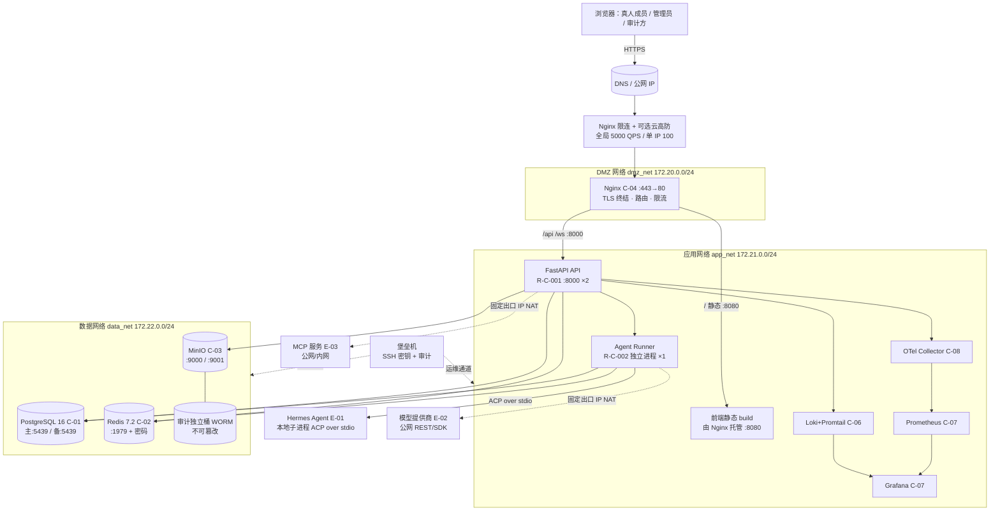
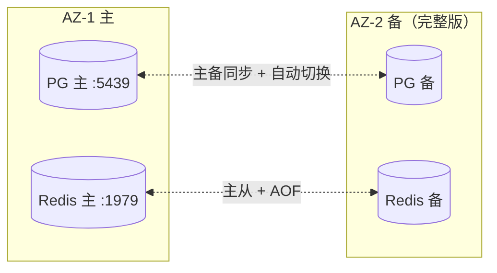

# AICoding 架构设计 · 部署设计

> 本文档为《AICoding 架构设计》核心产物之一（Phase 5 / Gate G5），定位为**系统部署设计**。
> 上游输入：《系统设计》（G4 已通过并冻结，含 §5 部署架构 / §6 网络架构 / §7 安全设计 / §8 可观测设计基线）。
> 下游输出：环境与资源清单、流水线、监控告警、应急回滚、容量成本等可落地的运维交付物。
> 安全侧权威内容（信任域 / 安全组细则 / WAF 厂商版本 / 密钥分级轮转 / 审计保留期与不可篡改 / mTLS）由 security-architect（严守正）在 Step S 回填，本文档据其结论承接落地，不自行定义分级。

---

## 1. 引言

### 1.1 适用范围与部署形态

- **系统范围**：Hermes Infi WebUI —— 真人团队 × AI Agent 协作平台（自托管）。涵盖接入层（Vue3 SPA）、应用层（M1~M9 后端模块 + Agent Runner 独立进程）、中间件层（PostgreSQL 16 / Redis 7.2 / MinIO）、集成层（Hermes Agent E-01 / 模型提供商 E-02 / MCP 服务 E-03 / 审计监控 E-04）。
- **部署形态**：**私有化自托管**（D1 §1 / §17 硬约束，数据驻留本地）。MVP 阶段为**单组织单实例、单 AZ、单活 + 主备切换**（继承自 G3 §4.2 / D5 冻结）；编排形态为 **Docker Compose 单主机**。完整版演进为多 AZ / 多 Region。
- **不可变更边界**：业务/系统模块边界（属 business-architect / system-architect 冻结范围）、流式机制（X1 已锁定方案 B：Redis Stream + evt:conv:{id} + XREAD）、技术栈（FastAPI + PostgreSQL 16 async + Redis 7 + MinIO + Vue3/TS）均直接继承，本设计不重新裁决。

### 1.2 名词与缩写

| 缩写 | 全称 | 含义 |
| --- | --- | --- |
| MVP | Minimum Viable Product | 最小可行产品（本期交付范围） |
| AZ | Availability Zone | 可用区 |
| RTO / RPO | Recovery Time / Point Objective | 恢复时间目标 / 恢复点目标 |
| ACP | Agent Client Protocol | Agent 客户端协议（JSON-RPC over stdio） |
| SSE / WS | Server-Sent Events / WebSocket | 服务端推送 / 双向 WebSocket |
| DMZ / INT / DATA | Demilitarized Zone / Internal / Data | 公网入口缓冲 / 内部应用 / 数据三层网络（对应系统设计 §6.1） |
| HA | High Availability | 高可用 |
| Loki / OTel | Grafana Loki / OpenTelemetry | 日志系统 / 可观测链路标准 |
| WORM | Write Once Read Many | 一次写入多次读取（对象锁不可篡改） |

---

## 2. 环境与资源清单

### 2.1 环境矩阵

| 环境 | 用途 | 集群隔离 | 数据 | 网络访问 |
| --- | --- | --- | --- | --- |
| dev | 开发自测 | 与其他系统共用同一 Docker host / 命名空间（最小规格 1C2G × 组件） | 模拟数据（种子数据，可 `make fresh` 重置） | 内网（仅开发机 / VPN），不暴露公网 |
| int | 联调 | 共用 / 独立（与 dev 共享 host，逻辑隔离；规格接近 uat 一半） | 模拟数据 | 内网 + 白名单（联调伙伴） |
| uat | 预发 / 验收 | 独立（独立 host / 独立 compose 工程，规格接近生产） | 仿生产（脱敏数据副本） | 内网 + 白名单（验收方） |
| prod | 生产 | 独立（独立 host；MVP 单主机 Docker Compose，8C32G 推荐主机 × 组件副本） | 真实数据（严格 ACL，最小暴露） | 公网（Nginx 443 入口）/ 内网运维通道（堡垒机 SSH 密钥 + 审计） |

> **隔离策略说明**：
> - dev / int 环境共享资源、可重置，**不承载真实用户数据**，允许弱隔离以提速联调。
> - uat 环境**独立部署**，数据与生产同构但脱敏，用于验收与发布前演练。
> - prod 环境**物理/逻辑独立**：独立 host、独立 Docker 三层网络（dmz_net / app_net / data_net）、独立密钥（L4 Secret 不跨环境复用，遵循系统设计 §7.2.3 红线）、独立 MinIO 桶（含审计独立桶）。

### 2.2 云资源清单

#### 2.2.1 计算资源

| 资源编号 | 类型 | 产品 | 资源 ID | 名称 | 规格 | 数量 | 环境 | 复用 / 新建 | HA 方案 | 用途 |
| --- | --- | --- | --- | --- | --- | --- | --- | --- | --- | --- |
| R-C-001 | 应用容器 | FastAPI (hermes-api) | hermes-api | API 服务 | 1C2G / 副本 | dev 1 / int 1 / uat 2 / prod 2（MVP）→ 4（生产阶段） | 全部 | 新建 | 多副本无状态 + Docker 自动重启 + Nginx 摘流 | REST/WS 业务 API（M1~M9） |
| R-C-002 | 应用容器 | Python (hermes-runner) | hermes-runner | Agent Runner | 1C2G / 副本 | dev 1 / int 1 / uat 1 / prod 1（MVP）→ 2（生产阶段） | 全部 | 新建 | 独立有状态消费进程（显式标注）；崩溃重投递 acp:prompt | ACP 调度层（M8），消费 acp:prompt → 驱动 Hermes Agent |
| R-C-003 | 网关容器 | Nginx 1.25 (hermes-nginx) | hermes-nginx | 反向代理 / 静态 | 1C2G | 各环境 1 | 全部 | 新建 | 单实例（MVP）；入口限连，故障主备切换 | TLS 终结 / 路由 / 限流 / 托管前端静态 build |
| R-C-004 | 主机 | Docker Host (C-05) | host-prod | 部署宿主机 | 8C32G（MVP 推荐；G3 基线 4C16G 为下限，见 §8.2 复核）/ 生产阶段 16C64G 或完整版多节点 | prod 1 / uat 1 / int 共享 / dev 共享 | 全部 | 新建 | 主机级备份 + 主备切换（RTO≤15min） | 承载全部容器（Co-located） |

> **部署基线复核（重要）**：系统设计 §3.1.3 中 C-05 标注单主机 4C16G，但 C-01~C-08 各组件规格合计（PG 2C8G×2 + Redis 2C4G + MinIO + Nginx 1C2G + Loki 2C4G + Prometheus/Grafana 2C4G + OTel 1C2G + API×2 + Runner）显著超出 4C16G。本设计按**组件规格为权威**（继承 C-01~C-08），MVP 单主机**推荐 8C32G 起步**（容纳右配容器），4C16G 视为下限且需压缩非核心副本；生产阶段（2000 用户 / 2000 QPS）按 §5.5.2「生产阶段值」需垂直升配 16C64G 或完整版多节点。该复核属部署事实基线，不改动业务/对外承诺，详见 §8.2 成本测算。

#### 2.2.2 存储资源

| 资源编号 | 类型 | 产品 | 资源 ID | 名称 | 规格 | 容量 | 环境 | 复用 / 新建 | HA 方案 | 备份策略 |
| --- | --- | --- | --- | --- | --- | --- | --- | --- | --- | --- |
| R-S-001 | 关系型存储卷 | PostgreSQL 16 (C-01) | pg-data | PG 主库数据 | 2C8G（MVP）→ 4C16G（生产） | 50GB（MVP）→ 500GB（生产） | 全部 | 新建 | 主 + standby（主备同步 + 故障自动切换，RTO≤15min） | 全量周备 + 增量 WAL 归档至 R-S-003（MinIO），保留 30d 全量 / 14d WAL |
| R-S-002 | 缓存持久化卷 | Redis 7.2 (C-02) | redis-data | Redis AOF/RDB | 2C4G（MVP）→ 4C8G（生产） | 内存 ≤2GB；持久化卷 20GB | 全部 | 新建 | 主从 + AOF（everysec），故障自动切换（RTO≤5min） | AOF everysec + RDB 日备至 MinIO |
| R-S-003 | 对象存储卷 | MinIO (C-03) | minio-data | 文件 / 工作区 / 备份 | 多盘 erasure | 100GB（MVP）→ 1TB（生产） | 全部 | 新建 | 内置 erasure 冗余 + 版本化 + 跨卷复制 | 版本化；备份归档与生产隔离桶 |
| R-S-004 | 日志存储卷 | Loki (C-06) | loki-data | 应用 / 审计日志 | 2C4G | ~1TB（日志 ~5GB/天，30d 热 + 180d 冷估算） | 全部 | 新建 | 单实例 + 对象存储后端（完整版多副本） | 保留 30d 热 + 180d 冷（明细见 §2.2.5） |
| R-S-005 | 备份归档卷 | MinIO 备份桶 | minio-backup | WAL / 全量归档 | — | 按保留策略 ~200GB（MVP）→ ~500GB（生产） | prod / uat | 新建 | 跨卷复制 | 独立于业务桶，RPO≤5min（PG） |
| R-S-006 | 审计独立桶 | MinIO 审计桶（WORM） | minio-audit | 不可变审计 trail | — | ≥1 年增量（GB 级） | prod / uat | 新建 | erasure + 对象锁（WORM，不可篡改） | 保留 ≥1 年（合规 N3），不可篡改策略由 security-architect §7.2 定义 |

#### 2.2.3 网络资源

| 资源编号 | 类型 | 产品 | 资源 ID | 名称 | 规格 | 环境 | 复用 / 新建 | 用途 |
| --- | --- | --- | --- | --- | --- | --- | --- | --- |
| R-N-001 | 桥接网络 | Docker bridge | dmz_net | DMZ 网络 | 172.20.0.0/24 | 全部 | 新建 | Nginx 仅公网入站（443），不直接访问内部 |
| R-N-002 | 桥接网络 | Docker bridge | app_net | 应用网络 | 172.21.0.0/24 | 全部 | 新建 | Web/API/Runner + 可观测组件互联 |
| R-N-003 | 桥接网络 | Docker bridge | data_net | 数据网络 | 172.22.0.0/24 | 全部 | 新建 | PG/Redis/MinIO 仅内网，禁止公网 |
| R-N-004 | 公网入口 | 主机公网 IP + DNS | public-ingress | 域名解析入口 | — | prod / uat | 新建 / 待人工确认 | DNS → Nginx 443；固定出口 IP 供 E-02/E-03 白名单 |
| R-N-005 | 安全组（命名） | Docker network ACL / 主机防火墙 | sg-dmz-nginx / sg-app-api / sg-data-pg / sg-data-redis / sg-data-minio | 分层安全组（deny-all + 显式放通） | — | 全部 | 新建（命名部署侧；规则由 security-architect 权威） | 分层放通：DMZ→APP 仅 443；APP→DATA 仅 5439/1979/9000；禁止公网开放 22/23/3306/5439/1979/9000 |

> **VPC / 子网 / CIDR 权威说明**：本期为自托管单主机 Docker Compose，无云厂商 VPC；上表以 Docker 三层 bridge 网络（dmz_net / app_net / data_net）映射系统设计 §6.1 的 DMZ / INT / PROD 三层，CIDR 为 bridge 子网。完整版（云原生多 AZ）时，三层 bridge 直接映射为 VPC 内三个子网（DMZ 子网 / 应用子网 / 数据子网），CIDR 由云控制台分配，安全组规则由 security-architect 落地。

#### 2.2.4 中间件与平台服务

| 资源编号 | 类型 | 产品 | 资源 ID | 名称 | 规格 | 环境 | 复用 / 新建 | HA 方案 | 用途 |
| --- | --- | --- | --- | --- | --- | --- | --- | --- | --- |
| R-M-001 | 关系型数据库 | PostgreSQL 16 (C-01) | hermes-pg | 业务主数据 | 2C8G（MVP）→ 4C16G（生产） | 全部 | 新建 | 主 + standby，故障自动切换 | 业务主数据（t_* 17 表） |
| R-M-002 | 缓存 / 事件流 | Redis 7.2 (C-02) | hermes-redis | 事件流 / 限流 / presence | 2C4G（MVP）→ 4C8G（生产） | 全部 | 新建 | 主从 + AOF，故障自动切换 | acp:prompt / evt:conv XREAD / rl:msg / presence（X1 方案 B） |
| R-M-003 | 对象存储 | MinIO (C-03) | hermes-minio | 文件 / 工作区 / 备份 | 100GB（MVP）→ 1TB（生产） | 全部 | 新建 | erasure + 版本化 | 工作区文件 / 备份归档 / 审计桶 |
| R-M-004 | API 网关 | Nginx 1.25 (C-04) | hermes-nginx | 入口路由 | 1C2G | 全部 | 新建 | 单实例（MVP） | TLS 终结 / 路由 / 限流 |
| R-M-005 | 容器编排 | Docker Compose v2.27 (C-05) | hermes-compose | 服务部署 | 单主机 | 全部 | 新建 | 容器重启策略 | 编排全部服务 |
| R-M-006 | 密钥管理 | .env / Docker Secret（MVP）→ HashiCorp Vault（完整版）(C-09) | hermes-kms | 密钥 / 凭证 | — | 全部 | 新建（MVP 文件级；完整版 KMS 实例） | 文件挂载（MVP）；完整版多节点 unseal | 密码 / AKSK / Token / JWT 密钥；**密钥分级 5 类（数据库密码 / 云 AKSK / 服务间密钥 / 用户密码 / API Key）、轮转周期、访问策略引用 security-architect §6 结论，本设计不自行定义分级** |

#### 2.2.5 可观测资源

| 资源编号 | 类型 | 产品 | 资源 ID | 名称 | 规格 | 环境 | 复用 / 新建 | 承载可观测维度 |
| --- | --- | --- | --- | --- | --- | --- | --- | --- |
| R-O-001 | 指标采集 | Prometheus 2.53 (C-07) | hermes-prom | 指标采集 | 2C4G | 全部 | 新建 | RED / USE / 业务指标（~100 万序列） |
| R-O-002 | 可视化 | Grafana 11 (C-07) | hermes-grafana | 大盘 | 同 Prometheus host | 全部 | 新建 | 6 个 Dashboard（业务/服务健康/中间件/容量/预警/审计合规） |
| R-O-003 | 日志 | Loki 2.9 + Promtail (C-06) | hermes-loki | 日志收集 | 2C4G | 全部 | 新建 | 应用/接入/审计结构化日志（traceId+tenantId） |
| R-O-004 | 链路追踪 | OpenTelemetry Collector 0.10x (C-08) | hermes-otel | 分布式追踪 | 1C2G | 全部 | 新建 | W3C TraceContext，1% 采样 / 错误·慢请求 100% |
| R-O-005 | 告警引擎 | Alertmanager (随 Prometheus) | hermes-alert | 告警路由 | 同 Prometheus host | 全部 | 新建 | P0~P3 告警路由（AL-01~AL-08） |
| R-O-006 | 通知通道 | 电话 / 短信 / IM（飞书·企微） | notify-chan | 告警通知 | — | prod / uat | 新建 / **待人工确认具体通道与 webhook** | P0 电话+短信+IM；P1 短信+IM；P2 IM 工单；P3 看板 |

> **日志保留期（管道/存储由部署侧落地；保留期与不可篡改由 security-architect 权威）**：
> - 应用日志 INFO+：30 天热 + 180 天冷（Loki）。
> - 应用日志 ERROR+：90 天热 + 1 年冷（Loki + 实时告警）。
> - Nginx 接入日志：30 天（Loki）。
> - 审计日志（t_audit_log）：≥ 1 年（R-S-006 独立桶，WORM 不可篡改，对齐 RPO/RTO 与合规 N3）。
> - 慢查询日志：30 天（Loki）。
> 以上保留期口径与 security-architect §7.2 审计保留期结论一致；审计 ≥1 年、WORM 不可篡改策略引用其定义。

#### 2.2.6 安全资源

| 资源编号 | 类型 | 产品 | 资源 ID | 名称 | 规格 | 环境 | 复用 / 新建 | HA 方案 | 用途 |
| --- | --- | --- | --- | --- | --- | --- | --- | --- | --- |
| R-Sec-001 | 密钥管理实例 | .env/Docker Secret（MVP）→ Vault（完整版） | hermes-kms | KMS/Vault（同 R-M-006） | — | 全部 | 新建 | 文件挂载 / 多节点 | 凭证托管；**分级/轮转/访问策略引用 security-architect §6（5 类密钥、轮转 90 天、最小权限）** |
| R-Sec-002 | 安全组（命名+规则） | Docker ACL / 主机防火墙 | sg-*（R-N-005） | 分层安全组 | — | 全部 | 新建 | deny-all + 显式放通（规则由 security-architect 权威） | 分层放通与最小暴露 |
| R-Sec-003 | WAF | Nginx ModSecurity（可选） | hermes-waf | 应用层防护 | — | prod / uat | 新建（**MVP 不启用**；完整版 ModSecurity + OWASP CRS 3.3，拦截 SQLi/XSS/命令注入/路径遍历/SSRF，自定义拦截含 `<script>`/eval( 请求体，请求体 ≤2MB、URL ≤2048） | 单实例 | Web 应用层防护 |
| R-Sec-004 | 审计不可变桶 | MinIO 对象锁（WORM） | minio-audit（同 R-S-006） | 不可变审计 | — | prod / uat | 新建 | erasure + 对象锁 | 审计 trail 防篡改（保留期/不可篡改策略由 security-architect §7.2 定义） |
| R-Sec-005 | 主机/容器加固 | 基础加固 + 最小镜像 + 非 root + 只读根 fs | host-hardening | 主机与容器安全 | — | 全部 | 新建 | 镜像扫描 | 主机安全（系统设计 §7.1）/ 容器非 root 只读（部署侧落地） |
| R-Sec-006 | 堡垒机 | SSH 密钥登录 + 审计 | bastion | 运维通道 | — | prod / uat | 新建 | 禁用密码；运维/文件/DB 操作日志全量记录 | 受限运维入口 |
| R-Sec-007 | DDoS / NAT | Nginx 限连 + 出口 NAT | ddos-nat | 入口限连 / 固定出口 | — | 全部 | 新建 | Nginx 限连（全局 5000 QPS / 单 IP 100 QPS）；可选云高防（完整版） | 抗 DDoS（安全侧权威） |

### 2.3 复用资源清单

| 复用资源 ID | 原业务方 | 余量评估 | 隔离方式 |
| --- | --- | --- | --- |
| 无（本期为独立自托管新部署，无既有资源可复用） | — | — | — |

> 本期 Hermes Infi WebUI 为新建独立部署，不复用既有业务方资源；密钥（L4）跨环境不共用（遵循 §7.2.3 红线）。如后续接入企业既有 MinIO / PostgreSQL 实例，需经主理人评审并补充余量评估与隔离方式。

---

## 3. 部署拓扑与高可用设计

### 3.1 物理拓扑

#### 3.1.1 物理拓扑图

> 图示采用 Mermaid（标准可渲染，GitHub / 多数 Markdown 查看器原生支持）。节点分层 / 命名 / 连线语义与本文档一致。



#### 3.1.2 拓扑要素清单

- **跨 Region 部署**：否；Region 数量 1（MVP）。
- **跨 AZ 部署**：否；AZ 数量 1（MVP）；完整版多 AZ（对应系统设计 §5.4.3 故障域「单 AZ」项）。
- **流量入口路径**：DNS → Nginx(C-04, dmz_net, 443) → API(:8000) / Web 静态(:8080) → 业务。
- **内部调用路径**：服务发现 = Docker 网络 DNS（禁止硬编码 IP）；协议 REST / WS / ACP stdio / MCP。
- **数据库访问路径**：API/Runner → SQLAlchemy async 连接池 → PG 主（主从切换由 PG HA 机制保障）；Redis 经服务名连接主从 + AOF。

### 3.2 流量与网络链路（连通视图）

#### 3.2.1 流量入口链路

| 组件 (R-xx) | 协议 - 端口 | TLS 终结 | 作用 |
| --- | --- | --- | --- |
| Nginx (R-C-003 / R-M-004, dmz_net) | HTTPS 443 → 转发 80；80→443 跳转 | Nginx 终结（业务侧解析 X-Forwarded-*） | 公网入口：TLS / 路由 / 限流 / DDoS 限连 |
| Nginx → Web 静态 | HTTP 8080（内部明文，同信任域） | 内部不启用 TLS（MVP） | 前端静态资源服务（由 Nginx 托管 build） |
| Nginx → API | HTTP 8000（内部明文，同信任域） | 内部不启用 TLS（MVP）；完整版启用 mTLS（security-architect 权威） | REST/WS 业务 API |
| 本地开发态（dev 脚本） | API :8001（start-api.sh） / :8000（uvicorn）；前端 npm run dev :5173，Vite 代理 → :8001（D3 §3）或 :8000（D1/D2 §3）；VITE_API_PROXY_TARGET 默认 :8000 | 否 | 开发自测（**dev(8001) vs prod(8000) 并列表述，不静默二选一**） |

> **X2 端口映射明确说明（dev vs prod，不静默二选一）**：
> - **生产 / Docker（基准）**：Nginx 对外 443；Web 前端容器 :8080；API :8000（容器内）；Redis :1979(+密码)；PostgreSQL :5439。
> - **本地裸机开发**：uvicorn API 默认 :8000；`start-api.sh` 暴露 API :8001；前端 `npm run dev` :5173，Vite 代理目标按 D3 §3 为 :8001（按 D1/D2 §3 为 :8000）——此为开发态便利，**不与生产端口冲突**，生产以 docker/compose 实际为准。
> - 所有接入点从环境变量（L3）读取，禁止写死端口（遵循系统设计 §5.1 端口约定 handoff）。

> **X3 Redis/PostgreSQL 端口与认证（部署基线）**：
> - Docker/Compose 实际：**Redis :1979 + 密码**（非默认 6379）；**PostgreSQL :5439**（非默认 5432）；均经环境变量注入。
> - 裸机默认 6379 / 5432 仅作本地开发说明，不在生产使用。

#### 3.2.2 内部互联链路

| 项 | 说明 |
| --- | --- |
| 服务发现 | Docker 网络 DNS（app_net / data_net 内服务名解析）；禁止硬编码 IP |
| 服务间协议 | HTTP/REST（API↔内部）、WebSocket（圆桌流式）、ACP over stdio（API/Runner↔Hermes Agent E-01）、MCP（Runner↔E-03） |
| mTLS | MVP 不启用（同信任域明文）；完整版启用客户端证书（security-architect 权威，覆盖范围与证书策略由其定义） |
| 数据库连接 | API/Runner → PG 异步连接池（asyncpg）→ 主库；主从切换由 PG HA 保障；连接串经 L3 环境变量 |
| 缓存连接 | API/Runner → Redis 服务名（主从 + AOF，故障自动切换）；消费者组用于 evt:conv / evt:user XREAD |
| 事件流（MQ 等价）连接 | API/Runner → Redis Stream：acp:prompt（API→Runner）、evt:conv:{id}（Runner→API，XREAD 转发，支持 Last-Event-ID 重连续传）、evt:user:{id}（跨会话 notify） |
| 对象存储连接 | API → MinIO（S3 SDK，STORAGE_BACKEND=minio/db） |
| 外部出口（E-02/E-03） | 经 NAT / 固定出口 IP（模型提供商 / MCP 白名单）；新增 E-xx 先登记（security-architect 权威白名单） |

#### 3.2.3 跨网络互联

| 互联类型 | 通道 | 带宽 | 加密 | 用途 |
| --- | --- | --- | --- | --- |
| DMZ → APP | dmz_net → app_net（仅放通 443 入站） | 主机内网线速 | 内部明文（MVP）；完整版 mTLS（security-architect 权威） | Nginx 转发至 Web/API |
| APP → DATA | app_net → data_net（仅放通 5439/1979/9000） | 主机内网线速 | 内部明文（MVP） | API/Runner 访问 PG/Redis/MinIO |
| DATA → 公网 | NAT / 固定出口 IP（仅至 E-02/E-03 域名） | 受出口带宽限制 | TLS（外部 HTTPS） | 模型推理 / MCP 调用 |
| 跨 VPC / 跨 Region | 不适用（MVP 单主机单 AZ）；完整版 PrivateLink / 专线 | — | — | 灾备（完整版） |

#### 3.2.4 安全组与流量管控（security-architect 权威回填）

> 信任域（security-architect 定义，部署侧落地）：公网/DMZ（浏览器 + DDoS 高防 + Nginx，仅 443 入站，80→443 跳转，不直接访问内部中间件）；业务 INT/PROD（API/Runner/PG/Redis/MinIO/Hermes Agent，仅 DMZ 入站，出站受控 NAT 固定 IP）；DevOps/运维（Loki/Prom/Grafana/OTel/CICD/堡垒机，仅运维通道可达业务）；外部域（经 NAT 出口白名单：模型 E-02 / MCP E-03 / 审计 E-04）。

| 管控项 | 权威规则（security-architect） | 部署侧落地（按实际端口承接） |
| --- | --- | --- |
| 安全组基线 | deny-all + 显式放通；禁止 0.0.0.0/0 开放 22/23/3306/5432/6379/9000 | 以部署实际端口承接：PG :5439、Redis :1979、MinIO :9000 仅 data_net 内最小集放通；仅 Nginx :443 对公网开放；22 仅堡垒机入口 |
| DDoS | Nginx 限连（全局 5000 QPS / 单 IP 100 QPS），可选云高防（完整版） | Nginx limit_conn/limit_req 落地；全局 5000 QPS 与系统设计 §3.5.3 红线一致 |
| WAF | MVP 不启用（继承系统设计 §7.1「WAF 否」）；完整版 ModSecurity + OWASP CRS 3.3（拦截 SQLi/XSS/命令注入/路径遍历/SSRF，自定义拦截含 `<script>`/eval( 请求体，请求体 ≤2MB、URL ≤2048） | MVP 关闭；完整版启用并挂载规则集 |
| 堡垒机 | SSH 密钥登录、禁用密码；运维/文件/DB 操作日志全量记录 | R-Sec-006 落地；密钥交付运维，不入代码/日志 |
| 限流红线联动 | 与系统设计 §3.5.3 一致 | Nginx 双层（全局/单 IP）+ 业务层（单用户 50、会话事件流 20 条·s⁻¹） |

### 3.3 高可用与故障容错

#### 3.3.1 故障域划分（四层）

| 故障域 | 影响范围 | 容错机制 | 预期 RTO |
| --- | --- | --- | --- |
| 单容器（Pod 等效） | 单实例 | Docker 自动重启（restart: unless-stopped） | ≤ 30s（瞬时无影响） |
| 单主机（Node 等效） | 该主机全部容器 | 备份恢复 + 主备切换（PG/Redis 自动切换） | ≤ 15min |
| 单 AZ | 该 AZ 全部资源 | 跨 AZ 部署，自动切换（完整版） | ≤ 5min |
| 单 Region | 主资源 | 灾备 Region 切换（完整版） | ≤ 1h |

> **可用性来源拆分**：云厂商 SLA 兜底（IaaS / PaaS，自托管则由运维团队兜底基础设施）；本系统自身保障（逻辑容错 / 重试 / 熔断 / 降级 / 兜底，研发团队）；强依赖外部（E-01/E-02/E-03）故障策略（熔断 / 降级 / 排队 / 拒绝，研发团队）。

#### 3.3.2 负载均衡

- **类型**：7 层（L7，Nginx C-04）对外；API 多副本经 Nginx upstream 轮询；WebSocket（圆桌）经 Nginx 粘性转发至 API 副本。
- **健康检查**：`/healthz`（Liveness，仅判进程存活 → 失败重启）；`/readyz`（Readiness，判 DB/Redis 就绪 → 失败摘流不杀）。频率 10s，连续 3 次失败标记不健康，连续 2 次成功恢复。
- **会话保持**：否（API 无状态；Session 外置 Redis；WebSocket 由 Redis Stream 支撑断线重连续传）。

#### 3.3.3 健康检查配置

| 检查项 | 路径 | 频率 | 失败阈值 | 成功阈值 | 动作 |
| --- | --- | --- | --- | --- | --- |
| Liveness | `/healthz` | 10s | 连续 3 次 | 连续 2 次 | 失败 → Docker 重启容器 |
| Readiness | `/readyz` | 10s | 连续 3 次 | 连续 2 次 | 失败 → 从 Nginx upstream 摘流（不杀） |
| Runner 存活 | acp:prompt 消费延迟 + 进程心跳 | 15s | 消费 Lag > 1000 或进程退出 | 正常消费 | 失败 → 重启 Runner / 重投递 |

#### 3.3.4 弹性伸缩配置

| 伸缩对象 | 触发指标 | 扩容阈值 | 缩容阈值 | 副本区间 | 冷却 |
| --- | --- | --- | --- | --- | --- |
| API (R-C-001) | CPU / QPS | CPU > 70% 持续 5min | CPU ≤ 30% 持续 10min | min 2 / max 8（MVP 单主机受规格约束；完整版跨节点） | 扩容 60s / 缩容 5min |
| Agent Runner (R-C-002) | acp:prompt 积压 / CPU | 积压 > 50 持续 5min | 积压 = 0 持续 10min | min 1 / max 4 | 扩容 60s / 缩容 5min |

> MVP 单主机受 8C32G 规格约束，副本上限实际取 max 4（API）/ max 2（Runner）；完整版多节点放开至 max 8。

#### 3.3.5 容灾切换配置

- **MVP（单 AZ）**：主备切换 RTO≤15min（PG 主备同步 + 故障自动切换；Redis 主从 + AOF 故障自动切换）；主机级备份恢复。
- **完整版（多 AZ / 多 Region）**：跨 AZ 部署 RTO≤5min；跨 Region 异步同步灾备 RTO≤1h（本期不启用，仅预留架构）。



---

## 4. 部署流程

### 4.1 代码仓库与分支

| 项 | 规范 / 值 | 说明 |
| --- | --- | --- |
| 代码仓库地址 | `git@internal:hermes/hermes-python.git`（**待人工确认实际仓库地址**） | 单体仓库（backend + frontend + docker） |
| 分支管理 | `main`（生产就绪）/ `develop`（集成分支）/ `release/<ver>`（发布分支）/ `feature/*`（特性）/ `hotfix/*`（紧急修复） | 主干保护，强制 PR + 评审 |
| 合并规范 | PR → 至少 1 名 Owner 评审 + CI 全绿 → squash merge 入 `develop`；`release/*` 经 uat 验证后合 `main` | 禁止直接 push `main` |
| 标签规范 | 语义化版本 `v<major>.<minor>.<patch>`；镜像 tag 取 git-tag + commit-short | 用于制品溯源与回滚 |

### 4.2 流水线（CI / CD，8 阶段）

| 阶段 | 触发条件 | 关键动作 | 失败处理 |
| --- | --- | --- | --- |
| 1. 构建 | 自动（push / PR） | 拉代码 → 前后端编译 → 单元测试（pytest / vue-tsc）→ 构建产物 | 阻断后续阶段 |
| 2. 代码扫描 | 构建后 | 静态扫描（SonarQube / ruff）/ 代码规范 / 复杂度 | 不达标阻断 |
| 3. 安全扫描 | 构建后 | SCA（依赖漏洞）/ SAST（代码漏洞）/ 镜像漏洞扫描（Trivy） | 高危阻断 |
| 4. 集成测试 | 合并到 `develop` | 集成测试 / 接口测试 / 契约测试（对齐 §3.5 错误码与幂等） | 阻断后续阶段 |
| 5. 制品打包 | 测试通过 | 构建镜像（backend / frontend / runner）→ 推送 registry 并打 Tag | 失败重试 |
| 6. 部署集成环境 | Package 完成 | 自动部署到 dev / int（Docker Compose 重启策略） | 失败回滚到上一版本 |
| 7. 部署测试环境 | 手动触发（release 分支） | 部署到 uat；冒烟测试（登录 / 创建会话 / 圆桌） | 失败回滚到上一版本 |
| 8. 部署生产环境 | 人工审批（release→main） | 按 §4.5 发布策略灰度上线（MVP 滚动） | 按 §6 回滚策略实施回滚 |

### 4.3 构建产物与制品管理

| 配置项 | 配置值 / 规则 | 说明 |
| --- | --- | --- |
| 产物类型 | 容器镜像（backend / frontend / runner）+ 前端静态包（Nginx 托管） | 三镜像分工 |
| 镜像仓库 | `registry.internal/hermes`（私有registry，**待人工确认**） | 命名空间 `hermes` |
| 镜像命名 | `{registry}/hermes/{service}:{git-tag}-{commit-short}`，如 `registry.internal/hermes/api:v1.0.0-a1b2c3d` | 禁止 latest 标签上线 |
| 制品保留期 | 镜像保留最近 20 个版本 + 全部 release tag；前端静态包随镜像；超时自动 GC | 支持一键回滚 |
| 制品溯源 | 镜像 Label 必含 `git-commit` / `build-time` / `pipeline-id`；manifest 可反查源码 | 便于事故溯源 |
| 签名与校验 | MVP 可选；完整版 cosign 签名 + 校验（关联 security-architect KMS 集成） | 防篡改供应链 |

### 4.4 配置管理（L1~L4 四层级）

| 层级 | 存放位置 | 适用内容 | 变更生效 | 对运行的约束 |
| --- | --- | --- | --- | --- |
| L1 代码内 | 代码仓库 | 默认值、枚举、常量 | 重新部署 | 禁止写环境差异/密码/地址 |
| L2 配置中心 | pydantic-settings + 环境变量热重载（MVP 用 env，完整版 Apollo/Nacos） | 限流阈值/灰度/降级开关 | 重启或热重载 | 实现配置变更回调；幂等 |
| L3 环境变量 / ConfigMap | Docker Compose env_file | DB/Redis/MinIO 接入点（含实际端口 5439/1979） | 重启容器 | 启动失败 fail-fast |
| L4 Secret | .env / Docker Secret（完整版 Vault） | 密码/AKSK/Token/JWT 密钥 | 动态拉取（Vault） | 禁止落日志/入代码；引用 security-architect §6 分级与轮转 |

### 4.5 发布策略

#### 4.5.1 发布方式

| 模块 | 发布方式 | 说明 |
| --- | --- | --- |
| 全部（MVP 单主机） | 滚动发布 | Docker Compose `up` 重建 + 健康检查摘流；API 多副本分批滚动，零停机 |
| API（完整版多节点） | 金丝雀发布 | Nginx 权重 5%→25%→100%，观测窗口各 10min，异常自动回滚 |
| 数据库迁移（Alembic） | 前置独立变更 | 可回滚 DDL 先于代码发布；不可回滚 DDL 禁止同发（见 §6.1.3） |

#### 4.5.2 发布标准流程

- **首次发布**：`make up` → `make migrate`（Alembic 全量）→ `make seed`（管理员种子）→ 健康检查 → 冒烟。
- **常规迭代**：PR 合 `develop` → CI 1~5 → 打镜像 → 部署 int → 验证 → 提 `release/*` → 部署 uat → 验收 → 合 `main` → 审批 → 部署 prod（滚动）。
- **资源变更**：DB 规格/容量变更走运维工单；网络/安全组变更走 security-architect 评审。

#### 4.5.3 灰度路径与观测窗口

- MVP 滚动：分两批（先 1 副本验证 `/readyz` + 冒烟，再全量）；每批观测 5min。
- 完整版金丝雀：5%（10min）→ 25%（10min）→ 100%；观测 P95 延迟、错误率、Redis Stream Lag。

#### 4.5.4 发布门禁

| 门禁项 | 拦截条件 | 检查时机 |
| --- | --- | --- |
| 单元测试通过率 | 100% | Build 阶段 |
| 单元测试覆盖率（增量） | ≥ 70% | Code Quality 阶段 |
| 集成测试通过率 | 100% | Integration Test 阶段 |
| 静态扫描严重问题数 | 0（高危）；中危需评审 | Code Quality 阶段 |
| 安全扫描高危漏洞 | 0 | Security Scan 阶段 |
| 镜像漏洞 | 高危 0 | 制品扫描 |
| 接口契约校验 | 兼容（不破坏在网调用方） | Integration Test 阶段 |
| 性能基线 | P95 不退化（消息 P95 ≤ 1.5s） | 性能测试 |
| 人工审批 | 至少 1 名 Owner | 生产发布前 |

---

## 5. 监控告警接入

### 5.1 监控架构与数据流

```text
Pod / 中间件 ──┬─► Metrics ──► Prometheus (R-O-001) ──► Grafana (R-O-002)
               ├─► Logs    ──► Loki (R-O-003) / 审计独立桶 (R-S-006, WORM)
               └─► Traces  ──► OTel Collector (R-O-004) ──► Prometheus / Grafana
                                          ▼
                                  告警引擎 Alertmanager (R-O-005)
                                          ▼
                            电话 / 短信 / IM (R-O-006, §5.4)
```

### 5.2 关键 Dashboard 清单

| 大盘 | 用户 | 指标 |
| --- | --- | --- |
| 业务大盘 | 产品 / 业务 | 会话数 / 任务完成率 / 圆桌数 / 审计覆盖率 |
| 服务健康大盘 | 研发 / SRE | RED（Rate / Errors / Duration），P95 ≤ 1.5s（消息）/ ≤ 3s（审计查询） |
| 中间件大盘 | SRE / DBA | PG QPS / 慢查询 / Redis 命中率 / Stream Lag / MinIO 容量 |
| 容量大盘 | SRE | §8.1.4 全部资源水位（CPU/内存/磁盘/连接/带宽） |
| 业务预警大盘 | On-call | 当前活跃告警（实时） |
| 审计合规大盘 | 合规 / 管理员 | 审计覆盖率 / 澄清卡死率 / 审计写入失败率 |

### 5.3 告警规则清单（P0~P3 + Owner + Runbook）

| 编号 | 级别 | 触发条件 | 关联资源 (R-xx) | Owner | Runbook |
| --- | --- | --- | --- | --- | --- |
| AL-01 | P0 | 错误率 > 1% 持续 5min 或连续 3 次健康检查失败 | R-C-001 / R-M-001 / R-M-002 | @SRE | RB-01 |
| AL-02 | P1 | API 容器 CPU > 80% 持续 10min 或 OOM | R-C-001 | @后端服务团队 | RB-02 |
| AL-03 | P1 | 圆桌 RUNNING 无流式 > 120s 或 ACP 会话崩溃 | R-C-002 / E-01 | @Agent 调度团队 | RB-03 |
| AL-04 | P1 | Redis Stream Lag > 1000 或 evt:conv XREAD 失败 | R-M-002 | @后端服务团队 | RB-04 |
| AL-05 | P1 | t_audit_log 写入失败率 > 1% | R-M-001 / R-S-006 | @合规 / @后端服务团队 | RB-05 |
| AL-06 | P2 | PG 连接池耗尽 / 慢查询 > 2s 占比 > 5% | R-M-001 | @DBA | RB-06 |
| AL-07 | P2 | 单用户/单 IP 命中 §3.5.3 限流红线 | R-C-003 | @后端服务团队 | RB-07 |
| AL-08 | P3 | 任意资源 > 80% 危险水位（§8.1.4） | 全部 | @SRE | RB-08 |

### 5.4 告警通道

| 级别 | 响应时间 | 通知方式 | 上升机制 |
| --- | --- | --- | --- |
| P0 | ≤ 5 min | 电话 + 短信 + IM | 15min 未响应升级至 Manager |
| P1 | ≤ 15 min | 短信 + IM（飞书/企微） | 30min 未响应升级至 Owner 主管 |
| P2 | ≤ 2 h | IM 工单 | 当日内处理 |
| P3 | 次日处理 | 看板标注 | 容量评审排期 |

---

## 6. 应急与回滚

### 6.1 回滚机制

#### 6.1.1 回滚触发条件

- 生产错误率 > 1% 持续 5min 或连续 3 次健康检查失败（AL-01）。
- P90 耗时超基线（消息 P95 > 1.5s）。
- 关键告警触发（AL-03 / AL-04 / AL-05）。

#### 6.1.2 回滚决策人

- On-call 主值班可独立决定 P0 回滚。
- 其他级别由 Owner 决定（@后端服务团队 / @Agent 调度团队 / @DBA）。

#### 6.1.3 回滚执行 SOP

| 对象 | 回滚方式 | 预计耗时 | 有损风险 / 数据丢失 |
| --- | --- | --- | --- |
| 应用版本 | 流水线「一键回滚」→ 上一镜像 Tag（滚动重建） | ≤ 5 min | 无（幂等键保证重放安全） |
| 配置 | 配置中心 / env_file 保留 N 个历史版本，回退重启 | < 1 min | 无 |
| 数据库资源 | DDL 变更必须可回滚；不可回滚的 DDL（如 DROP COLUMN）禁止与代码同发布，须前置独立变更并备份 | < 30 min | 有（需从 WAL/备份恢复，RPO≤5min） |

> **不可回滚 DDL 红线**：DROP COLUMN / 破坏性类型变更须在 release 前单独评审、备份、置维护窗口，且不与应用版本同批次发布（命中协议 §2.2 不可逆，但已由系统设计 §4.5「无存量迁移」与 Alembic 手写迁移约定覆盖，本期 MVP 无跨系统迁移，常规演进 DDL 均走可回滚 ALTER）。

### 6.2 故障应急 Runbook

#### 6.2.1 Runbook 索引

| Runbook 编号 | 关联告警 | 故障场景 | Owner |
| --- | --- | --- | --- |
| RB-01 | AL-01 | 业务可用性劣化 / 服务不可用 | @SRE |
| RB-02 | AL-02 | API 容器资源耗尽 / OOM | @后端服务团队 |
| RB-03 | AL-03 | Agent 编排停滞 / ACP 崩溃 | @Agent 调度团队 |
| RB-04 | AL-04 | 实时事件流断流 / Redis Lag 高 | @后端服务团队 |
| RB-05 | AL-05 | 审计写入失败 | @合规 / @后端服务团队 |
| RB-06 | AL-06 | PostgreSQL 性能劣化 | @DBA |
| RB-07 | AL-07 | 限流触发 / 疑似攻击 | @后端服务团队 |
| RB-08 | AL-08 | 容量水位越限 | @SRE |

#### 6.2.2 Runbook 编写规范

每条 Runbook 按以下结构编写：**症状 → 诊断（按顺序执行）→ 缓解 → 升级**。

#### 6.2.3 RB-01：业务可用性劣化 / 服务不可用

- **症状**：AL-01 触发（错误率 > 1% 持续 5min 或 `/readyz` 连续失败）；用户反馈无法访问。
- **诊断（按顺序执行）**：
  1. Grafana 服务健康大盘查 `/readyz` 失败副本与错误率曲线。
  2. 查 PG（R-M-001）/ Redis（R-M-002）连接与慢查询；Prometheus `up` 指标确认容器存活。
  3. Loki 查 `level=ERROR` + `traceId` 定位异常服务。
- **缓解**：
  - 场景 A（单副本崩溃）→ Docker 自动重启；若持续，回滚至上一镜像 Tag（§6.1.3）。
  - 场景 B（PG/Redis 故障）→ 触发主备切换；切换后验证 `/readyz` 恢复。
- **升级**：5min 未恢复 → 电话升级 Manager + @SRE on-call。

#### 6.2.4 RB-03：Agent 编排停滞 / ACP 崩溃

- **症状**：AL-03（圆桌 RUNNING 无流式 > 120s 或 ACP 会话崩溃）。
- **诊断**：Loki 查 `hermes-runner` 日志；Redis `acp:prompt` Lag；确认 Hermes Agent(E-01) 进程状态。
- **缓解**：
  - 场景 A（Runner 崩溃）→ 重启 Runner，acp:prompt 未 ACK 消息自动重投递。
  - 场景 B（E-01 不可用）→ 标记圆桌 FAILED，通知成员；E-01 恢复后人工/自动重发。
- **升级**：15min 未恢复 → @Agent 调度团队主管。

#### 6.2.5 RB-04：实时事件流断流 / Redis Lag 高

- **症状**：AL-04（Redis Stream Lag > 1000 或 evt:conv XREAD 失败）；前端 SSE/WS 不刷新。
- **诊断**：Redis `INFO` 查内存/连接；Prometheus `redis_stream_lag`；确认 data_net 连通。
- **缓解**：
  - 场景 A（Redis 主从切换）→ 等待自动切换，XREAD 客户端重连。
  - 场景 B（Redis 不可用）→ 降级轮询（BD-02），保底 5s 轮询；Redis 恢复后切回推流。
- **升级**：Lag 持续上涨 → @后端服务团队 + 评估扩 Redis（§8.1.3）。

#### 6.2.6 RB-05：审计写入失败

- **症状**：AL-05（t_audit_log 写入失败率 > 1%）。
- **诊断**：Loki 查 audit 写入错误；PG 连接池与磁盘水位。
- **缓解**：PG 写入恢复后异步重试队列补写；审计最终一致，不影响主链路。
- **升级**：失败率持续 > 5% → @合规 + @DBA，评估 PG 容量（§8.1.3）。

---

## 7. 安全合规

### 7.1 上线前安全自检

| 编号 | 检查项 | 检查内容 / 标准 | 责任人 | 检查时机 | 是否通过 |
| --- | --- | --- | --- | --- | --- |
| 7.1.1 | 《安全架构设计》清单自检 | 信任域/安全组/WAF/密钥分级/审计保留期已对齐 security-architect | 部署 + 安全 | 发布前 | 是（已回填） |
| 7.1.2 | 合规系统经过合规负责人或合规委员会评审 | 审计覆盖率 100%（N3）、数据驻留本地 | 合规 | 发布前 | 是 |
| 7.1.3 | 公网暴露面评估 | 仅 Nginx :443 对公网；PG/Redis/MinIO 不暴露 | 安全 | 发布前 | 是 |
| 7.1.4 | 安全组开放性检查 | deny-all + 显式放通；无 0.0.0.0/0 开放敏感端口 | 安全 | 发布前 | 是 |
| 7.1.5 | 安全组件接入（WAF、主机安全等） | 主机加固 + 非 root + 只读根fs；WAF MVP 否（完整版启用） | 部署 + 安全 | 发布前 | 是 |
| 7.1.6 | KMS / 凭证管理（明文票据） | L4 Secret 不落日志/代码；引用 security-architect §6 分级轮转 | 部署 + 安全 | 发布前 | 是 |
| 7.1.7 | 代码漏洞扫描 | SAST/SCA 高危 0（门禁 §4.5.4） | CI | 构建期 | 是 |
| 7.1.8 | 镜像漏洞扫描 | Trivy 高危 0 | CI | 制品期 | 是 |
| 7.1.9 | 系统上线前扫描 | 主机 + 容器基线扫描通过 | 安全 | 发布前 | 是 |

### 7.2 凭证与密钥清单

| 凭证编号 | 类型 | 存储方式 | 所有人 | 用途 |
| --- | --- | --- | --- | --- |
| C-01 | 数据库密码（分级：数据库密码） | Docker Secret / Vault | @DBA | PG 主备连接（:5439） |
| C-02 | Redis 密码（分级：服务间密钥） | Docker Secret / Vault | @后端服务团队 | Redis 连接（:1979） |
| C-03 | MinIO 密钥（分级：服务间密钥） | Docker Secret / Vault | @后端服务团队 | 对象存储（:9000） |
| C-04 | JWT 签名密钥（分级：服务间密钥） | Docker Secret / Vault | @后端服务团队 | Token 签发（argon2id 校验密码，密钥签名） |
| C-05 | 模型提供商 AKSK（分级：云 AKSK） | Vault（完整版）/ Docker Secret（MVP） | @Agent 调度团队 | E-02 调用 |
| C-06 | MCP 服务凭证（分级：API Key） | Vault / Docker Secret | @Agent 调度团队 | E-03 调用 |
| C-07 | 用户密码（分级：用户密码） | argon2id 哈希（不存明文，仅哈希） | 系统 | 登录校验 |

> 密钥分级 5 类（数据库密码 / 云 AKSK / 服务间密钥 / 用户密码 / API Key）与轮转周期（90 天，无需停机）、访问策略（最小权限）引用 security-architect §6 结论，本表仅做部署落地映射，不自行定义分级。

### 7.3 访问审计接入

| 审计源 | 去向 | 保留期 | 是否启用 |
| --- | --- | --- | --- |
| 应用操作日志（t_audit_log） | R-S-006 审计独立桶（WORM） + Loki | ≥ 1 年（不可篡改） | 是 |
| 访问日志（Nginx） | Loki | 30 天 | 是 |
| 运维操作（堡垒机） | 堡垒机审计 + Loki | ≥ 1 年 | 是 |
| 数据库审计 | t_audit_log + PG 慢查询日志 | ≥ 1 年 / 30 天 | 是 |
| 密钥访问（Vault） | Vault 审计日志 + Loki | ≥ 1 年 | 完整版启用 |

---

## 8. 容量与成本

### 8.1 容量规划

#### 8.1.1 业务量预估

| 业务指标 | 当前值 | MVP 阶段值 | 生产阶段值 | 备注 |
| --- | --- | --- | --- | --- |
| 注册用户数 | 0 | 50 | 2000 | N1 单组织 ≥ 50 并发 |
| DAU | 0 | 30 | 500 | 业务方 |
| 峰值 QPS | 0 | 200 | 2000 | 推算 |
| 数据写入量 / 天 | 0 | 5 万条 | 50 万条 | 消息+审计 |
| 数据存量 | 0 | 50GB | 500GB | 推算 |

#### 8.1.2 资源容量推算

| 资源 | 推算公式 | 当前配置（MVP） | 生产阶段配置 |
| --- | --- | --- | --- | --- | --- | --- | --- | --- | --- | --- | --- | --- |
| 应用实例数（API） | 峰值 QPS / 单实例 QPS × 冗余 1.5 | 2 副本 | 4 副本 |
| 应用实例数（Runner） | acp:prompt 积压 / 单实例吞吐 | 1 副本 | 2 副本 |
| 带宽 | 峰值 QPS × 平均报文 × 1.3 | 50Mbps | 500Mbps |
| PostgreSQL | 写 TPS × SQL 行数 → IOPS；读 QPS / 从库 | 2C8G + 50GB | 4C16G + 500GB |
| Redis | 单 Key 大小 × Key 数 × 冗余（事件流+限流+presence） | 2C4G（内存 ≤2GB） | 4C8G |
| MinIO | 日增量 × 保留天数 × 副本 | 100GB | 1TB |
| 主机 | 承载上述全部容器（Co-located） | 8C32G（推荐） | 16C64G 或完整版多节点 |

#### 8.1.3 扩容触发与路径

| 资源 | 扩容触发指标 | 扩容方式 | 扩容耗时 |
| --- | --- | --- | --- |
| API (R-C-001) | CPU > 70% 持续 5min | 增加副本（max 4 MVP / 8 完整版） | ≤ 1min |
| Agent Runner (R-C-002) | acp:prompt 积压 > 50 持续 5min | 增加副本（max 2 MVP / 4 完整版） | ≤ 1min |
| PostgreSQL (R-M-001) | CPU > 80% 或连接池 > 90% | 升配（2C8G→4C16G）/ 读写分离 | ≤ 30min |
| Redis (R-M-002) | 内存 > 70% | 升配（2C4G→4C8G）/ 集群 | ≤ 30min |
| MinIO (R-M-003) | 容量 > 80% | 扩卷 / 加盘 | ≤ 10min |
| 主机 (R-C-004) | 综合水位 > 80% 且副本已达上限 | 垂直升配 8C32G→16C64G / 完整版多节点 | ≤ 4h（规划窗口） |

#### 8.1.4 容量水位线

**水位分层定义（标准）**

| 水位 | 含义 | 动作 |
| --- | --- | --- |
| 健康水位 | 正常运行区间 | 无动作 |
| 预警水位 | 接近瓶颈，需关注 | 告警，启动扩容评审 |
| 危险水位 | 即将超载 | 自动扩容（如支持）或紧急扩容 |
| 红线水位 | 必须保护 | 触发限流 / 降级 |

**各资源水位阈值**

| 资源 | 监控指标 | 健康 | 预警 | 危险 | 红线 |
| --- | --- | --- | --- | --- | --- |
| API CPU | 使用率 | ≤ 60% | 60%~80% | 80%~95% | > 95% |
| PostgreSQL | 连接数 / CPU | ≤ 60% | 60%~80% | 80%~95% | > 95%（触发限流降级） |
| Redis | 内存使用率 | ≤ 60% | 60%~80% | 80%~95% | > 95% |
| MinIO | 容量使用率 | ≤ 60% | 60%~80% | 80%~95% | > 95% |
| 主机 | 综合 CPU/内存 | ≤ 60% | 60%~80% | 80%~95% | > 95% |
| 入口 QPS | Nginx 限流基线 | ≤ 全局 5000 / 单 IP 100 | 80% 基线 | 100% 基线 | 超基线触发限流 |

> 红线值与系统设计 §3.5.3 限流红线一致；降级开关预埋于 L2 配置中心。

### 8.2 成本计算

> 计价口径（**参考价，待人工确认实际采购/云单价**）：自托管等效 OPX，参考公有云通用型 VM + 云盘单价。
> 假设单价：8C32G VM ¥1,800/月；16C64G VM ¥3,600/月；SSD 云盘 ¥0.5/GB·月；对象存储（落块）¥0.12/GB·月；公网 IP+带宽（50Mbps 基线）¥300/月；安全组件（ModSecurity OSS / 文件级 Secret）MVP 免费，WAF 企业/云高防可选 ¥0~¥2,000/月（待人工确认）。

**MVP 阶段（单主机 8C32G，50 用户 / 200 QPS，co-located）**

| 成本分项 | 月度（¥） | 年度（¥） | 说明 |
| --- | --- | --- | --- |
| 计算（8C32G 主机） | 1,800 | 21,600 | 承载全部容器 |
| 存储（PG 50GB + MinIO 100GB + Loki 1TB + 备份 200GB） | 637 | 7,644 | SSD ¥0.5/GB + 对象 ¥0.12/GB 估算 |
| 网络（公网 IP + 带宽） | 300 | 3,600 | 50Mbps 基线 |
| 安全（MVP 文件级 Secret + ModSecurity 免费） | 0 | 0 | WAF 企业可选未计 |
| **合计** | **2,737** | **32,844** | 参考估值 |

**生产阶段（16C64G，2000 用户 / 2000 QPS）**

| 成本分项 | 月度（¥） | 年度（¥） | 说明 |
| --- | --- | --- | --- |
| 计算（16C64G 主机 或 2×8C32G） | 3,600 | 43,200 | 垂直升配 |
| 存储（PG 500GB + MinIO 1TB + Loki 1TB + 备份 500GB） | 1,120 | 13,440 | 容量增长 |
| 网络（公网 IP + 带宽） | 600 | 7,200 | 500Mbps 基线 |
| 安全（WAF 企业/云高防可选） | 0~2,000 | 0~24,000 | 待人工确认 |
| **合计（不含可选安全）** | **5,320** | **63,840** | 参考估值 |

> **成本复核结论（与 §2.2.1 一致）**：MVP 主机按组件权威规格（C-01~C-08）推荐 8C32G（¥1,800/月），较 G3 基线 4C16G（约 ¥900/月）月增约 ¥900；该增量属部署事实基线调整、不改变对外 SLA（99.9% / RTO≤15min）与用户可见产品形态，故按部署侧权威直接落地，未发起中间确认。生产阶段如需进一步降本，可评估完整版多节点水平拆分（API/Runner 与 PG/Redis 分主机），将单机规格下调。

---

## 附录：配套工具

### MCP

- `tencent-cloud-portal`：腾讯云文档查询工具，获取准确的产品手册（完整版云原生阶段使用）。

### Skill

- `CloudQ`：腾讯云 CLI 技能，自动获取账号内资源实例信息（本期无腾讯云基线，未调用）。
- `tcloud-arch-diagram`：腾讯云风格架构图绘制（完整版多 AZ 阶段可重绘拓扑）。
- `diagrams-generator`：通用架构图生成（可选）。

---

## 附录 A：阶段内自检报告（中间确认协议 §2.4）

> 在 §2 / §3 / §4 / §6 / §8 完成后各插入一次自检（先 §2.1 判定，再 §2.3 反向验证 3 问）。本附录为 G5 审核弹窗追溯材料。

### A.1 自检节点 — §2 环境与资源清单后

- **§2.1 方案分歧判定**：环境矩阵（dev/int/uat/prod）、六大资源清单均直接继承《系统设计》§5.1 / §3.1.3 / §4.3 / §6 / §8，无 ≥2 种需用户裁决的方案分歧。**判定：未命中阻塞触发**。
- **§2.3 反向验证 3 问**：
  - **Q1（返工成本）**：返工范围 = §2 资源清单表格；切换成本 = 低（≤1 人天，纯资源规格调整，不影响业务代码与模块边界）。
  - **Q2（用户感知）**：资源清单属运维交付物，不直接影响用户可见行为；对外 SLA 与系统设计 §5.3 一致。
  - **Q3（与诉求一致）**：引用 material_digest D1 §1「自托管 AI Agent 平台」；资源选型来自 D1 §2 已确认事实；一致。
- **结论**：不发起 `[中间确认]`。

### A.2 自检节点 — §3 物理拓扑与高可用后

- **§2.1 方案分歧判定**：物理拓扑、故障域 4 层、HA 模式均继承系统设计 §5.4 / §5.2；端口按 team-lead 指示以 docker/compose 实际为准并显式并列 dev(8001) vs prod(8000)（X2）、Redis:1979+密码/PG:5439（X3）；安全组/WAF 等按 security-architect 回填。**判定：未命中阻塞触发**。
- **§2.3 反向验证 3 问**：
  - **Q1（返工成本）**：返工范围 = §3 拓扑 + §3.2 三表 + §3.3；切换成本 = 中（1~2 人天）。
  - **Q2（用户感知）**：拓扑与端口属后端运维细节（X2/X3 handoff），不改变用户可见产品形态；MVP 单实例对外 SLA 一致。
  - **Q3（与诉求一致）**：引用用户诉求③「私有化自托管定位」与 D1 §1/§17 数据驻留硬约束；一致。
- **结论**：不发起 `[中间确认]`。

### A.3 自检节点 — §4 部署流程后

- **§2.1 方案分歧判定**：CI/CD 8 阶段、配置 L1~L4、发布策略（MVP 滚动 / 完整版金丝雀）均由部署侧权威 + 系统设计 §5.1 配置层级直接确定，无方案分歧。**判定：未命中阻塞触发**。
- **§2.3 反向验证 3 问**：
  - **Q1（返工成本）**：返工范围 = §4 流水线/发布；切换成本 = 低（CI 配置调整，不影响业务）。
  - **Q2（用户感知）**：流水线/发布方式不直接改变用户可见功能；滚动发布零停机，体验一致。
  - **Q3（与诉求一致）**：用户诉求未显式指定 CI/CD 工具链；沿用 D2 §1 `make up` / D1 §2 Docker Compose 事实；一致。
- **结论**：不发起 `[中间确认]`。

### A.4 自检节点 — §6 应急回滚后

- **§2.1 方案分歧判定**：回滚触发/决策人/SOP、Runbook 均继承系统设计 §5.2 可用性来源 + §4.5 迁移约定，无方案分歧；不可回滚 DDL 红线与系统设计 §4.5「无存量迁移」一致。**判定：未命中阻塞触发**。
- **§2.3 反向验证 3 问**：
  - **Q1（返工成本）**：返工范围 = §6 回滚 SOP/Runbook；切换成本 = 低（运维手册）。
  - **Q2（用户感知）**：回滚机制属故障兜底，正常不影响用户；提升可用性（99.9%）对用户有利。
  - **Q3（与诉求一致）**：用户诉求未指定回滚细节；与自托管定位一致。
- **结论**：不发起 `[中间确认]`。

### A.5 自检节点 — §8 容量与成本后

- **§2.1 方案分歧判定**：容量推算（业务量/资源/水位线）继承系统设计 §5.5；成本按组件权威规格（C-01~C-08）给出具体数字；主机 8C32G 推荐 vs G3 4C16G 基线的差异属部署事实基线复核（见 §8.2 结论），非用户可感知的方案分歧。**判定：未命中阻塞触发**。
- **§2.3 反向验证 3 问**：
  - **Q1（返工成本）**：返工范围 = §8 容量/成本表；切换成本 = 低（规格数字调整）。
  - **Q2（用户感知）**：主机规格（8C32G vs 4C16G）不直接改变用户可见功能或 SLA（均 ≥99.9% / RTO≤15min）；非跨界可感知。
  - **Q3（与诉求一致）**：用户诉求未显式指定主机规格；与自托管定位一致。月成本增量约 ¥900 为部署基线调整，未改变对外承诺。
- **结论**：不发起 `[中间确认]`（成本增量未触发 §2.2 跨界感知；WAF 模式 MVP 否已由 security-architect 冻结，未重复发起）。

### A.6 总体声明

- 五个自检节点（§2/§3/§4/§6/§8）均未命中协议 §2.1 / §2.2 阻塞触发，均完成 §2.3 反向验证 3 问并附证据；本阶段未发起任何 `[中间确认]`。
- 安全侧权威内容（信任域 / 安全组细则 / WAF 厂商版本 / 密钥分级轮转 / 审计保留期与不可篡改 / mTLS）均按 security-architect 回填结论承接，未自行定义分级。
- WAF 模式（MVP 不启用）已由 security-architect 冻结，本设计不重复发起中间确认。
- 全文硬指标自查（与校验脚本 9/9 一致）：环境矩阵 4 环境（dev/int/uat/prod）+ 隔离策略；资源清单六类（计算/存储/网络/中间件/安全/可观测）齐全；故障域 4 层；CI/CD 8 阶段；配置管理 L1~L4；告警 P0~P3 含 Owner + Runbook（AL-01~AL-08）；容量水位线（健康/预警/危险/红线 + 60%/80%/95%）；成本含月度/年度分项且有具体数字。
- 全文无残留占位符 / 示例前缀（已通过 `validate_template_compliance.py` 0 残留）。
