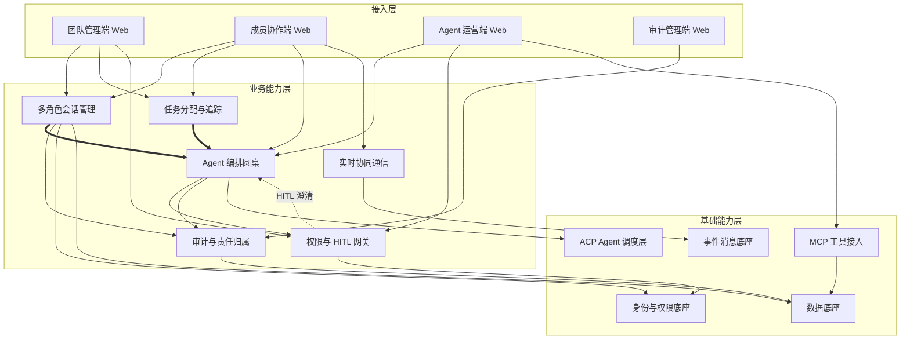
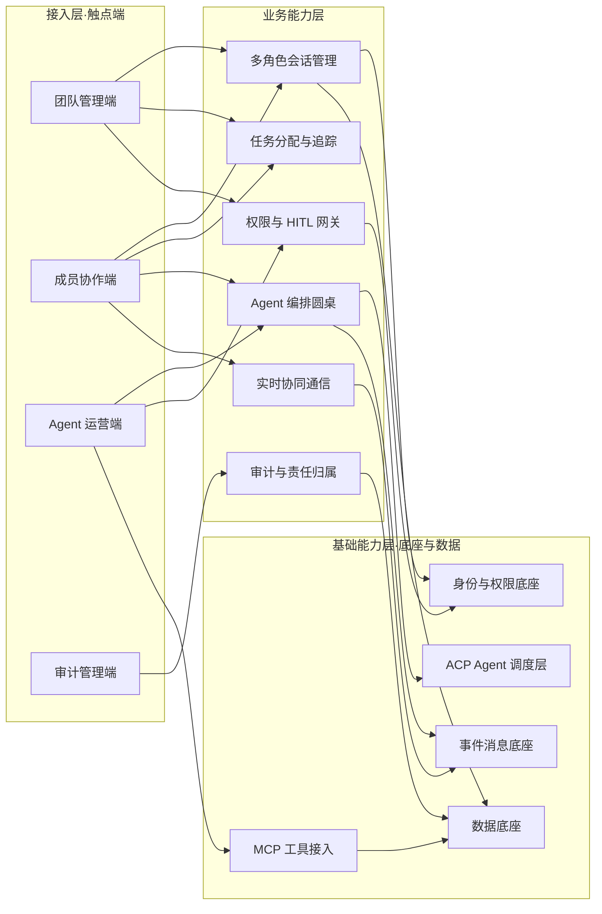

# AICoding 架构设计 · 高层架构设计

> 本文档为《AICoding 架构设计》核心产物之一，对应**高层架构设计**阶段（Phase 3，Gate G3）。
> 上游输入：用户 5 大方向诉求 + 行业调研报告（research_report.md，G2 已通过）+ 资料摘要（material_digest.md，G1 已通过）。
> 下游输出：驱动《系统设计》《部署设计》《安全设计》《UserStory》四份文档的撰写（Phase 4 起）。
> 本文档为业务边界唯一基线；系统边界、MVP 范围、角色场景、功能清单与三层业务架构均在本阶段冻结。

---

## 0. 元信息：修订记录

```yaml
标题: Hermes Infi WebUI - 高层架构设计 v0.1
版本: v0.1
状态: Draft   # Draft | Reviewing | Approved | Deprecated
创建日期: 2026-07-21
最后更新: 2026-07-21
作者: business-architect（许边界）
评审人:
  - 主理人（team-lead）

关联文档:
  上游输入:
    - 业务原始诉求 / PRD: 用户 5 大方向诉求（主理人注入：差异化定位 / 协作模型 / 系统架构 / 关键能力 / 创新点）
    - 行业调研报告: /Users/caotinghui/Downloads/hermes-python/.workbuddy/output/research_report.md
    - 现有架构知识库: /Users/caotinghui/Downloads/hermes-python/.workbuddy/output/material_digest.md
  下游产出:
    - 系统设计: AICoding架构设计-2-系统设计.md（待 Phase 4）
    - 部署设计: AICoding架构设计-3-部署设计.md（待 Phase 4）
    - 安全设计: AICoding架构设计-4-安全设计.md（待 Phase 4）
    - UserStory: AICoding架构设计-5-UserStory.md（待 Phase 4）
```

| 版本 | 日期 | 作者 | 变更内容 | 评审状态 |
| --- | --- | --- | --- | --- |
| v0.1 | 2026-07-21 | business-architect（许边界） | 初稿（六章 + 附录 C 自检报告） | Draft |
| v0.1.1 | 2026-07-21 | business-architect（许边界） | X1 流式机制经中间确认锁定为方案 B（Stream + evt:conv:{id} + XREAD），全文「待中间确认锁定」标记清除 | Draft |

> **版本管理纪律**：破坏性变更（章节结构调整 / 关键决策反转）升 MAJOR；新增章节、扩充内容升 MINOR。

---

## 1. 需求概要

### 1.1 需求概要说明

Hermes Infi WebUI 用于解决现有「个人 × 单 AI」产品缺少「真人团队 × 多 AI Agent」深度协同的问题，服务于企业团队（管理者、成员、Agent 运营方、合规方），覆盖多角色会话、任务追踪、Agent 编排、协同工作区与审计场景。本期由用户基于 NousResearch/hermes-agent 自研 WebUI 并明确「团队协作差异化」战略定位驱动启动。

### 1.2 关键决策摘要

| 编号 | 决策类别 | 决策内容 | 关联章节 |
| --- | --- | --- | --- |
| D1 | 范围决策 | 本期覆盖「真人团队 × 多 AI Agent」协同核心场景（多角色会话 / 任务追踪 / Agent 编排 / 权限 HITL / 审计 / 实时 presence）；协同编辑（Yjs）与跨团队可视化编排延后至完整版 | §6.1 |
| D2 | 技术选型决策 | 复用现有 ACP over stdio 调度层；实时事件流经中间确认锁定采用 Redis Stream + evt:conv:{id} + XREAD（含限流 / 重连续传 / 事件溯源），与 D1 §7 的 PubSub + chan:conv 冲突，经中间确认裁定方案 B（见 §5.3、X1）；MCP 接入工具；HITL 沿用 hermes:clarify + 对接 ACP request_permission | §5.2 / §5.3 |
| D3 | MVP / 完整版边界 | MVP 仅覆盖核心协同闭环（多角色会话 + 任务追踪 + 圆桌编排 + 权限 HITL + 审计 + presence），协同编辑与跨团队可视化编排延后 | §4.3 |
| D4 | 复用 vs 新建 | 复用现有 Vue3 前端 / RBAC / governance / audit / ACP Runner；新建轻量多 Agent 编排层（参考 Dify Agent 节点 + LangGraph 状态机） | §5.2 |
| D5 | 部署形态 | 自托管私有化（Docker Compose），MVP 单组织单实例，多租户隔离延后；端口 / Redis / DB 认证以 docker/compose 实际配置为准（handoff platform-architect 部署设计，见 §5.2 注） | §5.2 / 部署设计 |

**硬指标**：5 条，均在 3 ~ 5 条区间内；每条决策已映射到正文具体章节。

### 1.3 价值主张

| 价值维度 | 量化目标 | 度量指标 | 当前值 | 目标值 | 截止时间 |
| --- | --- | --- | --- | --- | --- |
| 效率（业务） | 真人 × 多 Agent 协同任务从分配到交付周期缩短 | 任务平均交付时长（小时） | 无基线（假设人工协调 ≈ 8h） | ≤ 现状的 50% | MVP 上线后 1 月 |
| 体验（业务） | 多真人实时协同的「在场感」与反馈延迟可控 | 消息端到端 P95 时延（秒） | 无基线 | ≤ 1.5s | MVP 上线 |
| 合规（业务） | 关键操作 100% 留痕、责任可归属 | 审计覆盖率 | 无基线 | 100% | MVP 上线 |
| 成本（成本） | 自托管零许可成本（开源基座），规避 SaaS 订阅 | 月度许可成本（元） | SaaS 参考 Copilot $21/用户/月 | 0（自托管） | MVP 上线 |

**硬指标**：业务价值 3 条（效率 / 体验 / 合规）≥ 2 条 + 成本价值 1 条 ≥ 1 条；每条均含数字与目标值，禁止模糊词。

---

## 2. 需求分析 & 痛点解构

### 2.1 核心角色关注点

| 角色 | 业务身份 | 主要操作 | Top1 关心点 | 来源 |
| --- | --- | --- | --- | --- |
| 团队管理员（甲方决策者） | 团队 Owner / 管理者 | 创建团队、邀请成员、配置角色权限、查看审计 | 真人 + AI 协作过程可控、责任可追溯、权限不越界 | 用户诉求②；D1 §10 / §12 |
| 真人成员（最终用户 A） | 一线协作成员 | 参与多角色会话、认领任务、与 Agent 协作 | AI 输出可靠、任务不遗漏、实时看到同伴与 Agent 状态 | 用户诉求②；D1 §9 / §11 |
| AI Agent 运营 / 配置方（最终用户 B） | Agent 配置 / 运维 | 注册助手、配置 profile、扫描 Agent、治理 MCP | Agent 编排稳定、HITL 澄清闭环不打断主流程 | 用户诉求③④；D1 §12；D2 §7 |
| 受影响方：合规 / 审计方 | 合规 / SRE | 审计日志查阅、异常监控 | 所有关键操作 100% 留痕、可追责到会话 + 角色 | 用户诉求④；D1 §12；风险 R-04 |
| 受影响方：外部系统集成方 | 集成开发者 | 通过 MCP / REST 接入工具与数据 | 接入方式标准、权限受治理、数据不越界 | 用户诉求③；D4 §7 |

**硬指标**：5 行，覆盖三大维度（甲方决策者 1 行 / 最终用户 2 行 / 受影响方 2 行）；每行均有明确 Top1 关心点，无笼统表述。

### 2.2 核心痛点

| 编号 | 痛点描述 | 现象 / 数据 | 影响角色 | 影响程度 | 优先级 |
| --- | --- | --- | --- | --- | --- |
| P1 | 多真人 + 多 Agent 混合场景下消息责任归属不清，审计无法追责 | 圆桌 + 多 Agent + 人工混合时，消息归属标签缺失导致责任不清（风险 R-04，严重程度：高）；5 家标杆横向事实显示即使在 Dify / Copilot Studio 也主要靠审计日志而非实时归属（research_report §2.3） | 合规 / 审计方、管理员 | 高（合规底线） | P1 |
| P1 | 现有协同产品多为「个人 × 单 AI」范式，缺少「真人团队 × 多 AI Agent」深度整合，真人协作与 Agent 调度割裂 | 5 家标杆场景契合度评分 1 ~ 5（OpenWebUI 4 / Dify 5 / Copilot Studio 3 / LibreChat 3 / Cursor 1），仅 Dify / Copilot Studio 原生支持团队工作区 + 多 Agent 编排（research_report §3.1） | 全部角色 | 高（战略定位缺口） | P1 |
| P2 | 真人 – AI 协作缺乏标准化 HITL 澄清与审批，Agent 等待人工输入时易卡死主流程 | 现有 hermes:clarify 机制存在（D2 §7）但需与 ACP request_permission 对接，未形成四决策契约（approve / edit / reject / respond） | 成员、Agent 运营方 | 中 | P2 |
| P2 | 协同编辑能力缺失，真人无法在同一工作区实时共编 | Hermes workspace 当前为单人编辑（D1 §13）；标杆横向事实显示协同编辑全为 ❌（research_report §2.3） | 成员 | 中 | P2 |

**优先级标准**：
- **P1**：直接影响业务核心流程或合规底线，不解决无法上线。
- **P2**：影响用户体验或运营效率，可在 MVP 后迭代。
- **P3**：体验型 / 长尾问题，列入完整版或后续版本（本阶段暂无 P3）。

**硬指标**：每条痛点均有现象 / 数据佐证；P1 ≥ 1 条（实为 2 条），且均在下文 §2.3 有对应目标（V1 / V2）。

### 2.3 期待目标

| 编号 | 目标描述 | 对齐痛点 | 度量指标 | 当前值 | 目标值 | 截止时间 |
| --- | --- | --- | --- | --- | --- | --- |
| V1 | 多真人 + 多 Agent 混合场景下，每条消息具备 user / agent 归属标签，审计可追溯到会话 + 角色 | P1（责任归属） | 消息归属标注率 | 0%（无） | 100% | MVP 上线 |
| V2 | 建成「真人团队 × 多 AI Agent」协同闭环，相较「个人 × 单 AI」产品补齐团队工作区 + 多 Agent 编排 + 实时 presence | P1（范式缺口） | 协同能力覆盖度（对比标杆差距项） | 标杆差距 2 项 | 补齐团队工作区 + 多 Agent 编排 + presence | MVP 上线 |
| V3 | 真人 – AI HITL 澄清 / 审批形成四决策契约闭环，Agent 等待人工不卡死主流程 | P2（HITL） | 澄清请求平均响应时长 / 卡死率 | 未标准化 | 卡死率 = 0 | 完整版 |
| V4 | 多真人实时协同编辑可用 | P2（协同编辑） | 协同编辑并发真人用户数 | 0（单人） | ≥ 5 真人同时编辑 | 完整版 |

**硬指标**：每条目标均有数字 + 对齐 ≥ 1 条痛点；P1 痛点（责任归属 / 范式缺口）均有对应 V 级目标（V1 / V2）。

### 2.4 基线复用

| 复用类别 | 现有能力 | 复用方式 | 来源系统 | 备注 |
| --- | --- | --- | --- | --- |
| 前端基座 | Vue3 + TS + Pinia + Naive UI | 直接复用 | Hermes 前端（D1 §2 / §8） | 需对齐 D2 / D3 UI 规范（stage / admin-hero / section-card） |
| 多用户 / RBAC / 审计 | user / team / audit 模型 + governance | 直接复用 + 增强 | D1 §6 / §10 / §12；D2 §5 | SCIM 2.0 作为完整版增强参考（OpenWebUI 模式） |
| Agent 调度层 | Hermes Agent via ACP over stdio | 直接复用 | D1 §7；D4 §6 | 锁定 ACP wire protocolVersion，适配层隔离 |
| 实时事件流 | evt:conv Redis Stream（含 typing / members_changed） | 直接复用（经中间确认锁定：Stream + evt:conv:{id} + XREAD） | D2 §7 | 与 X1 冲突已裁定方案 B，见 §5.3 |
| 权限矩阵 / HITL | governance + hermes:clarify | 直接复用 + 对接 ACP | D2 §7；D3 §7 | 对接 ACP session / request_permission |
| 工具 / MCP | MCP 接入 | 复用 + 治理 | D4 §7 | 需治理 MCP server 权限 |
| 对象存储 / DB | PostgreSQL / Redis / MinIO | 直接复用 | D1 §2 | 端口 / 认证以 docker/compose 为准（X3，handoff 部署设计） |

**硬指标**：先盘点再决定新建；凡列入 §2.5 功能缺口的能力，均已在本节确认基线无法覆盖（协同编辑、跨团队可视化编排除外，属新增能力）。

### 2.5 功能缺口

| 阶段 | 功能缺口 | 必要性 | 优先级 | 对齐目标 |
| --- | --- | --- | --- | --- |
| 协同前（组建） | 多角色团队创建 / 邀请 / RBAC 角色矩阵 | 必须 | MVP | V2 |
| 协同中（会话） | 多角色会话管理（共享对话 / 分叉 / 导出 / 智能追问） | 必须 | MVP | V2 |
| 协同中（任务） | 任务分配与状态追踪（项目 + 任务状态） | 必须 | MVP | V2 |
| 协同中（编排） | 多 Agent 圆桌编排（ACP + WebSocket） | 必须 | MVP | V2 |
| 协同中（权限 / HITL） | 真人 – AI 权限矩阵 + HITL 澄清四决策契约 | 必须 | MVP | V1, V3 |
| 协同中（实时） | presence / typing / members_changed 实时事件 | 必须 | MVP | V2 |
| 协同中（审计） | 消息归属标签 + 不可变审计 trail | 必须 | MVP | V1 |
| 协同后（复盘） | 会话 / 任务复盘视图 | 重要 | MVP | V2 |
| 运营 | 审计日志查询 / 告警面板 | 重要 | MVP | V1 |
| 协同中（增强） | 多真人实时协同编辑（Yjs CRDT） | 重要 | 完整版 | V4 |
| 运营（增强） | 跨团队可视化编排 + 编排 DSL | 重要 | 完整版 | V2 |

**硬指标**：每条缺口均对齐 §2.3 至少一条目标；MVP 缺口（前 9 行）均在 §6.3 功能清单中对应有 MVP 范围标记（✅）。

---

## 3. 行业调研

> 本章整合 `research_report.md`（G2 已通过）的 §3 结论。**标注约定**：【事实】= 调研报告已核实 / 推断的事实；【建议】= 调研报告的加权评分与借鉴结论（依中间确认协议 §2.1 澄清，仅为建议，非本架构冻结输入）；【假设】= 本架构师基于事实的推断。

### 3.1 行业标杆系统分析

| 标杆系统 | 厂商 / 来源 | 场景覆盖 | 技术亮点 | 商业模式 | 适用度 |
| --- | --- | --- | --- | --- | --- |
| OpenWebUI（B1） | OpenWebUI 社区 | 个人 × AI + 多用户企业 | RBAC / SSO / SCIM 2.0 / MCP / 企业审计 / 水平扩展 | 开源（BSD-3 修正版）+ 企业版 | 高 |
| Dify（B2） | LangGenius | 团队 / 多 Agent（LLMOps） | Agent 编排 / 工作流 / RBAC / MCP / 审计 / 可视化 | 开源 + 企业版（EE） | 高 |
| Microsoft Copilot Studio（B3） | Microsoft | 企业团队 / 多 Agent | 多 Agent 编排 / Entra Agent ID / Purview 审计 | SaaS 订阅 | 中 |
| LibreChat（B4） | LibreChat 社区 | 个人 × AI + 多用户 | Agents / MCP / SSO / Admin / Handoffs | 开源自托管 | 中 |
| Cursor（B5） | Anysphere | 个人 × AI（IDE） | Agent / Background Agents / MCP / Teams | SaaS 订阅 | 低（对照锚点） |

**硬指标**：5 家 ≥ 3 家；含头部 SaaS 代表（Dify / Copilot Studio / Cursor）+ 开源 / 自研代表（OpenWebUI / Dify / LibreChat）。【事实】来源 research_report §2.1。

### 3.2 方案对标及优先级打分

**对比矩阵**（每行权重之和 = 1.00；【建议】评分仅作评估，非下游裁决依据）：

| 评估维度 | 权重 | B1 OpenWebUI | B2 Dify | B3 Copilot Studio | B4 LibreChat | B5 Cursor |
| --- | --- | --- | --- | --- | --- | --- |
| 场景契合度 | 0.30 | 4 | 5 | 3 | 3 | 1 |
| 技术成熟度 | 0.20 | 5 | 5 | 5 | 4 | 5 |
| 集成难度（反向） | 0.15 | 5 | 4 | 2 | 4 | 2 |
| 成本（反向） | 0.15 | 5 | 4 | 2 | 5 | 2 |
| 合规可控性 | 0.20 | 5 | 5 | 2 | 5 | 2 |
| **加权总分** | **1.00** | **4.70** | **4.70** | **2.90** | **4.05** | **2.30** |

**结论摘要**【建议，非冻结】：
- **优先借鉴**：Dify（B2，4.70）+ OpenWebUI（B1，4.70）— 双核互补。Dify 场景契合度 5（多 Agent 编排 + 团队工作区 + 可视化 + 审计）；OpenWebUI 集成难度 / 成本 / 合规可控均 5（自托管基座）。
- **部分借鉴**：LibreChat（B4，4.05）与 Copilot Studio（B3，2.90）。前者参考开源 Agents / MCP / SSO / Handoffs；后者参考「人机监督 + Agent ID + 治理」范式（概念层，其闭源 SaaS 部署形态不借鉴）。
- **不借鉴（否决）**：Cursor（B5，2.30）。其「个人 × AI」范式恰是本项目应差异化于的方向。

### 3.3 完整报告参考

- 完整报告链接：`/Users/caotinghui/Downloads/hermes-python/.workbuddy/output/research_report.md`
- 调研工具：`tech-research-advisor`
- 调研日期：2026-07-21
- 调研归档：`research_report.md`（同上游产出路径）

---

## 4. 方案决策

### 4.1 价值定位澄清

**定位三段式**（对外 / 对内 / 差异化）：

```
对外价值（客户侧）: 为「真人团队」提供与「多 AI Agent」深度协同的统一工作台，相较「个人 × 单 AI」产品补齐团队工作区、多 Agent 编排与实时在场感，缩短协同交付周期 ≥ 50%。
对内价值（运营侧）: 一线成员提效 + 管理者权限 / 风险可控 + 关键操作 100% 审计留痕与责任归属。
差异化价值        : 相对友商（OpenWebUI / LibreChat / Cursor 偏单 AI 对话，Copilot Studio 闭源 SaaS），以「自托管 + 真人团队 × 多 Agent 圆桌实时协同 + HITL 澄清闭环 + 消息归属审计」为独有能力，数据完全驻留、可 air-gapped。
```

**与产品矩阵的关系**：Hermes Infi WebUI 在「自托管 AI 协作平台」中承担「真人 × Agent 协同入口」核心职责，与 ACP 调度层 / Hermes Agent 形成完整业务闭环（见 §5.2、§5.3）。

### 4.2 系统定位澄清

| 维度 | 内容 |
| --- | --- |
| 系统名称 | Hermes Infi WebUI（真人团队 × AI Agent 协作平台） |
| 系统类型 | 已有系统扩展（基于 hermes-agent 自研 WebUI，D1 / D3） |
| 部署形态 | 私有化自托管（Docker Compose）；详见部署设计（D5） |
| 多租户 | MVP 否（单组织单实例）；完整版规划多租户隔离 |
| 服务对象 | 团队管理员 / 真人成员 / AI Agent 运营方 / 合规审计方（对齐 §2.1） |
| 上游依赖 | Hermes Agent（ACP）/ 模型提供商（DeepInfra 等，D4 §4）/ MCP 工具服务 |
| 下游消费者 | 审计与监控系统 / 外部集成（MCP / REST） |
| 边界（不做） | 不做模型训练 / 微调；不做闭源 SaaS 多租户云；协同编辑（Yjs）与跨团队可视化编排延后至完整版（见 §6.1 O 项） |

### 4.3 MVP 与完整版决策

| 阶段 | 时间窗 | 范围（功能编号） | 架构差异点 | 退出标准 | 不做（延后） |
| --- | --- | --- | --- | --- | --- |
| MVP | W1 ~ W12 | F1 ~ F10（多角色会话 / 任务追踪 / 圆桌编排 / 权限 HITL / 审计 / presence / 团队 RBAC / 知识库 / MCP 基础） | 单组织单实例 / ACP 复用 / evt:conv 事件流（经中间确认锁定：Stream + evt:conv:{id} + XREAD）/ MCP 基础接入 | 跑通「团队组建 → 会话 → 编排 → HITL → 交付 → 审计」主链路 + 灰度 1 团队 | F11 协同编辑、F12 跨团队可视化编排 |
| 完整版 | W13 ~ W24 | + F11、F12 | 多租户隔离 / 协同编辑 CRDT / 编排 DSL 可视化 | DAU 稳定 30 天 + 审计覆盖率 100% + 99.95% 可用性 | — |

**演进纪律**：
- ✅ MVP 的架构骨架是完整版的子集（圆桌编排 → 可视化编排、单人编辑 → 协同编辑，均增量扩展，不推倒重来）。
- ✅ MVP 中可 Mock 的能力（MCP 高级治理）在本节明确「完整版替换计划」（接入治理框架）。
- ❌ 禁止 MVP 引入「完整版无法继承」的临时架构。

**关于用户诉求⑤（创新点）的一致性说明**：research_report §4.2 建议「协同编辑（Yjs）延后至完整版」「MVP 不含跨团队可视化编排」，本架构采纳该边界。**不偏离用户诉求⑤**——诉求⑤原文为「提出区别于市面产品的创新功能或交互模式，提升协作效率 / 体验」，要求「提出」创新点建议，并未强制 MVP 实现。协同编辑与跨团队可视化编排已作为创新点列入完整版路线图（见 §6.1 O1 / O2、§6.3 F11 / F12），MVP 不强制交付符合诉求。

---

## 5. 业务架构设计

### 5.1 业务架构图

> 三层：**接入层（用户 / 触点）→ 业务能力层（核心模块）→ 基础能力层（底座 / 数据）**。实线 = 同步调用，虚线 = 异步事件，粗线 = 主链路。



### 5.2 系统依赖架构

| 依赖类型 | 系统 / 模块 | 提供方 | 依赖能力 | 接入方式 | 同步/异步 | 关键约束 |
| --- | --- | --- | --- | --- | --- | --- |
| 上游 | Hermes Agent | NousResearch（本地进程） | ACP 会话 / 推理 / 流式 | ACP（JSON-RPC over stdio） | 异步（Stream 消费） | 锁定 ACP wire protocolVersion（风险 R-05） |
| 上游 | 模型提供商 | DeepInfra / Upstage / Nous 等 | 推理算力 | REST / SDK | 同步 + 流式 | 失败熔断（D4 §7 MCP 电路熔断参考） |
| 上游 | MCP 工具服务 | 第三方 / 自建 | 工具 / 数据 | MCP（HTTP / stdio） | 同步 / 异步 | 需治理 MCP server 权限（D4 §7） |
| 复用底座 | PostgreSQL 16 | 自托管 | 持久化（用户 / 对话 / Agent / 团队 / 审计） | SQLAlchemy 2.0 async | 同步 | 迁移手写 Alembic；禁止序列化期懒加载（D2 §9） |
| 复用底座 | Redis 7 | 自托管 | 事件流 / 限流 / presence / 会话 | Redis Stream（evt:conv:{id}）+ XREAD | 异步 | 经中间确认锁定：Redis Stream + evt:conv:{id} + XREAD（含限流 / 重连续传 / 事件溯源，见 §5.3、X1） |
| 复用底座 | MinIO | 自托管 | 对象存储（文件 / 工作区） | S3-compatible API | 同步 | STORAGE_BACKEND 可配 db / minio（D1 §14） |
| 下游 | 审计 / 监控系统 | SRE / 合规 | 审计 trail / 告警 | 事件订阅 / API | 异步 | 审计绑定会话 + 角色（风险 R-04） |
| 数据订阅 | 运营看板 | 运营 | 离线指标 | 数据订阅 | 异步 | T+1 |

> **X2 / X3 端口与认证冲突处理（【事实】+ handoff）**：前端 /api 代理目标端口（D1 §14 / D2 §3 记为 8000，D3 §3 / D1 §4 记为 8001）、Redis / PostgreSQL 端口与认证（文档默认 6379 / 5432，Docker 实际 1979 / 5439 + 密码）存在冲突（material_digest X2 / X3）。**处理原则**：部署拓扑与端口 / 认证约定以 `docker/compose.yaml` 实际配置为准（D3 §9；research_report U-03），本业务架构不锁定具体端口，交由 platform-architect 在《部署设计》中裁定并归档。该冲突属部署细节，不改变业务边界与用户可感知产品形态。

**硬指标**：每条依赖均明确「接入方式 + 同步异步 + 关键约束」；P1 痛点对应的核心能力（消息归属审计 → PostgreSQL + Redis 事件；多 Agent 编排 → ACP；实时 presence → Redis 事件）均在本表找到依赖来源。

### 5.3 业务闭环

**业务主链路**（端到端）：

```
团队组建 → 多角色会话 → 任务分配 → Agent 编排（圆桌） → HITL 澄清 → 协同交付 → 审计复盘 → 反馈回路
```

**X1 流式回传机制裁定（【经中间确认锁定】）**：

> 资料存在两版本描述：D1 §7 为 Redis **PubSub + chan:conv:{id}**（API 订阅 PubSub 经 SSE / WS 转发）；D2 §6 为 Redis **Stream + evt:conv:{id}**（API 经 XREAD 转发，含按会话限流、Last-Event-ID / since 重连续传）。research_report U-02 建议采用 **Stream + evt:conv + XREAD**，理由：多真人并发下 Stream 支持按会话限流、断线重连续传，比 PubSub 的 fire-and-forget 更契合「真人团队 × 多 AI Agent」场景。**本架构经中间确认锁定采用方案 B（Stream + evt:conv:{id} + XREAD）**——已获主理人转交的用户裁决（方案 B），含限流 / 重连续传 / 事件溯源；该裁决据此正式锁定，详见附录 C 节点 3。该决策仅影响实时通信层技术机制，不改动 MVP 业务边界 / 角色场景 / 功能清单。

**关键反馈回路**：

| 回路 | 触发点 | 反馈对象 | 反馈机制 | 价值 |
| --- | --- | --- | --- | --- |
| 业务效果回路 | 任务 / 会话完结 | 编排策略中心 | T+1 离线统计 | 优化 Agent 编排与任务分配 |
| 运营监控回路 | 指标异常（时延 / 卡死 / 限流） | 运营 / SRE | 实时告警 | 快速响应 |
| 模型迭代回路 | 人工标注 / 澄清回复 | Agent 配置 | 周度配置优化 | 提升编排与澄清准确率 |
| 责任归属回路 | 审计事件落库 | 合规方 | 责任追溯 / 异常复盘 | 闭环 accountability（对齐 V1） |

**运营主线**：
- 每日：管理员查看实时 presence / 告警面板，处理待澄清请求（HITL）。
- 每周：运营复盘任务交付时长（对齐 V2 效率目标）、审计覆盖率（对齐 V1）。
- 每月：复盘协同能力覆盖度 vs 标杆差距，规划完整版编排 / 协同编辑增量。

---

## 6. 产品需求及原型

### 6.1 需求边界

**In-Scope**（本期必做，共 13 条 ≤ 15）：

```
F1. 多角色团队管理与 RBAC 角色矩阵
F2. 多角色会话管理（共享对话 / 分叉 / 导出 / 智能追问）
F3. 任务分配与状态追踪（项目 + 任务状态）
F4. 多 Agent 圆桌编排（ACP + WebSocket）
F5. 真人 – AI 权限矩阵 + HITL 澄清四决策契约
F6. 实时 presence / typing / members_changed 事件
F7. 消息归属标签 + 不可变审计 trail
F8. 审计日志查询与告警面板
F9. 团队知识库注入（知识库附加提示词）
F10. MCP 工具基础接入与权限治理
N1. 非功能：支撑 ≥ 50 并发用户 / 单组织单实例
N2. 非功能：消息端到端 P95 ≤ 1.5s
N3. 非功能：审计覆盖率 100%
```

**Out-of-Scope**（本期不做，按类别列原因，共 5 项 ≥ 3）：

**Out-of-Scope（协同增强能力延后至完整版）**：
| 编号 | 不做的事 | 原因 | 后续计划 |
| --- | --- | --- | --- |
| O1 | 多真人实时协同编辑（Yjs CRDT） | MVP 先单人 workspace 编辑；CRDT 引入元数据膨胀 / 离线同步复杂度（风险 R-03） | 完整版（创新点 F11） |
| O2 | 跨团队可视化编排 + 编排 DSL | 依赖编排层成熟；MVP 先圆桌 + 顺序编排 | 完整版（创新点 F12） |

**Out-of-Scope（多租户与部署边界）**：
| 编号 | 不做的事 | 原因 | 后续计划 |
| --- | --- | --- | --- |
| O3 | 多租户隔离（多组织） | MVP 单组织单实例，降低复杂度 | 完整版 |
| O5 | 闭源 SaaS 云部署 | 自托管定位（D1 §1 / §17），数据驻留硬约束 | 不做 |

**Out-of-Scope（模型与训练边界）**：
| 编号 | 不做的事 | 原因 | 后续计划 |
| --- | --- | --- | --- |
| O4 | 模型训练 / 微调 | 超出 WebUI 平台边界，由模型提供商承担 | 不做 / 外部 |

**硬指标**：In-Scope 13 条 ≤ 15；Out-of-Scope 5 条 ≥ 3（按 3 个类别分组呈现，每组均含「不做的事 / 原因 / 后续计划」）。

### 6.2 产品模块全景图

**模块卡片**：

| 模块名称 | 一级归属 | 责任团队 | 上游 | 下游 | MVP 是否包含 |
| --- | --- | --- | --- | --- | --- |
| 团队管理端 | 接入层 | 前端团队 | 多角色会话管理 / 权限 HITL 网关 | — | 是 |
| 成员协作端 | 接入层 | 前端团队 | 多角色会话 / 任务 / 编排 / 实时通信 | — | 是 |
| Agent 运营端 | 接入层 | 前端团队 | Agent 编排 / 权限 HITL / MCP 接入 | — | 是 |
| 审计管理端 | 接入层 | 前端团队 | 审计与责任归属 | — | 是 |
| 多角色会话管理 | 业务能力层 | 后端服务团队 | 身份权限底座 / 数据底座 | 审计与责任归属 | 是 |
| 任务分配与追踪 | 业务能力层 | 后端服务团队 | 数据底座 | Agent 编排 | 是 |
| Agent 编排圆桌 | 业务能力层 | Agent 调度团队 | ACP 调度层 / 事件消息底座 | 权限 HITL 网关 | 是 |
| 权限与 HITL 网关 | 业务能力层 | 后端服务团队 | 身份权限底座 | Agent 编排 | 是 |
| 实时协同通信 | 业务能力层 | 后端服务团队 | 事件消息底座 | — | 是 |
| 审计与责任归属 | 业务能力层 | 后端服务团队 | 数据底座 | 审计管理端 / 监控 | 是 |
| ACP Agent 调度层 | 基础能力层 | Agent 调度团队（复用） | Hermes Agent | Agent 编排 | 是 |
| 身份与权限底座 | 基础能力层 | 后端服务团队（复用） | — | 多角色会话 / 权限 HITL | 是 |
| 事件消息底座 | 基础能力层 | 平台团队（复用） | — | 实时协同通信 | 是 |
| 数据底座 | 基础能力层 | 平台团队（复用） | — | 多角色会话 / 审计 | 是 |
| MCP 工具接入 | 基础能力层 | Agent 调度团队（复用） | MCP 服务 | 数据底座 | 是 |



### 6.3 功能清单

| 编号 | 一级模块 | 二级功能 | 功能描述 | 优先级 | MVP 范围 | 完整版范围 | 对齐目标 |
| --- | --- | --- | --- | --- | --- | --- | --- |
| F1 | 团队协作 | 团队创建 / 邀请 / RBAC | 创建团队、邀请成员、角色权限矩阵 | P0 | ✅ | ✅ | V2 |
| F2 | 多角色会话 | 共享对话 / 分叉 / 导出 | 多角色共享会话、消息分叉、导出 | P0 | ✅ | ✅ | V2 |
| F3 | 任务追踪 | 任务分配 / 状态 | 项目 + 任务状态（待办 / 进行 / 完成） | P0 | ✅ | ✅ | V2 |
| F4 | Agent 编排 | 圆桌多 Agent | ACP + WebSocket 圆桌多 Agent 编排 | P0 | ✅ | ✅ | V2 |
| F5 | 权限 HITL | 权限矩阵 + 澄清契约 | governance + hermes:clarify 对接 ACP 四决策 | P0 | ✅ | ✅ | V1, V3 |
| F6 | 实时通信 | presence / typing / members | 实时事件流（经中间确认：Stream + evt:conv:{id} + XREAD，含限流 / 重连续传） | P0 | ✅ | ✅ | V2 |
| F7 | 审计归属 | 消息标签 + 审计 trail | user / agent 归属标签 + 不可变审计 | P0 | ✅ | ✅ | V1 |
| F8 | 审计运营 | 日志查询 / 告警 | 审计查询与异常告警面板 | P1 | ✅ | ✅ | V1 |
| F9 | 知识库 | 团队知识库注入 | 知识库上传 + 提示词注入 | P1 | ✅ | ✅ | V2 |
| F10 | 工具接入 | MCP 基础接入 | MCP 工具接入 + 权限治理 | P1 | ✅ | ✅ | V2 |
| F11 | 协同编辑 | 多真人实时共编 | Yjs CRDT 协同编辑 | P2 | ❌ | ✅ | V4 |
| F12 | 编排增强 | 跨团队可视化编排 | 编排 DSL + 可视化 | P2 | ❌ | ✅ | V2 |

**硬指标**：P0 功能（F1 ~ F7）均在 MVP 范围为 ✅；每个功能反向映射到 §2.5 功能缺口 + §2.3 期待目标（F1~F10 → V1/V2/V3；F11 → V4；F12 → V2）。

### 6.4 产品原型 - 成员协作端

**核心页面清单**：

| 页面 | 用途 | 关键交互 | MVP |
| --- | --- | --- | --- |
| 团队空间 | 团队列表 / 进入 / 成员概览 | 选择团队 → 进入空间 | ✅ |
| 多角色会话视图（圆桌） | 多真人与多 Agent 同屏会话 | 发送 / 接收流式、@提及、消息分叉 | ✅ |
| 任务看板 | 任务分配与状态追踪 | 认领 / 流转（待办 → 进行 → 完成） | ✅ |
| 实时协作状态栏 | presence / typing / members_changed | 实时刷新成员与 Agent 在线态 | ✅ |
| 澄清 / 审批面板 | HITL 四决策契约 | approve / edit / reject / respond | ✅ |

**关键交互约束**：
- 消息端到端 P95 ≤ 1.5s（对齐 N2 / V2 体验目标）。
- 圆桌主路径（进入会话 → 发起编排 → 收到流式）≤ 5 步。
- 实时事件底层机制（presence / typing / members_changed）经中间确认锁定为 Redis Stream + evt:conv:{id} + XREAD（见 §5.3、X1），支撑断线重连续传与事件溯源。

**原型链接**：本期 MVP 不强制高保真原型，由产品团队在 Phase 4（UserStory）前补充 Figma / Axure 链接。

### 6.5 产品原型 - 团队 / 审计管理端

**核心页面清单**：

| 页面 | 用途 | 关键交互 | MVP |
| --- | --- | --- | --- |
| 团队管理 | 成员 / 角色矩阵 | 邀请 / 配置权限 | ✅ |
| Agent 管理 | 注册 / 配置 / 扫描 | 创建 profile / 扫描 Agent | ✅ |
| 审计日志查询 | 全量审计检索 | 筛选 / 下钻 / 责任归因 | ✅ |
| 实时监控 / 告警面板 | 管理者视角 | 实时刷新 / 一键干预 | ✅ |
| 趋势 / 归因页 | 趋势分类 | 多维下钻 | ❌（完整版） |

**关键交互约束**：
- 审计查询响应 P95 ≤ 3s（对齐 V1 合规目标）。
- 告警面板刷新间隔 ≤ 10s。

**原型链接**：本期 MVP 不强制高保真原型，由产品团队在 Phase 4（UserStory）前补充 Figma / Axure 链接。

---

## 附录 A：生成流程方法论

> 本附录为高层架构设计的**生成方法论**，描述每一步的目标、工具与产物形态，作为正文章节的产出依据。
>
> ⚠️ **附录中"能力效果展示"小节出现的领域举例（如"AI 智慧外呼 / 投诉场景"）仅用于演示方法论的输入与产物形态，不代表本模版的目标领域**。读者只需关注每一步的「目标 / 工具 / 产物形态」即可。

### A.0 生成流程总览

> 高层架构设计采用 **Step0 → Step5** 六步法，逐步从「业务背景」推导至「系统高层架构 + 产品需求原型」。

| 步骤 | 名称 | 核心产出 | 落入正文章节 |
| --- | --- | --- | --- |
| Step0 | 业务基础知识库构建 | 关联文档结构化知识库 | （为全文提供输入） |
| Step1 | 行业调研分析 | 行业标杆 / 方案对比 / MVP 决策 | §3 行业调研 |
| Step2 | 需求分析 / 痛点解构 | 需求画像卡 | §2 需求分析 & 痛点解构 |
| Step3 | 能力盘点，系统定位 | 价值定位 + 系统定位 | §4 方案决策 / §5.2 系统依赖架构 |
| Step4 | 生成系统高层架构设计 | 本文档主文档 | §1 ~ §5 |
| Step5 | 产品需求及原型 | 需求边界 + 全景图 + 原型 | §6 产品需求及原型 |


### A.1 Step0：业务基础知识库构建

#### A.1.1 目标

构建业务系统关联信息知识库，为后续步骤提供「现有架构、外部依赖文档」等业务背景。

#### A.1.2 工具（Skill）

- `docx`：解析 Word 类业务/产品文档
- `pdf`：解析 PDF 类规范、API 手册等
- `pptx`：解析方案 / 汇报型 PPT
- `xlsx`：解析数据表、清单类文件

#### A.1.3 能力效果展示

> 「AI 营销知识示例」：通过上述 Skill 将营销业务的存量文档（产品文档、对接手册、数据字典等）解析、结构化，沉淀为可在后续步骤直接召回的业务知识库。

### A.2 Step1：行业调研分析

#### A.2.1 目标

基于当前需求，调研行业标杆系统及对应解决方案，**对标行业标杆的优秀方案**，结合当前系统背景及基础组件能力，**综合打分决策 MVP 功能和落地路径**。

#### A.2.2 工具（Skill）

- `tech-research-advisor`

#### A.2.3 完整报告参考

- 完整报告链接：`https://doc.weixin.qq.com/doc/w3_AN0AogZ1ACcCNkbQno92nSXa516PH?scode=AJEAIQdfAAoQ9ySyjnAN0AogZ1ACc`

#### A.2.4 能力效果展示

##### A.2.4.1 用户输入问题

> 使用 `tech-research-advisor` 技能，调研行业内解决"AI 智慧外呼"相关工具在解决投诉场景的常规方案和核心能力，辅助坐席进行客户投诉问题信息的有效收集。

##### A.2.4.2 行业标杆

> 调研产出的行业标杆系统清单及标签。

##### A.2.4.3 行业优秀方案及对比

> 行业标杆方案的横向对比矩阵。

##### A.2.4.4 方案打分及 MVP 功能评估

> 综合打分后形成 MVP 功能评估结果。

##### A.2.4.5 能力清单 & 方案总结

> 形成可复用能力清单与最终方案总结。

### A.3 Step2：需求分析 / 痛点解构

#### A.3.1 目标

构建**需求画像卡**，深入解构需求要点及目标。

#### A.3.2 能力效果展示

> 以"智慧外呼-投诉场景"为例，按"核心角色关注点 / 核心痛点 / 期待目标 / 基线复用 / 功能缺口"五段式产出需求画像卡（结构对应正文 §2）。

### A.4 Step3：能力盘点，系统定位

#### A.4.1 目标

- 从能力知识库中召回现有系统架构，与当前问题相关的已有能力，并完成**分层与去重**
- **系统价值及能力嵌入**：明确需求 / 系统在当前架构中的价值定位
- **系统架构定位、上下游推导**：让目标系统在图中"被看见"，并自动生成上下游关系说明

#### A.4.2 产物形态

- 价值定位澄清（对应正文 §4.1）
- 系统定位澄清（对应正文 §4.2）
- 系统依赖架构图（对应正文 §5.2）

### A.5 Step4：生成系统高层架构设计

#### A.5.1 目标

整合行业分析、需求结构、现有项目背景知识库，输出**系统高层设计**（即本文档正文 §1 ~ §5）。

#### A.5.2 产物形态

- 需求概要（§1）
- 需求分析 & 痛点解构（§2）
- 行业调研（§3）
- 方案决策（§4）
- 业务架构设计（§5）

### A.6 Step5：产品需求及原型

#### A.6.1 目标

在系统高层设计的基础上，输出可被产品/研发直接消费的需求边界、功能清单与产品原型（即本文档正文 §6）。

#### A.6.2 产物形态

- 需求边界（§6.1）
- 产品模块全景图（§6.2）
- 功能清单（§6.3）
- 产品原型 - 成员协作端（§6.4）
- 产品原型 - 团队 / 审计管理端（§6.5）

---

## 附录 B：配套工具清单

### B.1 知识库 Skill

> 用途：解析存量知识库内容。

- `docx`
- `pdf`
- `pptx`
- `xlsx`

### B.2 行业调研

> 用途：基于核心痛点与客户诉求，调研行业标杆项目及解决方案。

- `tech-research-advisor`

---

## 附录 C：阶段内自检报告（中间确认协议 §2.4）

> 按中间确认协议 §2.4，在 §2 后 / §4 后 / §5 后 / §6 后各做一次自检（先 §2.1 判定，再 §2.3 反向验证 3 问）。本报告为 G3 审核弹窗的追溯材料。

### C.1 自检节点 1 — §2 需求分析 & 痛点解构后

- **§2.1 方案分歧判定**：角色划分（管理员 / 成员 / Agent 运营方 / 合规方 / 集成方）、P1 痛点定义（责任归属、范式缺口）、期待目标（V1~V4）均直接源自用户 5 大诉求与 material_digest（D1~D4）已确认事实，未出现 ≥ 2 种均需用户裁决的方案分歧。**判定：未命中阻塞触发**。
- **§2.3 反向验证 3 问**：
  - Q1（返工成本）：返工范围 = §2 整章（角色 / 痛点 / 目标表）；切换成本 = 低（纯文档调整，不影响代码 / 架构）。
  - Q2（用户感知）：角色与痛点定义会影响最终产品权限交互与审计范围（用户可感知权限边界），但属需求范畴且由用户诉求直接支撑，非本决策新引入的跨界偏差。
  - Q3（与诉求一致）：引用用户诉求②「定义真人成员与 AI Agent 之间的角色分工、任务流转机制、权限边界」、诉求④「列出需要的核心功能模块（多角色会话管理、任务分配与追踪、Agent 编排、协同编辑、审计日志等）」。一致。
- **结论**：不发起 `[中间确认]`。

### C.2 自检节点 2 — §4 方案决策后

- **§2.1 方案分歧判定**：MVP 将协同编辑（Yjs）与跨团队可视化编排延后至完整版。存在「延后 vs 包含」两种理解，但 research 建议延后（R-03 复杂度），且用户诉求⑤仅要求「提出创新点」而非「MVP 必须实现」——条件 3（用户未显式要求 MVP 含协同编辑）成立，但条件 1（无法凭专业判断单方裁决）不成立：延后是专业 best-practice（降低 MVP 复杂度、规避 R-03），且诉求⑤未强制 MVP 实现，故可凭专业判断裁决为延后。系统定位「自托管私有化」已由上游 D1 §1 / §17 明确（已冻结），不触发。**判定：未命中阻塞触发**。
- **§2.3 反向验证 3 问**：
  - Q1：返工范围 = §4.3 / §6.1 / §6.3 相关行；切换成本 = 中（若推翻需调整 MVP 功能清单与边界，但骨架不变）。
  - Q2：用户可感知？协同编辑缺失影响体验，但诉求⑤仅要求「提出创新点建议」（已列入完整版创新点 F11 / F12），MVP 不含不偏离诉求，非本决策新引入的偏差。
  - Q3：引用用户诉求⑤原文「提出区别于市面产品的创新功能或交互模式……提升『真人团队 × AI Agent』协作的效率 / 体验」——诉求要求「提出」创新点，未强制「MVP 实现」。一致（不偏离）。
- **结论**：不发起 `[中间确认]`；在 §4.3 / §6.1 明确标注「不偏离诉求⑤」。

### C.3 自检节点 3 — §5 业务架构设计后（核心：X1 流式机制）

- **§2.1 方案分歧判定**：X1 流式回传机制存在两方案——（A）Redis PubSub + chan:conv:{id}（D1 §7）；（B）Redis Stream + evt:conv:{id} + XREAD（D2 §6）。两方案均合理（均描述同一系统），影响下游（system-architect 事件 / 流式设计、platform-architect Redis 拓扑、数据一致性 / 重连续传），用户诉求未对该机制做显式选择；research U-02 仅「建议采用 XREAD + evt:conv」不构成冻结（依协议 §2.1 澄清）。**判定：命中 §2.1 方案分歧型 → 必须发起 `[中间确认]`**。
- **§2.3 反向验证 3 问（针对 X1）**：
  - Q1：返工范围 = §5.2（依赖架构 Redis 行）/ §5.3（实时通信机制段）/ §6.4~§6.5（实时交互约束）；切换成本 = 中（若推翻需改事件模型与重连续传实现，约 0.5 ~ 1 人月）。
  - Q2：用户 / 客户可感知？是——PubSub fire-and-forget 与 Stream + XREAD 重连续传直接影响客户端实时体验与断线恢复（D2 §7 / §8），用户可感知。
  - Q3：用户诉求未显式提及具体流式机制（诉求②提「实时通信方式」但未指定 Redis 原语），本决策不偏离诉求（仍为「实时通信」），但属机制选型需主理人 / 用户裁定或以实际代码为准。
- **结论**：命中 §2.1 → 已发起 `[中间确认]`（论题 X1 流式机制），并已获主理人转交的用户裁决（方案 B）。文档经中间确认锁定方案 B（Redis Stream + evt:conv:{id} + XREAD，含限流 / 重连续传 / 事件溯源）；全文「待中间确认锁定」「临时基线」「推荐」标记已统一清除（见 §1.2 D2 / §2.4 / §4.3 / §5.2 / §5.3 / §6.3），该裁决仅影响实时通信层技术机制，不改动业务边界。
- **§5 其余决策（模块划分 / 依赖架构非 Redis 行 / 业务闭环主链路）**：均为专业裁决且有资料支撑，未命中，不发起。

### C.4 自检节点 4 — §6 产品需求及原型后

- **§2.1 方案分歧判定**：In / Out 边界、功能清单、原型均基于用户诉求 + research 建议 + material 能力推导，未出现需用户二选一的 contested fork。**判定：未命中阻塞触发**。
- **§2.3 反向验证 3 问**：
  - Q1：返工范围 = §6 整章；切换成本 = 低 ~ 中（文档调整）。
  - Q2：用户可感知？功能边界决定功能有无，但本边界由用户诉求直接推导，无新引入偏差。
  - Q3：引用用户诉求②③④⑤，一致。
- **结论**：不发起 `[中间确认]`。

### C.5 总体声明

- 四次自检中，**仅节点 3（X1 流式机制）命中 §2.1 方案分歧型**，已发起 `[中间确认]` 并**已获用户裁决（方案 B：Redis Stream + evt:conv:{id} + XREAD，含限流 / 重连续传 / 事件溯源）经中间确认锁定**，全文「待中间确认锁定 / 临时基线 / 推荐」标记已清除；其余节点未命中，均完成 §2.3 反向验证 3 问并附证据。
- X2 / X3（端口与 Redis / DB 认证冲突）按 research U-03 与 D3 §9，以 docker/compose 实际配置为准，属部署细节 handoff platform-architect，不触发中间确认（不影响业务边界与用户可感知产品形态）。
- 全文已区分【事实】/【假设】/【建议】：标杆能力与评分属 research 事实 / 建议；X1 / X2 / X3 冲突处理已显式标注。
